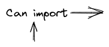

# Tags in the workspace and their organisation

In this workspace, we use tags to organise the libraries and application to ensure have strong boundaries between projects.

There is 3 tag groups : scope, type, meta.

You should use the internal generators to create libraries and application, they will have selectors for the tags groups.

Next here, you can find all of the tags that we have, along side the explanation and the import rule matrix.

## `scope` tag group

A scope tag is used to add boundaries between modules of the monorepo.

### Tag list :

#### `scope:console`

Console application related libraries

#### `scope:nx-plugins`

Nx plugins, internal or external

#### `scope:shared`

Shared libraries, used across all other libraries

### Constraints

- There can be only one `scope` tag per library.

- A `scope` tag should be present on all libraries.

Here is the import rule matrix :

|  | `scope:shared` | `scope:console` | `scope:nx-plugins` |
| ---------------------------------------------- | :------------: | :-------------: | :----------------: |
| `scope:shared`                                 |       ✅       |       ⛔        |         ⛔         |
| `scope:console`                                |       ✅       |       ✅        |         ⛔         |
| `scope:nx-plugins`                             |       ✅       |       ⛔        |         ✅         |

## `type` tag group

A type tag is used to add information about a library.

### Tag list :

#### `type:utils`

Utilities library, ex : date-utils, zod-utils

#### `type:data`

Data library, with state management and network

#### `type:ui`

Ui library, with only component getting data via props

#### `type:feature`

Feature library, with connected ui & data to make a feature

#### `type:app`

Application, where the orchestration is done

#### `type:storybook`

A storybook host, used to aggregate stories

#### `type:e2e`

End to end tests projects

### Constraints

- There can be only one `type` tag per library.

- A `type` tag should be present on all libraries.

Here is the import rule matrix :

|  | `type:utils` | `type:data` | `type:ui` | `type:feature` | `type:app` | `type:storybook` | `type:e2e` |
| ---------------------------------------------- | :----------: | :---------: | :-------: | :------------: | :--------: | :--------------: | :--------: |
| `type:utils`                                   |      ✅      |     ⛔      |    ⛔     |       ⛔       |     ⛔     |        ⛔        |     ⛔     |
| `type:data`                                    |      ✅      |     ✅      |    ⛔     |       ⛔       |     ⛔     |        ⛔        |     ⛔     |
| `type:ui`                                      |      ✅      |     ⛔      |    ✅     |       ⛔       |     ⛔     |        ⛔        |     ⛔     |
| `type:feature`                                 |      ✅      |     ✅      |    ✅     |       ✅       |     ⛔     |        ⛔        |     ⛔     |
| `type:app`                                     |      ✅      |     ✅      |    ✅     |       ✅       |     ⛔     |        ⛔        |     ⛔     |
| `type:storybook`                               |      ✅      |     ✅      |    ✅     |       ✅       |     ⛔     |        ✅        |     ⛔     |
| `type:e2e`                                     |      ✅      |     ✅      |    ✅     |       ✅       |     ✅     |        ✅        |     ✅     |

## `meta` tag group

A meta tags is used to add artifical boundaries when needed

### Tag list :

#### `meta:legacy`

A library marked as legacy is used to clearly separate the old and new patterns

#### `meta:package`

A package is a library published to NPM. And it can only depends on publishable packages to be published

### Constraints

- There can be multiple `meta` tag per library.

- A `meta` tag is an optional tag.

Here is the import rule matrix :

|  | `meta:legacy` | `meta:package` |
| ---------------------------------------------- | :-----------: | :------------: |
| `meta:legacy`                                  |      ✅       |       ⛔       |
| `meta:package`                                 |      ⛔       |       ✅       |

## FAQ

> How big/small a library should be ?

A library can be as little as a single function to as big as a full page. You can find the [tradeoffs from the Nx docs](https://nx.dev/more-concepts/creating-libraries).
