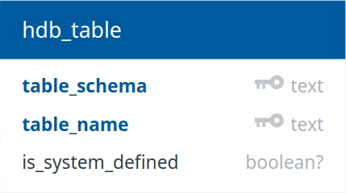
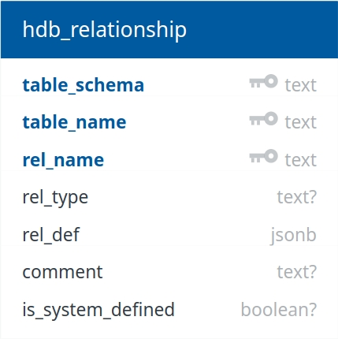
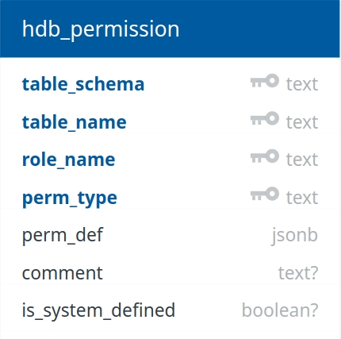

Hasura GraphQL Engine Internals
===============================

In every Hasura GraphQL engine, there are a set of internal tables GraphQL engine uses to manage the state of your database. Hasura GraphQL engine uses the data in these tables to generate a GraphQL API which then can be accessed from different clients.

Hasura GraphQL engine when initialized, creates a schema with the name ``hdb_catalog`` and initializes the list of tables under it.

hdb_catalog
-----------

The schema created by Hasura GraphQL engine where it manages its internal state. Whenever a table/permission/relationship is created/updated using the Hasura console or Hasura CLI. Hasura GraphQL engine captures that information and stores it in the corresponding tables.

The following tables are commonly used by Hasura GraphQL engine.

hdb_table
^^^^^^^^^

This table stores information about all the tables/views which are created/tracked using the Hasura console or Hasura CLI.

Schema
""""""

Column Definitions
""""""""""""""""""

- **table_schema**:
  Captures information about the schema under which a table/view is tracked.
- **table_name**:
  Captures name of the tracked table/view. 
- **is_system_defined**:
  Used by GraphQL engine for internal purpose.
  If it is true, then the table/view is created by GraphQL engine for internal purpose. If it is false, then the table/view is created by the end user.

hdb_relationship
^^^^^^^^^^^^^^^^

This table stores information about the relationships created for tables/views using the Hasura console or Hasura CLI.

Schema
""""""

Column Definitions
""""""""""""""""""

- **table_schema**:
  Captures information about the schema under which a relationship is created
- **table_name**:
  Captures name of the table/view under which a relationship is created.
- **rel_name**:
  Captures name of the relationship.
- **rel_type**:
  Captures the relationship type (object/array).
- **rel_def**:
  Captures information about how the relationship is defined. Lets say it has the following data, GraphQL engine will create a relationship with the relationship name using the foreign constraint on the ``user_id`` column of the table.
.. code-block:: json

  {
    "foreign_key_constraint_on": "user_id"
  }
- **comment**:
  Captures the comment for the relationship.
- **is_system_defined**:
  If it is true, then the relationship is created by GraphQL engine for internal purpose. If it is false, then the relationship is created by the end user.

hdb_permission
^^^^^^^^^^^^^^

Stores information about the access control rules on tables/views.

Schema
""""""

Column Definitions
""""""""""""""""""

- **table_schema**:
  Captures information about the schema under which a permission is created
- **table_name**:
  Captures name of the table/view under which a permission is created.
- **role_name**:
  Captures name of the role for which this permission will be applicable.
- **perm_type**:
  Captures the permission type (insert/select/update/delete).
- **perm_def**:
  Captures information about how the permission is defined. Lets say it has the following data, Whenever a query is made with the above role for the above table GraphQL Engine will first validate the requested columns with the columns which the user has access to. Once the query is validated user is returned the appropriate results after applying the filter defined in the ``filter`` key.
.. code-block:: json

  {
    "filter": {
      "id": {
      "_eq": "X-HASURA-USER-ID"
      }
    },
    "columns": ["id", "name"]
  }

- **comment**:
  Captures the comment for the permission.
- **is_system_defined**:
  If it is true, then the permission is created by GraphQL engine for internal purpose. If it is false, then the permission is created by the end user.
