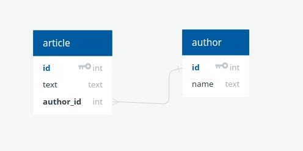

Troubleshooting GraphQL Engine Errors
=====================================

.. note::
  This section requires knowledge of GraphQL engine internals. Kindly checkout :doc:`Hasura GraphQL Internals <../engine-metadata/index>` for more info.

Hasura GraphQL engine will not work as expected and will throw unexpected errors if the table/view tracked by the GraphQL engine is altered using psql or any other postgresql client. Hasura GraphQL engine creates and maintains an internal **state** based on the database it is configured to use. This internal state will comprise of information about the tables/views, relationships and access control rules defined on them using Hasura. Check :doc:`this <../engine-metadata/index>` out for more info. It is highly recommended to do any modifications to the database schema through Hasura console or Hasura CLI to avoid corrupting the GraphQL engine's **state**.

Following are the list of error messages returned by the GraphQL Engine when it encounters an inconsistent state.

Error: no such table/view exists in postgres
--------------------------------------------

The error is due to ``table/view`` tracked by the Hasura GraphQL engine is deleted or is not available in the database.

You will encounter the above error if you would have done the following.

- Created a table called `author` from console.
- Opened `psql` or `adminer` or any other postgresql client and deleted `author` table.
- Restarted GraphQL engine.

Solution
^^^^^^^^

From the above example, it is clear that GraphQL engine expects the table to be available in the database to function properly. There are multiple ways to solve this problem. One of the easiest way is to delete problematic row from ``hdb_table`` table under ``hdb_catalog`` schema

Error: no foreign constraint exists on the given column
-------------------------------------------------------

Hasura GraphQL Engine validates all the relationships (created using foreign key/manual) before it starts serving. When it encounters a relationship defined from table ``A -> B`` it looks for a foreign key constraint in table ``A`` and when it couldn't find, it throws the above error.

Solution
^^^^^^^^

Connect to the database and switch to ``hdb_catalog`` schema, look for a table called ``hdb_relationship``. Find the entry for the above relationship and delete it. Restart GraphQL engine to verify.

Error: field already exists
---------------------------

When a relationship is created using Hasura GraphQL Engine. It creates a special field with the relationship name which is extremely useful while fetching from multiple tables in a single request. 

Example
^^^^^^^

Lets say we have a table called ``article`` and ``author`` as follows

Using console or Hasura CLI if you have created a relationship with name as ``author`` from ``article`` to ``author``. Hasura GraphQL engine will create a special field (``author``) in the ``article`` table in its internal state. This field will be available via the GraphQL interface.

When this table is described using psql, ``author`` field will not be available as part of the list of fields returned by the describe command as it is something added by Hasura GraphQL engine. Now if a new column is created with the same name via psql, Hasura GraphQL engine will throw the above error when restarted.

Solution
^^^^^^^^

1. Remove the problematic column from the table or remove the relationship from the ``hdb_relationship`` table under ``hdb_catalog``
