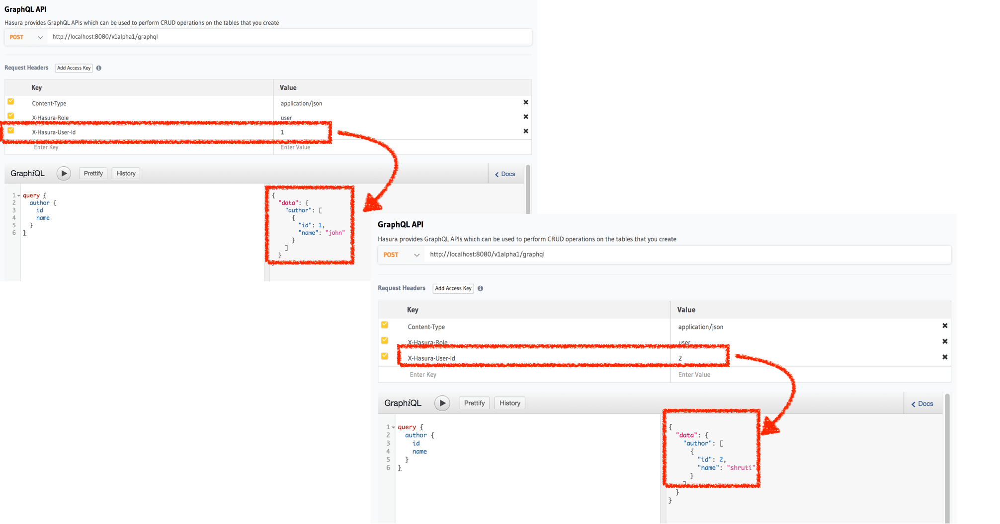

Access control basics
=====================

In this section, we're going to setup a simple access control rule for restricting querying on a table.
We're working with a simple author table where users have some information stored about themselves in the
``author`` table.

Create a author table
---------------------

Head to your console and create the ``author`` table the following columns:

+----------+--------+
|      id  | integer|
+----------+--------+
| name     | text   |
+----------+--------+

.. image:: ../../../img/graphql/manual/auth/author-table.png

Insert some sample data into the table:

+-------------+----------+
|      **id** | **name** |
+-------------+----------+
| 1           |  john    |
+-------------+----------+
| 2           |  shruti  |
+-------------+----------+
| 3           |  celine  |
+-------------+----------+
| 4           |  raj     |
+-------------+----------+

Try out a query
---------------

.. code-block:: none

  query {
    author {
      id
      name
    }
  }

You'll see that this results in a response that contains all the authors because by default the GraphQL query is
accepted with admin permissions.

.. image:: ../../../img/graphql/manual/auth/fetch-authors.png

Add a simple access control rule for a logged in user
-----------------------------------------------------

Let's say for our app, logged in users are only allowed to fetch their own data.

Let's add a **select** permission for the **user** role on the ``author`` table:

.. image:: ../../../img/graphql/manual/auth/author-select-perms.png

.. list-table::
   :header-rows: 1
   :widths: 15 20 25 40

   * - Table
     - Definition
     - Condition
     - Representation

   * - author
     - user's own row
     - ``id`` in the row is equal to ``user-id`` from the request session
     -
       .. code-block:: json

          {
            "id": {
              "_eq": "X-Hasura-User-Id"
            }
          }

Now, let's make the same query as above but include the 2 dynamic authorization variables via request headers.
``X-Hasura-Role`` and ``X-Hasura-User-Id`` which will automatically get used according to the permission rule we set up.

You can notice above, how the same query now only includes the right slice of data.

.. graphiql::
  :view_only: true
  :query:
    # Query with X-Hasura-User-Id: 3
    query {
      author {
        id
        name
      }
    }
  :response:
    {
      "data": {
        "author": [
          {
            "id": 3,
            "name": "Sidney"
          }
        ]
      }
    }

Next, learn more about how permissions work
-------------------------------------------

Next: :doc:`Roles and dynamic variables <roles-variables>`

