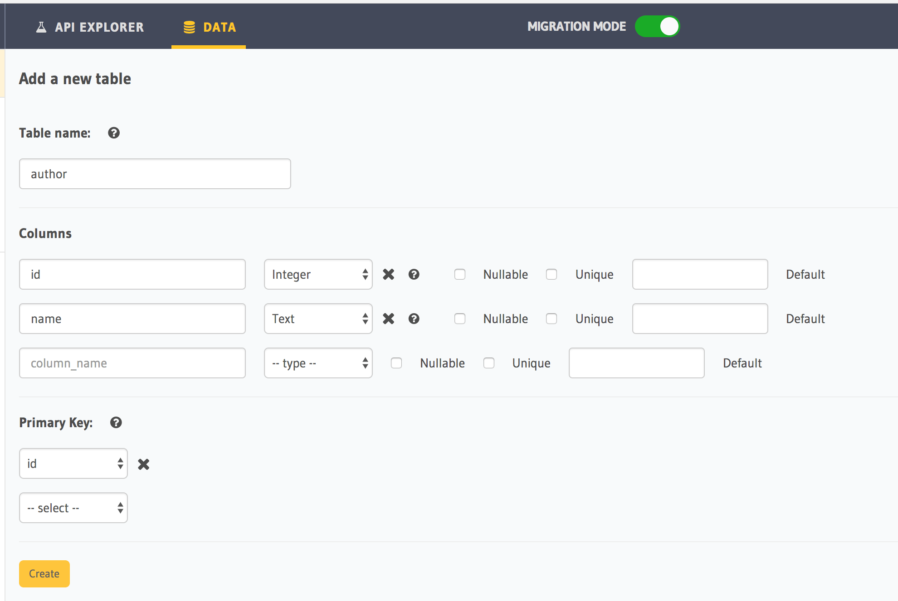
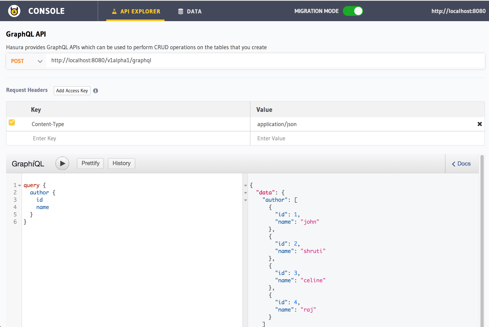
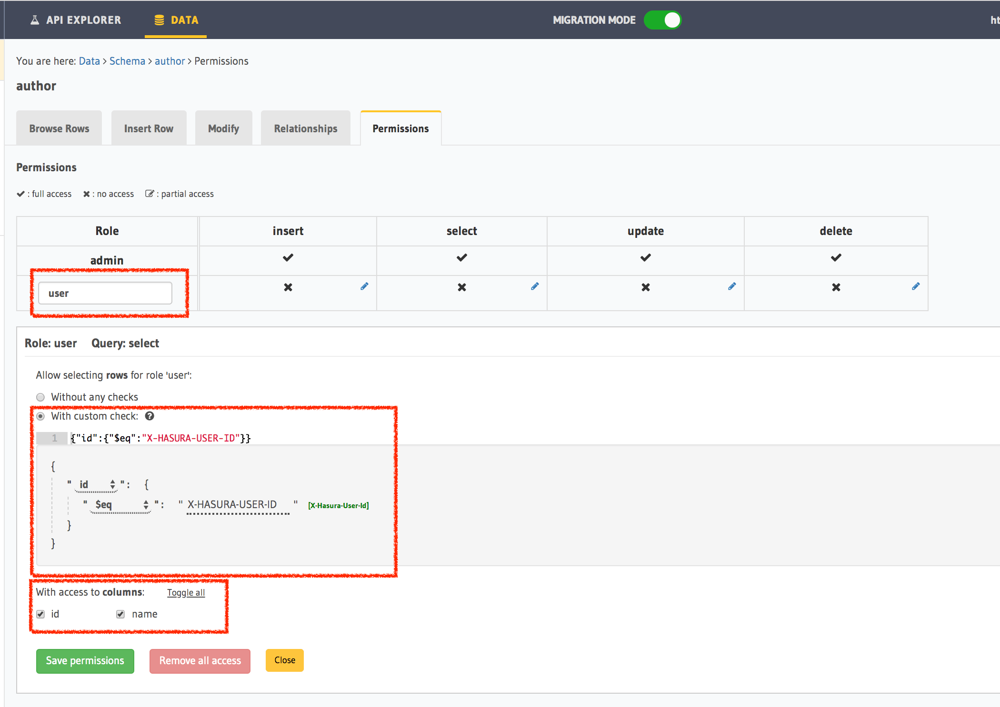
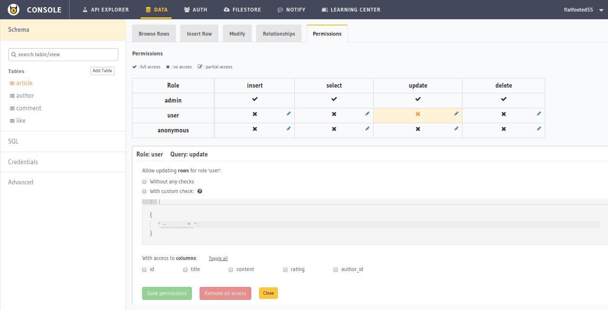
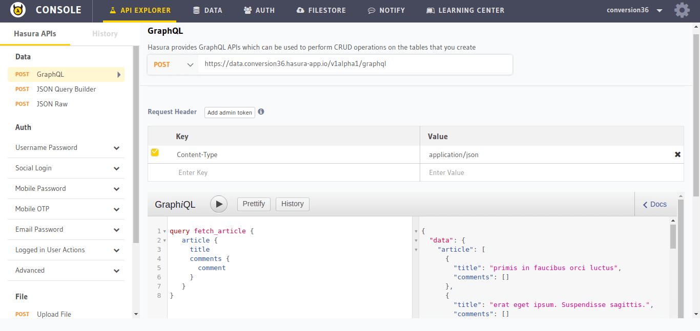

Access control basics
=====================

In this section, we're going to setup simple access control rules on a table. We're working with a simple
article, author schema where authors have some information stored about themselves in the author table and
articles written by an author are stored in an article table.

Create a author table
----------------------

Head to your console and create the author table the following columns:

+----------+--------+
| id       | integer|
+----------+--------+
| name     | text   |
+----------+--------+

Insert some sample data into the table:

+-------------+----------+
| **user_id** | **name** |
+-------------+----------+
| 1           |  john    |
+-------------+----------+
| 2           |  shruti  |
+-------------+----------+
| 3           |  celine  |
+-------------+----------+
| 4           |  raj     |
+-------------+----------+

Try out a query
---------------

.. code-block:: none

  query {
      author {
        id
        name
      }
  }

You'll see that this results in a respose that contains all the authors because by default the GraphQL query is
accepted with admin permissions.

Add a simple access control rule for a logged in user
-----------------------------------------------------

Let's say for our app, logged in users are only allowed to fetch their own data.

Let's add a **select** permission for the **user** role on the author table:

.. list-table::
   :header-rows: 1
   :widths: 15 20 25 40

   * - Table
     - Definition
     - Condition
     - Representation
         }

   * - author
     - user's own row
     - user-id is equal to ``id``
     -
       .. code-block:: json

          {
            "id": {
              "$eq": "X-Hasura-User-Id"
            }
          }

Now, let's make the same query as above but include the 2 dynamic authorization variables via request headers.
`X-Hasura-Role` and `X-Hasura-User-Id` which will automatically get used according to the permission rule we set up.

You can notice above, how the same query now only includes the right slice of data.

Adding permissions for insert, update, delete
---------------------------------------------

We can use the ``API console`` UI to add permissions for our tables. Head to *Data -> [table-name] -> Permissions* to
see/modify the permissions on the table.

**For example**, let's set the ``update`` permissions for ``user`` role on the ``article`` table:

The *Permissions* tab of the ``article`` table should look like this:

.. image:: ../../../img/platform/manual/graphql-tutorial/tutorial-permissions-tab.png

Click on the *Edit* icon next to the user/update cell. It should open up an edit section like this:

Now, set the permissions as described above. It should finally look like this:

.. image:: ../../../img/platform/manual/graphql-tutorial/tutorial-permissions-edit-filled.png

Hit *Save permissions* to save our changes.

Similary, set permissions for all the cases we have described above.

Once you have set the permissions, you can try the anonymous query to fetch the articles along with comments and it will work because we have set anonymous read permissions on all the tables:

Next: Customise Schema with Postgres Views
------------------------------------------

N
