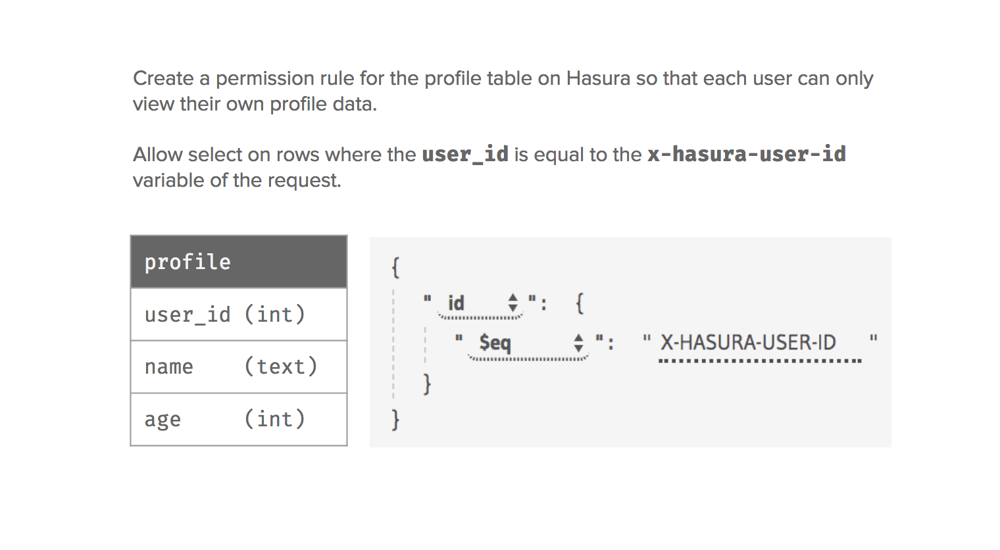
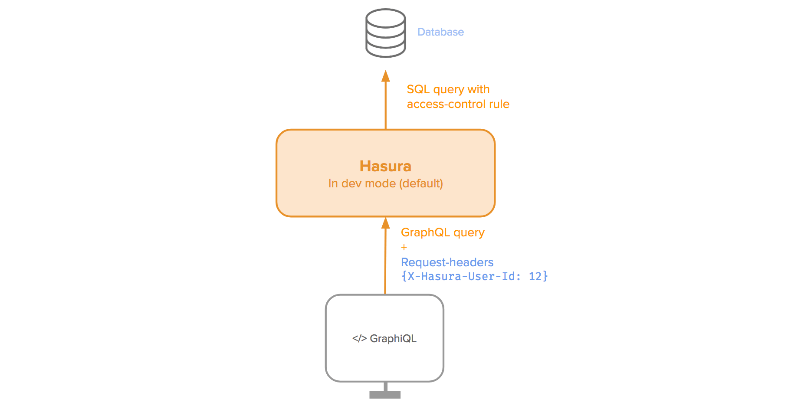
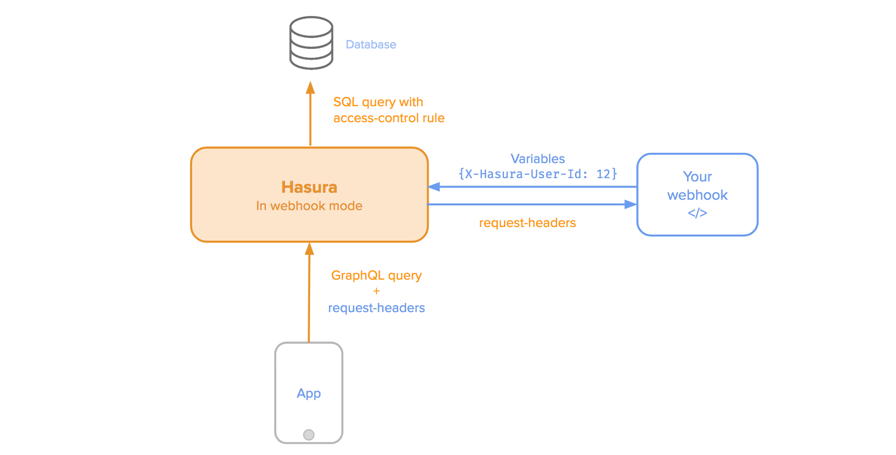

Autentication / Access control
==============================

Hasura helps you define granular access controls for every field in your GraphQL schema, basically every table or view in your postgres schema. These access control rules can use dynamic variables that come in with every request.

While developing, you can send variables as request headers directly.

However, in production, when your application is deployed, your app can't send these authorization variables directly!

Your app will likely only send an authorization token, or cookie that orginiated from your app's authentication system. In this case, when your app makes queries to Hasura, Hasura makes a request to a webhook with the request headers your app has sent (authorization tokens, cookies etc). Your webhook should then return an object of variables that will be provided as context to the access control rules.

Next, let's setup some :doc:`basic access control rules<basics>`.

See:
----

.. toctree::
   :maxdepth: 1

   basics
   roles-variables
   webhook
