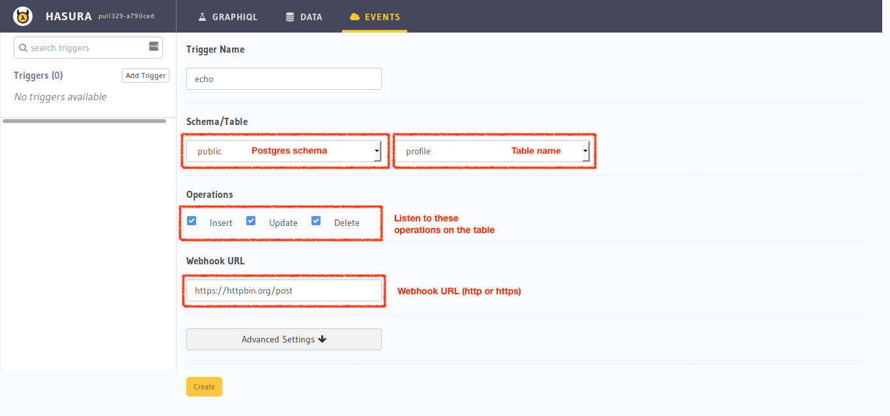

Creating an event trigger
=========================

Head to the Hasura console, click on events, click on create event-trigger.

Retry configuration
-------------------
Retry configuration is available in the "Advanced settings" option when you create a trigger.

1. ``num_retries``: This is the number of times a failed invocation is retried. The default value is 0.
2. ``retries``: This is the number of times a failed invocation is retried. The default value is 0.
