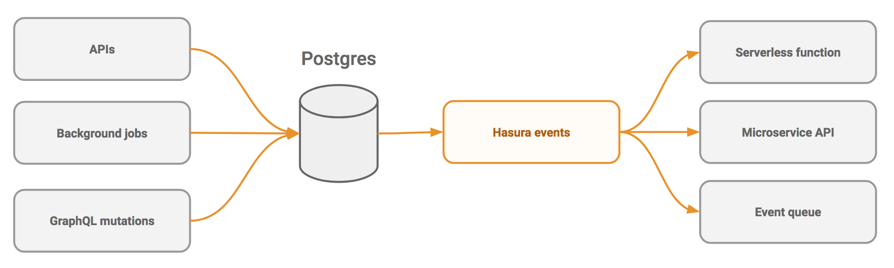

Event triggers
==============

You can create event triggers on tables in Postgres via Hasura. Event triggers will reliably capture
events happening on relevant tables and then call configured webhooks.

.. toctree::
   :maxdepth: 2
   :titlesonly:

   create-trigger
   payload
   tutorials
