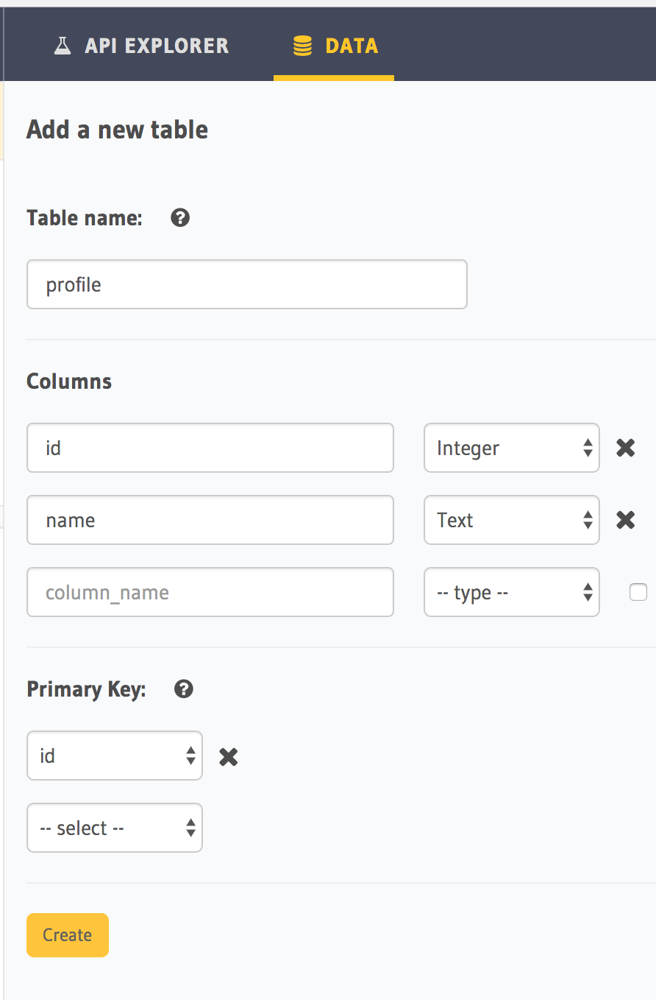
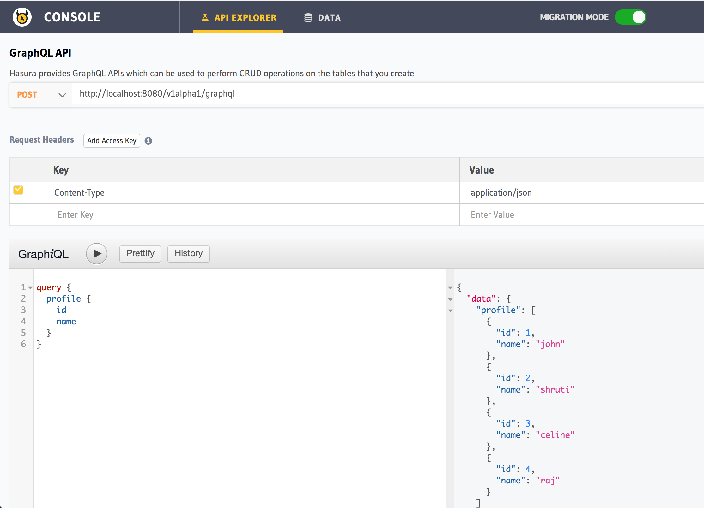

Making your first GraphQL query
===============================

Let's take a look at how to create tables using the Console, a UI tool meant for doing exactly this. We'll use a typical author/articles schema as a reference for all the following examples.

Open the console
----------------

Run the following command using the Hasura CLI tool.

.. code:: bash

   hasura console

Create a profile table
----------------------

Head to your console and create the author table the following columns:

+----------+--------+
| **profile**       |
+----------+--------+
| id       | integer|
+----------+--------+
| name     | text   |
+----------+--------+

Insert some sample data into the table:

+-------------+----------+
|      **id** | **name** |
+-------------+----------+
| 1           |  john    |
+-------------+----------+
| 2           |  shruti  |
+-------------+----------+
| 3           |  celine  |
+-------------+----------+
| 4           |  raj     |
+-------------+----------+

Try out a query
---------------

Head to the API explorer tab in the console and try running the following query in GraphiQL:

.. code-block:: none

  query {
      profile {
        id
        name
      }
  }

You'll see that you get all the responses!

Try out other GraphQL queries
-----------------------------

Explore GraphiQL via its autocomplete or its docs section to see other kinds of queries you can run.

To learn more:

- :doc:`Building your schema<../schema/index>`
- :doc:`Queries<../queries/index>`
- :doc:`Mutations<../mutations/index>`

