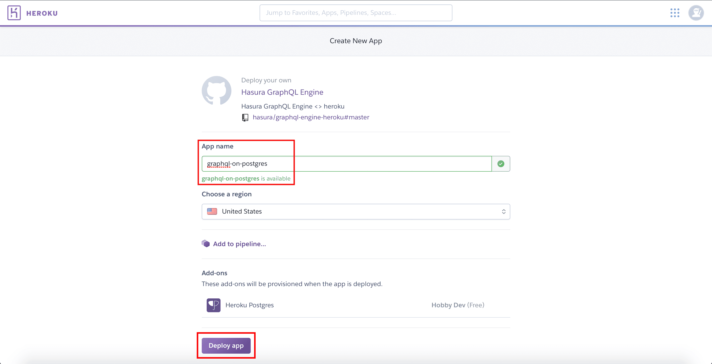
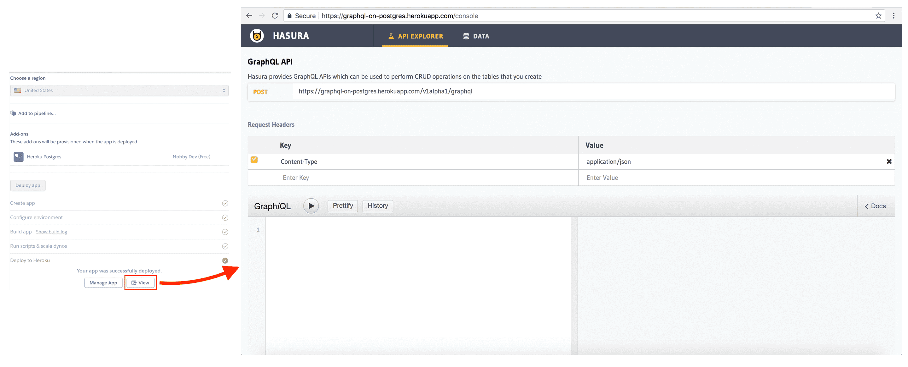
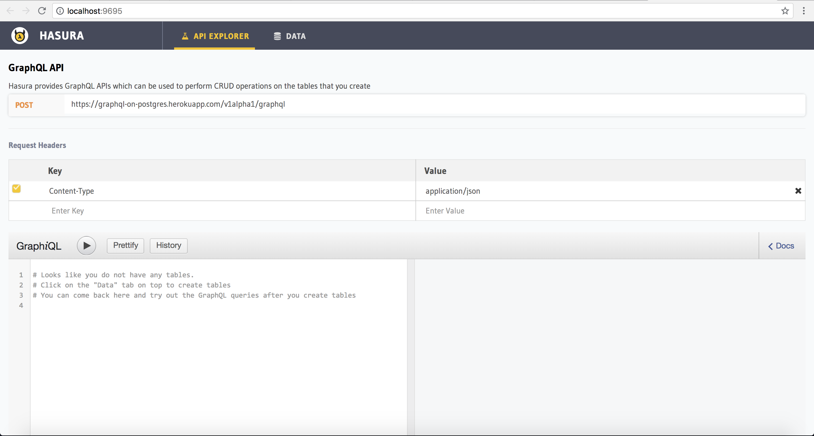

Run Hasura GraphQL Engine on Heroku (Simple)
============================================

This guide will help you get Hasura GraphQL engine and Postgres running on **Heroku's free tier**.
It is the easiest and fastest way of trying Hasura out if you don't have Docker!

Step 1: Deploy to Heroku & open your Heroku app
-----------------------------------------------

Deploy to Heroku by clicking:

.. image:: https://camo.githubusercontent.com/83b0e95b38892b49184e07ad572c94c8038323fb/68747470733a2f2f7777772e6865726f6b7563646e2e636f6d2f6465706c6f792f627574746f6e2e737667
  :width: 200px
  :alt: heroku_deploy_button
  :class: no-shadow
  :target: https://heroku.com/deploy?template=https://github.com/hasura/graphql-engine-heroku

**Note:** You might need to sign up on Heroku. You won't need a credit card, and once you sign up you'll be redirected to your Heroku app creation page.

Note that **Heroku's free Postgres add-on** is also automatically provisioned!

That's it!  Head to https://YOUR_HEROKU_APP.herokuapp.com and open your app.
You should see the Hasura GraphQL engine landing page!

Step 2: Download the Hasura CLI
------------------------------------------------------

Follow the instructions to download the Hasura CLI.

.. rst-class:: api_tabs
.. tabs::

   .. tab:: Mac

      In your terminal enter the following command:

      .. code-block:: bash

         curl -L https://cli.hasura.io/install.sh | bash

      This will install the ``hasura`` CLI in ``/usr/local/bin``. You might have to provide
      your ``sudo`` password depending on the permissions of your ``/usr/local/bin`` location.

   .. tab:: Linux

      Open your linux shell and run the following command:

      .. code-block:: bash

         curl -L https://cli.hasura.io/install.sh | bash

      This will install the ``hasura`` CLI tool in ``/usr/local/bin``. You might have to provide
      your ``sudo`` password depending on the permissions of your ``/usr/local/bin`` location.

   .. tab:: Windows

      .. note::

         You should have ``git bash`` installed to use ``hasura`` CLI. Download git bash using the following `(link)
         <https://git-scm.com/download/win>`_. Also, make sure you install it in ``MinTTY`` mode, instead on Windows'
         default console.

      Download the ``hasura`` installer:

      * `hasura (64-bit Windows installer) <https://cli.hasura.io/install/windows-amd64>`_
      * `hasura (32-bit Windows installer) <https://cli.hasura.io/install/windows-386>`_

      **Note:** Please run the installer as Administrator to avoid PATH update errors. If you're still
      getting a `command not found` error after installing Hasura, please restart Gitbash.

Step 3: Setup a Hasura project and open the console
---------------------------------------------------

Run the following commands which will result in having the Hasura console up:

.. code-block:: none

   hasura init --directory my-project --endpoint https://YOUR_HEROKU_APP.herokuapp.com/
   cd my-project
   hasura console

Your browser window should open up automatically at http://localhost:9695 with your Hasura console pointing to the
Heroku app where Hasura GraphQL engine is running!

Next: Make your first GraphQL query!
------------------------------------

Next, make your :doc:`first graphql query<first-graphql-query>`.
