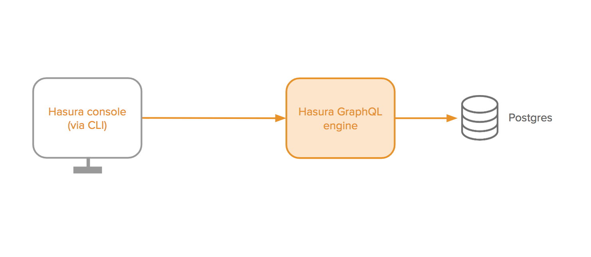

Getting started
===============

To use the Hasura GraphQL engine, you need to:

#. Run the Hasura GraphQL engine with access to a Postgres database
#. Use the Hasura console (an admin UI) that connects to the Hasura GraphQL engine to help you build your schema and
   run GraphQL queries

Choose a getting started guide:
-------------------------------

- :doc:`Using Heroku <heroku-simple>` **(recommended)**: Get started in under 60 seconds with no setup required to host the Hasura GraphQL engine and Postgres on Heroku's free tier.

  - Existing database: :doc:`Using an existing heroku database<../deployment/heroku/using-existing-heroku-database>`

- :doc:`Using Docker <docker-simple>`: Run a **local development** setup that sets up both the Hasura GraphQL
  engine and Postgres using Docker.

  - Existing database: :doc:`Run as a docker container and connect to existing postgres<../deployment/docker/index>`

.. toctree::
   :maxdepth: 2
   :titlesonly:
   :hidden:

   Heroku quickstart <heroku-simple>
   Docker quickstart <docker-simple>
   using-existing-database
   first-graphql-query
