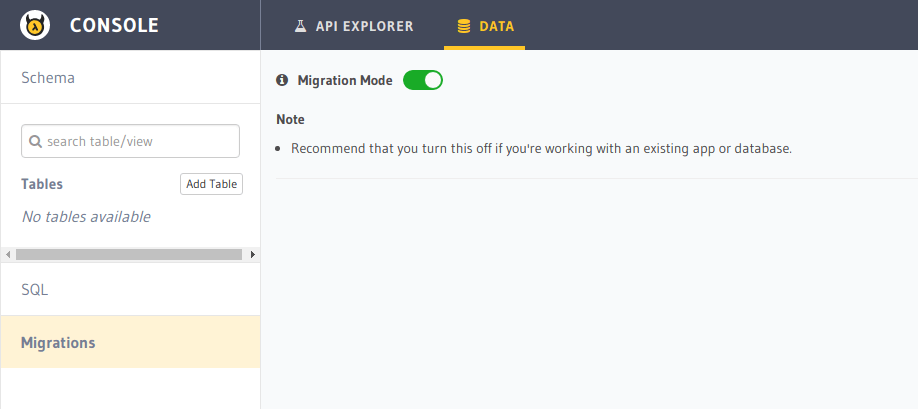

Migrations
==========

Hasura comes with powerful migration tooling to keep track of the changes being made to your database schema. These
can be used to quickly setup a clone of your database.

As you use the Hasura console UI to make changes to your schema, migration files are automatically generated
in the ``migrations/`` directory in your project.

You can also manually add or edit migration files and check them into version control as well.

No migrations mode
------------------

In case you do not want to allow any changes to be made to your Postgres schema using the Hasura console, you can toggle
the console to a "No migrations" mode which basically disables all functionalities which alter the schema.

To toggle the migrations mode, head to the ``Data -> Migrations`` section on the Hasura console.

