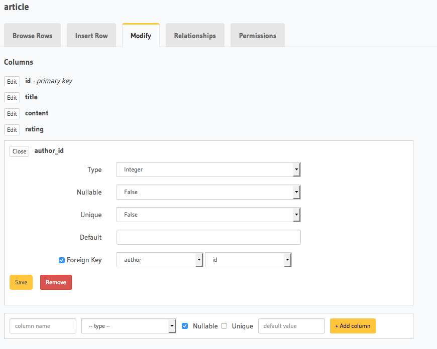
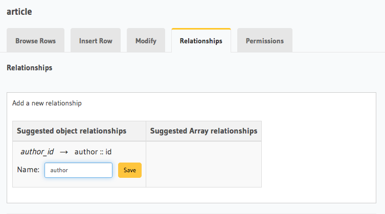

Relationships or connections between tables/views
=================================================
To make nested object queries, the tables/data in your database need to be connected using foreign-key constraints and relationships. So far, we've only created the two tables, ``author`` and ``article``. 

Add foreign-key constraint
--------------------------
In the console, navigate to the **Modify** tab of the ``article`` table. Edit the ``author_id`` column and configure it as a foreign-key for the ``id`` column in the ``author`` table.

Create 1:1 relationship
-----------------------
Each article has one author. This is an example of a 1:1 relationship a.k.a an *object* relationship. The console infers this and recommends potential relationships in the **Relationships** tab. Let's add a 1:1 relationship named *author* as shown here:

Please note that the name of the relationship will also be used to reference the nested object. For e.g. we can now run a nested object query that is based on just this one 1:1 relationship i.e. fetch a list of articles and each article's author:

.. graphiql::
   :query:
        query {
            article {
                id
                title
                author {
                    id
                    name
                }
            }
        }
   :response:
        {
            "data": {
                "article": [
                {
                    "id": 3,
                    "title": "some title",
                    "author": {
                    "name": "Derril",
                    "id": 28
                    }
                },
                {
                    "id": 4,
                    "title": "some title",
                    "author": {
                    "name": "Dreddy",
                    "id": 5
                    }
                },
                {
                    "id": 8,
                    "title": "some title",
                    "author": {
                    "name": "Bernhard",
                    "id": 6
                    }
                }
                ]
            }
        }

Create 1:many relationship
--------------------------
An author can write multiple articles. This is an example of a 1:many relationship a.ka. an *array* relationship. You add a 1:many relationship exactly how you add a 1:1 relationship in the console.

We can now run a nested object query that is based on this 1:many relationship i.e. fetch a list of authors and a nested list of each author's articles:

.. graphiql::
   :query:
        query {
            author {
                id
                name
                articles {
                    id
                    title
                }
            }
        }
   :response:
        {
            "data": {
                "author": [
                {
                    "id": 1,
                    "name": "Chrissie",
                    "articles": [
                    {
                        "id": 73,
                        "title": "some title"
                    },
                    {
                        "id": 87,
                        "title": "some title"
                    },
                    {
                        "id": 98,
                        "title": "some title"
                    }
                    ]
                },
                {
                    "id": 2,
                    "name": "Aubrey",
                    "articles": [
                    {
                        "id": 19,
                        "title": "some title"
                    }
                    ]
                },
                {
                    "id": 3,
                    "name": "Jane Doe",
                    "articles": []
                }
                ]
            }
        }

For a list of all the different types of queries you can make, please see :doc:`this <../queries/index>`.