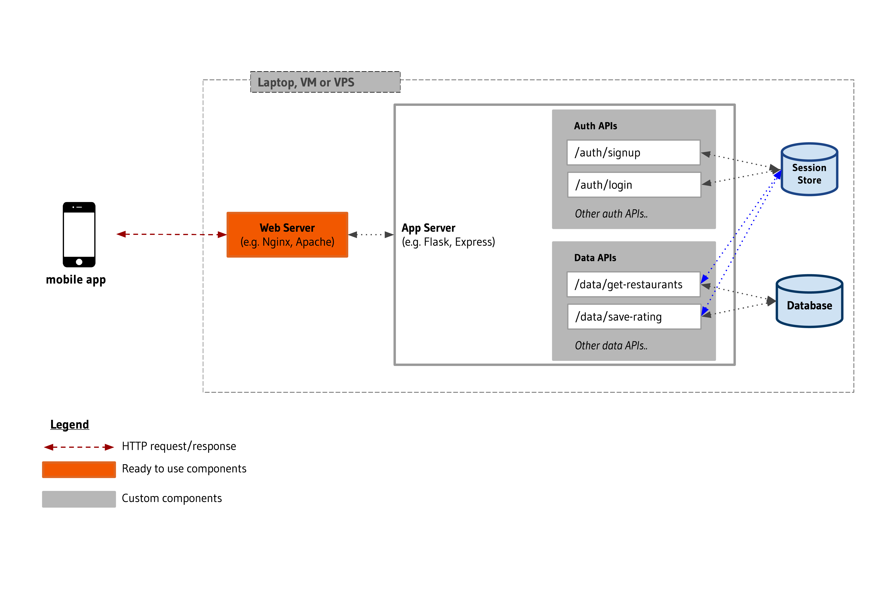
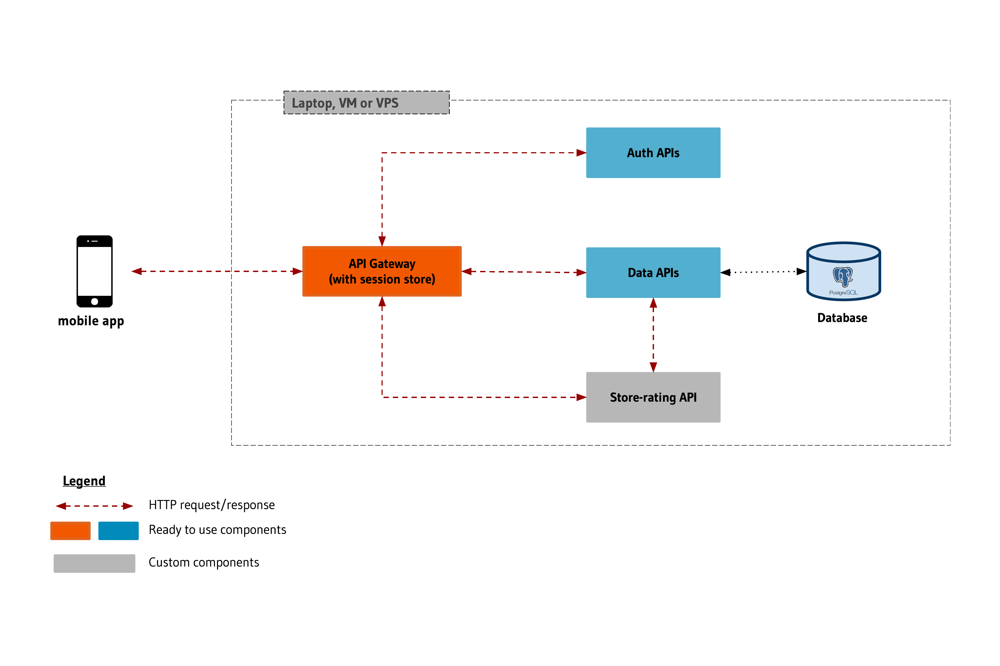
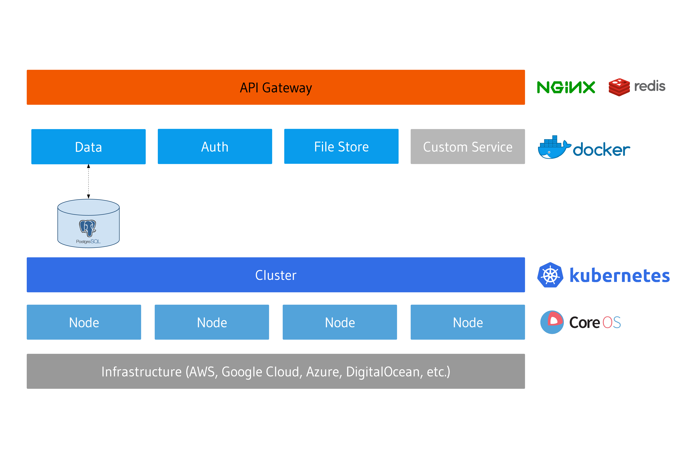

:orphan:

.. meta::
   :description: A guide to the understanding the architecture of applications built on the Hasura platform by comparing a reference app built with and without Hasura.
   :keywords: hasura, guide, architecture, app architecture
   :content-tags: app architecture, build apps

Application Architecture on Hasura
==================================

Introduction
------------
Hasura aims to provide the fastest way to build, deploy and manage a production application backend. To achieve this, Hasura provides a standardized architecture that is inherently secure, scalable and includes as much automation as possible. This brings predictability to the process of development, deployment and troubleshooting. To better understand the architecture, let's take a sample application as reference, and compare its architecture across the following 2 scenarios:

1. App built using a web framework like Django/Flask, Laravel, Spring, Ruby-on-Rails, etc.
2. App built using Hasura (with custom APIs in any language/framework)

Reference Application
---------------------

In this guide, we will use a simple restaurant rating mobile application (*like Yelp or Zomato*) as reference. It allows users to sign-up, log-in and rate restaurants on a scale of 1 to 5 stars. Given the scope of this guide, let's assume that the app displays the exact same list of restaurants, fetched from a database, to all users who can then rate any restaurant from that list.

Based on the above, the application backend will need the following components to serve the mobile app:

* **User management APIs:** A set of authentication APIs to allow users to sign up, log in, log out, etc.

* **Restaurant listing API:** An API that connects to a database, queries the list of restaurants and returns this list to the mobile app.

* **Restaurant rating API:** When users rate a restaurant on the app, the app contacts this API. The API also connects to the database and  stores ratings provided by users in the database.

Scenario-1: App architecture when built using a web framework 
-------------------------------------------------------------

The following is how the architecture for our reference application could look like when built using a web framework:

Notes
^^^^^

* Session management infrastructure is needed to authorize users to view the list of restaurants and submit a review over time.

* The dotted lines between data APIs and the session-store indicate the need for every API to implement its own session-resolution logic (translate auth token to ``user_id``/``role_id``. Centralized session management solutions can also be built, although they are hard to build and maintain.

* The session store in the above diagram may be implemented differently by using the application database itself, using an in-memory data store like redis or a combination of both.

* The above diagram is representative and the architecture for apps built this way could vary significantly.

Scenario-2: App architecture when built using Hasura
----------------------------------------------------

Every app built on Hasura largely adheres to the standard architecture show here:

.. rst-class:: featured-image

Notes
^^^^^

* The ready-to-use components shown above, API Gateway, Data & Auth APIs, the Postgres database, etc. are available out of the box with every Hasura project. In the context of our reference app, developers can write less code because:
	
  * The frontend uses the Auth APIs to allow users to sign up and log in.
  * The frontend also uses the Data API to fetch a list of restaurants to display to users.
  * The ``store-ratings`` custom API uses the Data API to store the ratings in the database.

* Code is  always deployed as independent components or services. This is applicable to both Hasura APIs and any custom code deployed on Hasura. This is why, compared to the previous section, you see HTTP calls between different components (e.g. between the ``store-rating`` API and the Data API. 

  .. admonition:: Note

	 Developers are free to choose the extent of breaking down app functionality into individual services. It is possible to deploy the entire set of custom services needed for an application as a single service.

* Auth/sessions are centralized & abstracted out into an API gateway, the single point of ingress into the platform. The gateway resolves session tokens into ``User`` and ``Role`` IDs, that are then forwarded to upstream services.

* Postgres is available as the only database that is completely managed by the platform. This allows the platform to handle database operations like handling data persistence, back-up & recovery, etc. The Hasura Data API also works exclusively with PostgreSQL.

* The custom service shown above is technically not needed - the Data API could have handled this use-case as well.

Comparison of the two architectures
-----------------------------------

* **Reusability and writing less code:** In the Hasura architecture, the two most basic components needed in most applications i.e. Data, and Auth APIs are carved out as independent services and session management is handled centrally. These functions can now be reused by custom services. For e.g. a new custom service need not authenticate a user as the API Gateway handles this. In contrast, apps built in the traditional way will have to repeat functionality or custom solutions to enable this kind of reusability will have to be built and maintained. The services based architecture, popularly called as *Microservices Architecture*, also encourages reusability across custom features.

* **Infrastructure dependency & Scalability:** Given the popularity of public cloud infrastructure, the natural method for handling more traffic for an application is adding more resources like virtual machines to the infrastructure the app is deployed on (a.k.a *scaling out* or *horizontal scaling*).

  * In the first method of building apps, manual intervention is needed to prepare this additional infrastructure like installing the OS, dependencies, copying the app code etc. So, you cannot have *intelligent* rules like '*If CPU utilization goes above 70%, add more resources*' unless you invest in some degree of automation. There are features provided by some cloud providers like AWS, etc. that let you achieve the same, but you risk being dependent on the provider when there are infrastructure agnostic options available. 

  * Hasura, while managing the life-cycle of deployed services create an abstraction between services and the underlying infrastructure. Services can be scaled independently and configured to use whatever infrastructure is available, without being directly coupled with any of the resources.

* **Project Config and Installation**: Continuing the above point about infrastructure dependency, Hasura takes advantage of the abstraction over infrastructure to encapsulate the entire application backend in a single configuration file. This project configuration file can be used to bring up a replica of an application backend on any infrastructure with a couple of clicks. This can be used to quickly set up a fresh development or staging environment. On the other hand, in the fist scenario, every underlying component or code will have to be sequentially installed or copied. Additional effort is also needed to migrate the state of the application(e.g. modified schema in the database).

* **Security:** With ad-hoc architectures, security is an additional task and highly dependent on developers. For example, in the first case, a developer could accidentally leave the database or an unused port publicly exposed, creating a serious vulnerability. In Hasura's case, access to services is strictly controlled as the platform manages the lifecycle of services, with the API Gateway being the only point of entry for HTTP services. Access to underlying components/services like Postgres, etc. is provided via SSH only (*encrypted and authenticated*). 

.. admonition:: Note

   Web frameworks like Flask, Express, Ruby-on-Rails etc. can be used for services deployed on Hasura. However, using features like ORM or Authentication modules may reduce the gain from the way the corresponding Hasura features interact with each other and come together in the overall architecture. 

Advanced
--------

Additional information about the Hasura platform and underlying components:

* **Microservices architecture:** All Hasura services are available as independent microservices and developers are encouraged to deploy their application as a set of microservices. Services in Hasura are exposed by the API gateway over HTTPS.

* **Deployment using containers:** Code, including Hasura microservices, is deployed as `Docker <https://www.docker.com/what-docker>`_ images only. The Docker based services are orchestrated using `Kubernetes <https://kubernetes.io/>`_. `CoreOS <https://coreos.com/products/container-linux-subscription/>`_ is used as the operating system when installed on a cloud and a `MiniKube <https://github.com/kubernetes/minikube>`_ fork is used as the base in local-development mode.

Based on the above, the following is a more detailed visualization of Hasura's architecture:

.. Add a section for additional reading
