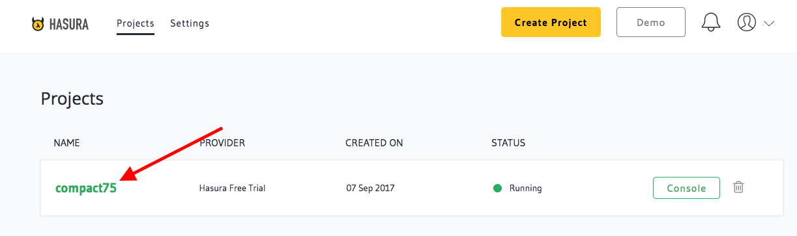
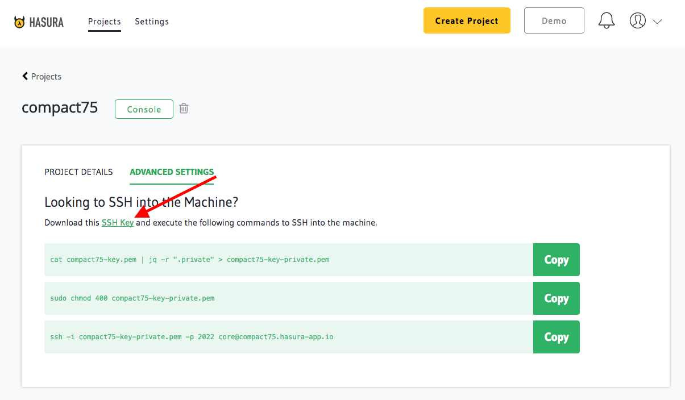

SSH access to your cluster
==========================

For those times where you just need to SSH into your cluster, Hasura allows you
access through an ssh key you can download from your project Dashboard.

Click on your project name on the `Hasura Dashboard <https://dashboard.hasura.io/project>`_

.. rst-class:: featured-image

Now download the ssh-key provided

.. rst-class:: featured-image

After downloading the ssh-key, use jq to parse the json to create a pem file

.. code::

    $ cat compact75-key.pem | jq -r ".private" > compact75-key-private.pem

(Replace compact75 here with your project-name)

Now change the permissions to the private key to 400

.. code::

    $ sudo chmod 400 compact75-key-private.pem

(Replace compact75 here with your project-name)

You can now directly ssh into your server using 

.. code::

    $ ssh -i compact75-key-private.pem -p 2022 core@compact75.hasura-app.io 

(Replace compact75 here with your project-name)

Since the Hasura platform runs on Kubernetes managed Docker containers, you
cannot directly use this to change your services/data on the machine.
