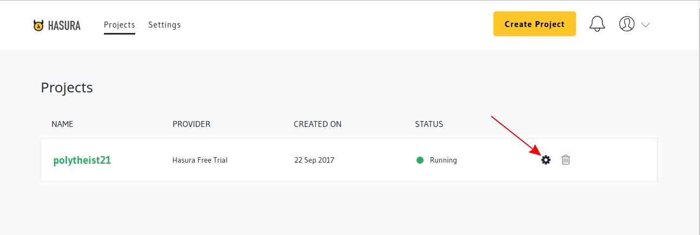
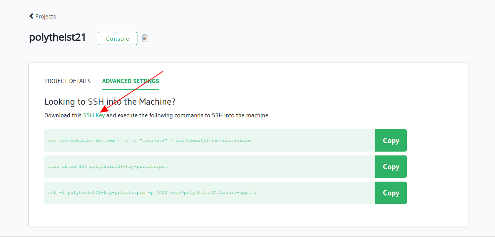

SSH access to your cluster
==========================

For those times where you just need to SSH into your cluster, Hasura allows you
access through an ssh key you can download from your project Dashboard.

Click on the settings icon next to your project name on the `Hasura Dashboard <https://dashboard.hasura.io/projects>`_

.. rst-class:: featured-image

Now go to the Advanced Settings tab

.. rst-class:: featured-image
.. image:: ../img/dashboard-ssh-2.png
   :scale: 50%

Now download the ssh-key using the link

.. rst-class:: featured-image

After downloading the ssh-key, use jq to parse the json to create a pem file

.. code::

    $ cat polytheist21-key.pem | jq -r ".private" > polytheist21-key-private.pem

(Replace polytheist21 here with your project-name)

Now change the permissions to the private key to 400

.. code::

    $ sudo chmod 400 polytheist21-key-private.pem

(Replace polytheist21 here with your project-name)

You can now directly ssh into your server using 

.. code::

    $ ssh -i polytheist21-key-private.pem -p 2022 core@polytheist21.hasura-app.io 

(Replace polytheist21 here with your project-name)

Since the Hasura platform runs on Kubernetes managed Docker containers, you
cannot directly use this to change your microservices/data on the machine.
