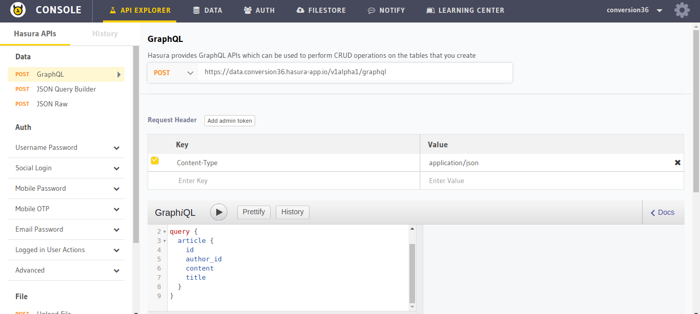
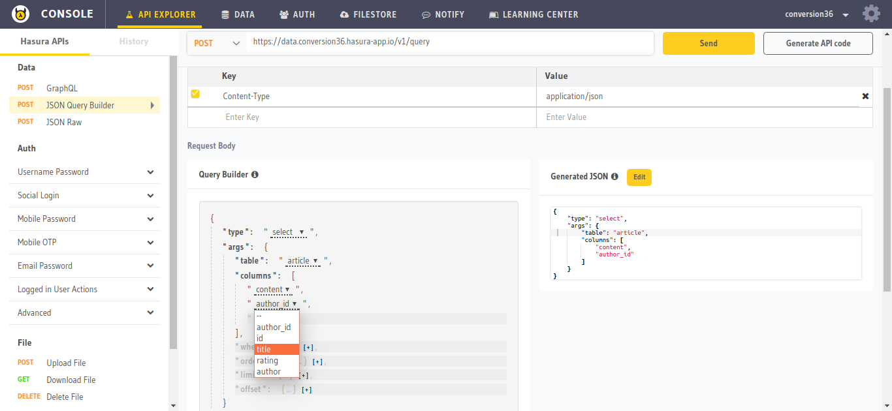
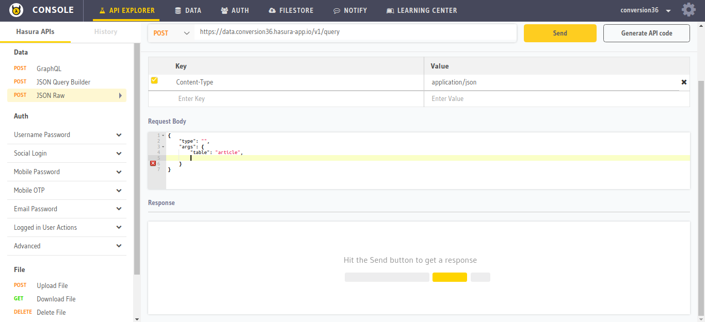
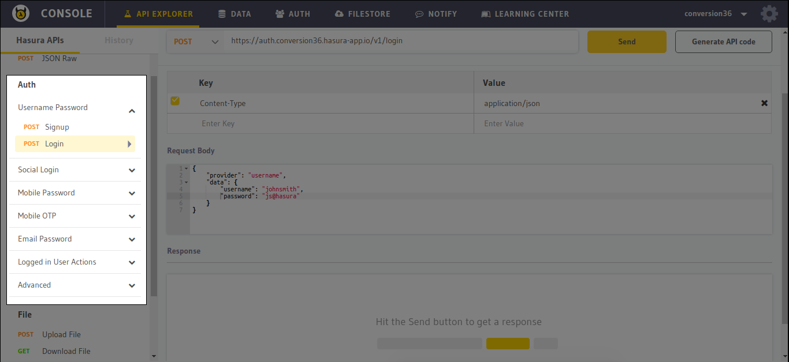
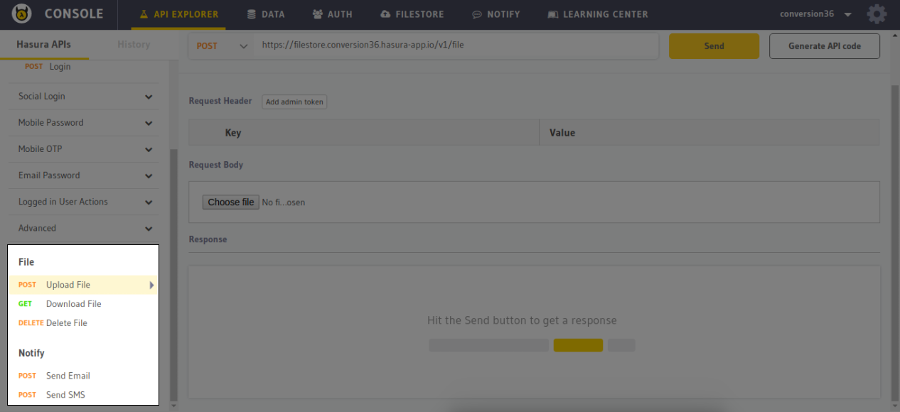
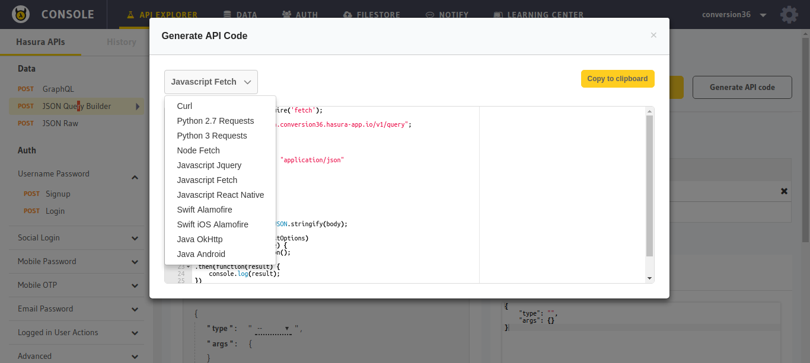

Hasura API Console: API-Explorer
================================

If you are using Hasura APIs like Data, Auth, Filestore and Notify,
use the API explorer section of the :doc:`API console <index>` to try out and explore the Hasura APIs.

GraphiQL
--------

The API-Explorer features `GraphiQL <https://github.com/graphql/graphiql>`_ which is an in-browser IDE for exploring the GraphQL APIs. It helps you build and try out GraphQL queries and mutations seamlessly.

JSON Query Builder
------------------

JSON query builder is a UI to build and try JSON queries for Hasura data APIs. To use to the ``JSON query builder``, select it from the left panel.

JSON Raw
--------

If you want to try custom queries, or want to use the API-Explorer as an HTTP client, you can use the ``JSON Raw`` feature. Select it from the left panel.

Auth APIs
---------

You can explore all the different auth APIs in the API Explorer.

Filestore and Notify APIs
-------------------------

The API Console can be used to upload/download files to your database using the filestore APIs. Also, you can send emails and SMS using the Notify APIs.

Generate API Code
-----------------

The API Explorer comes with an in-built code generator that converts the chosen API to a code snippet in your desired language. Select an API of your choice and click on the ``Generate API Code`` button next to the ``Send`` button.

