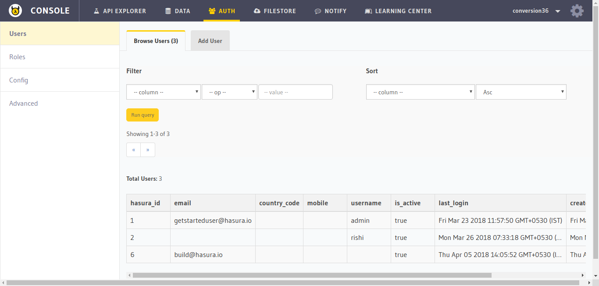
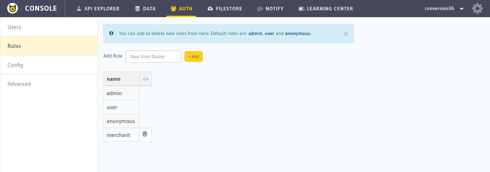
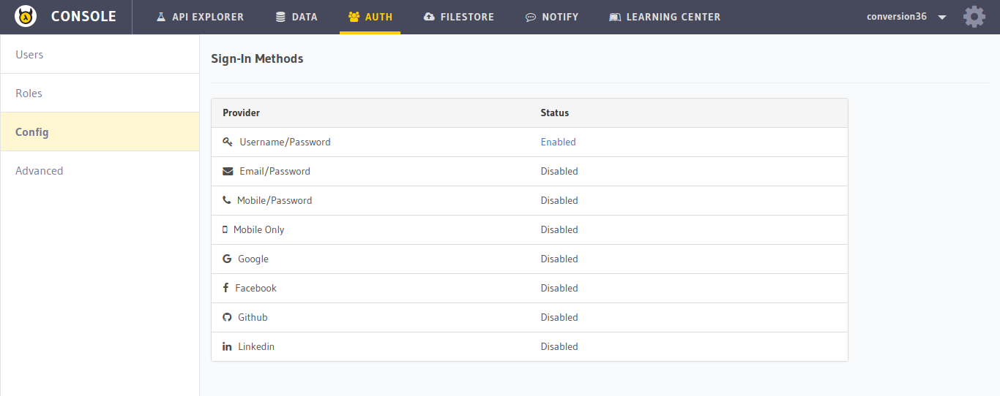
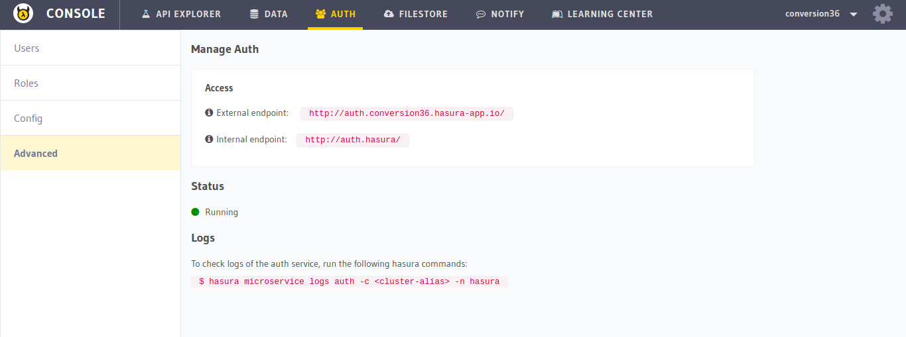

Hasura Api Console: Auth
========================

In this section, you will get a quick overview of the ``AUTH`` section of the :doc:`API console <index>`. Go to the ``AUTH`` tab on the top to navigate to this section.

Manage users
------------

You can add, manage and delete users in the ``Users`` section.

Roles
-----

You can create, assign, unassign and delete roles from this section. Select the ``Roles`` section on the left panel to navigate here.

Config
------

In this section, you can ``view`` your auth config. To edit the config, check the :doc:`auth config docs <../auth/authentication/providers/configure-auth-methods>`.

Advanced
--------

To view the endpoints and status of the ``auth`` microservice, select the ``Advanced`` section from the left panel.

