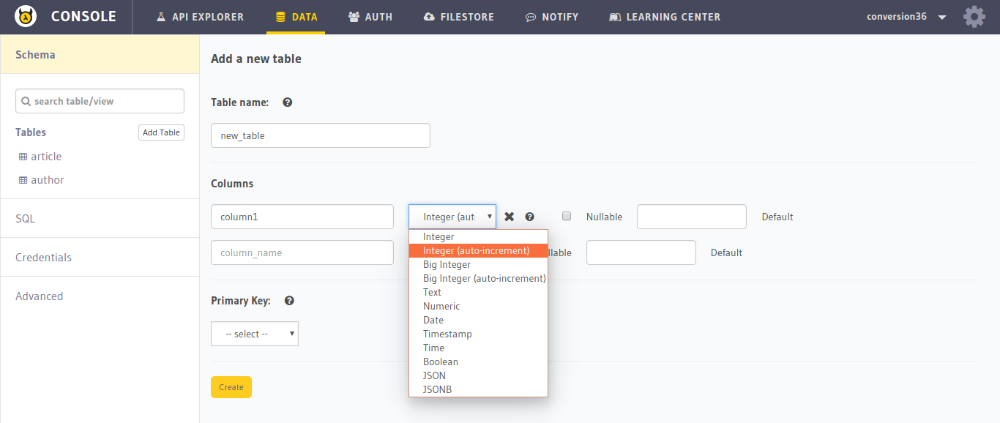
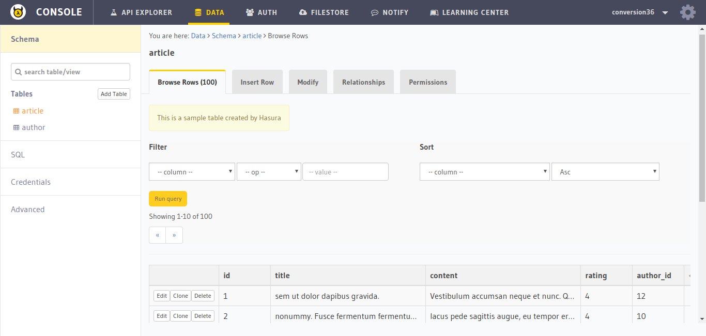
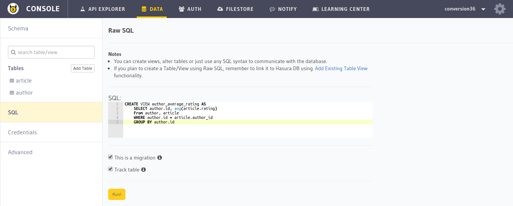
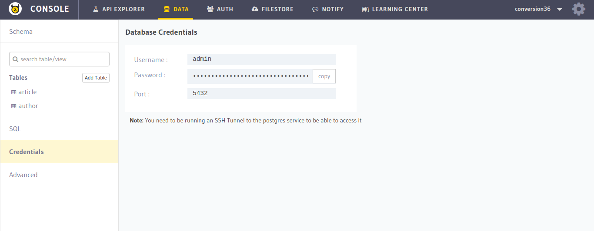
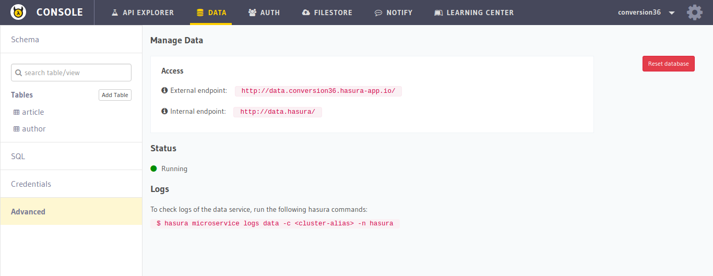

Hasura Api Console: Data
========================

In this section, you will get a quick overview of the ``DATA`` section of the :doc:`API console <index>`. Go to the ``DATA`` tab on the top to navigate to this section.

Create Table
------------

To create a table, just click on the ``Create Table`` button.

View Table
----------

To view, manage and delete a table, choose the table from the left panel.

SQL
---

If you want to run SQL queries over your database, you can select the ``SQL`` section in the left panel.

.. admonition:: Note

  Check the ``This is a migration`` checkbox if you want to generate :ref:`migration <schema_migrations>` files related to your SQL query.

Credentials
-----------

If you need your ``Postgres`` credentials to access your database, go to the ``Credentials`` section on the left.

Advanced
--------

To reset your database or view the status and endpoints of the ``data`` microservice, go to the ``Advanced`` section.

