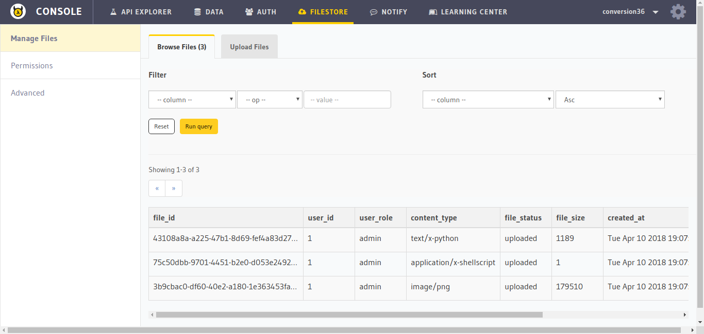
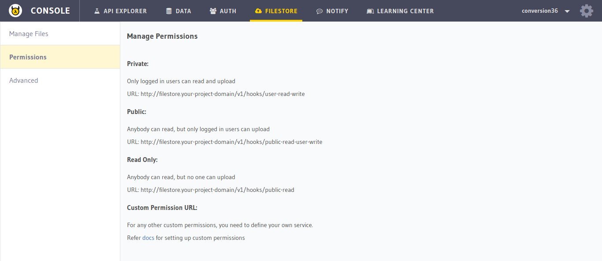
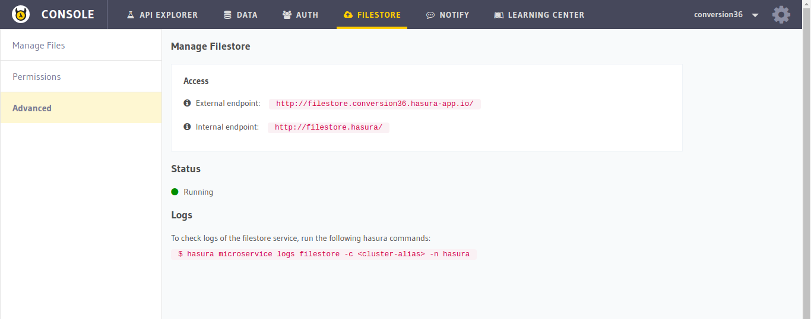

Hasura Api Console: Filestore
=============================

In this section, you will get a quick overview of the ``FILESTORE`` section of the :doc:`API console <index>`. Go to the ``FILESTORE`` tab on the top to navigate to this section.

Manage Files
------------

You can upload, download, manage and delete files in your database in this section.

Permissions
-----------

Know about filestore permissions in the ``Permissions`` section.

Advanced
--------

To view the status and endpoints of the ``filestore`` microservice, go to the ``Advanced`` section.

