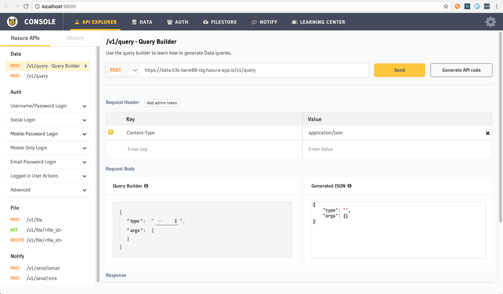

.. _api_explorer:

Hasura API Console
==================

The Hasura API console is an easy-to-use UI that lets you explore the Data, Auth, Filestore and Notify Hasura APIs on a cluster and also lets you manage the data & configuration of these microservices.

To open the API console, ``cd`` into the project directory and run:

.. code-block:: bash

  $ hasura api-console # optionally -c <cluster-alias>

This will run a local server on your system and will open up the api console in a browser window at `http://localhost:9695 <http://localhost:9695>`_. The API explorer section of the console will be open by default.

API explorer
------------

If you are using Hasura APIs like Data, Auth, Filestore and Notify,
use the API explorer to try out and explore the Hasura APIs.

.. note::

  The API console also allows you to generate API client code. For eg: you can
  easily export a sample ``curl`` command for an API request you make from the
  API explorer.
