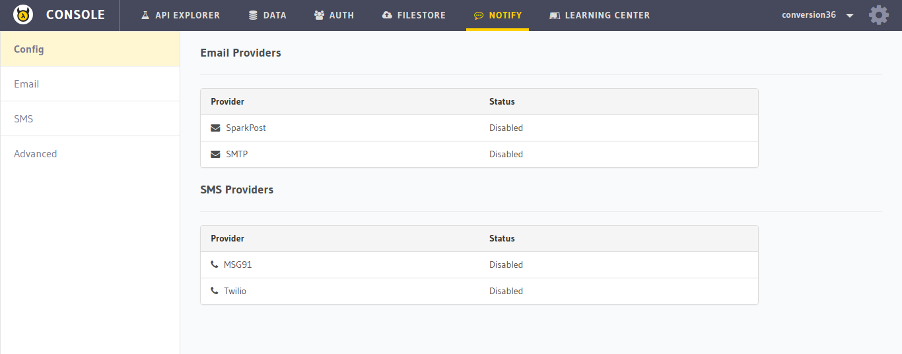
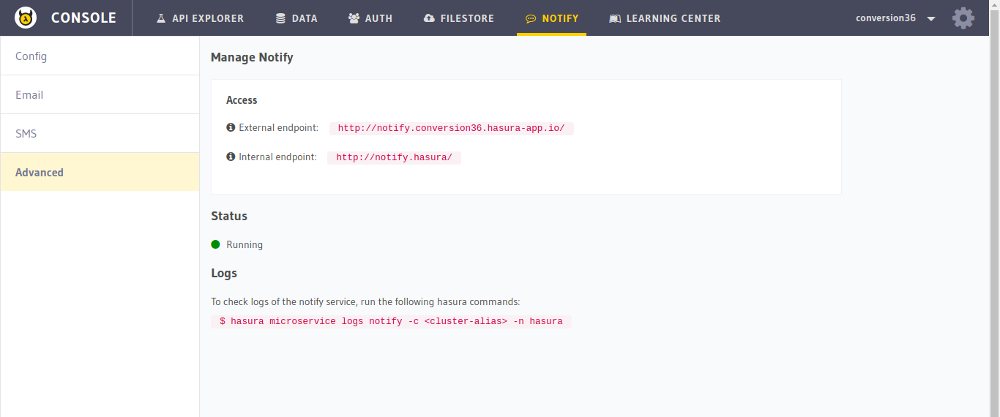

Hasura Api Console: Notify
==========================

In this section, you will get a quick overview of the ``NOTIFY`` section of the :doc:`API console <index>`. Go to the ``NOTIFY`` tab on the top to navigate to this section.

Config
------

You can ``view`` the notify configuration in this section. To edit the notify conf, check the :ref:`notify docs <hasura-notify>`.

Advanced
--------

To view the status and endpoints of the ``notify`` microservice, go to the ``Advanced`` section.

