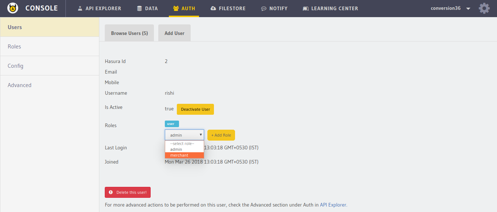

Assigning roles to users
==========================

A user can be assigned roles. This can only be done by the admin user.

To add a role to a user, make a request to ``/admin/user/add-role``
endpoint.

.. code-block:: http

   POST auth.<cluster-name>.hasura-app.io/admin/user/add-role HTTP/1.1
   Content-Type: application/json

   {
     "role" : "merchant",
     "hasura_id": 2
   }

You can also do this from the :doc:`API console <../../api-console/index>`.

1. Go to the ``Auth`` section on top and click on the ``Browse Users`` tab.

2. Click the user that you wish to assign a role.

