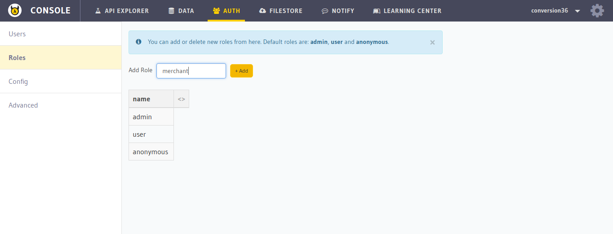

Creating user roles
===================

Creating roles can be done by users having ``admin`` roles.

To create a role, make a request to the ``/admin/create-role`` endpoint.

.. code-block:: http

   POST auth.<cluster-name>.hasura-app.io/admin/create-role HTTP/1.1
   Content-Type: application/json

   {
     "role" : "merchant"
   }

You can also do this from the :doc:`API console <../../api-console/index>`. Go to the ``auth`` tab on top and click on ``Roles`` on the left panel.

