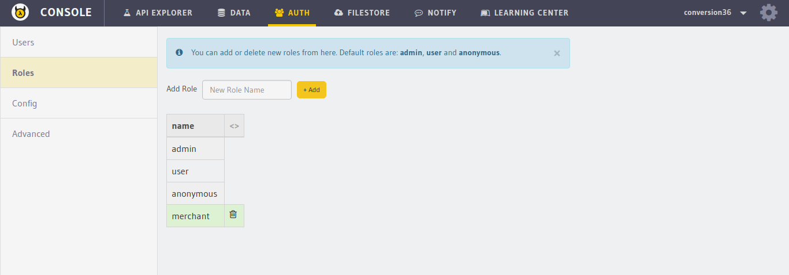

Deleting user roles
===================

Deleting roles can be done by users having the ``admin`` role.

To delete a role, make a request to the ``/admin/delete-role`` endpoint.

.. code-block:: http

   POST auth.<cluster-name>.hasura-app.io/admin/delete-role HTTP/1.1
   Content-Type: application/json

   {
     "role" : "merchant"
   }

You can also do this from the :doc:`API console <../../api-console/index>`. Go to the ``auth`` tab on top and click on ``Roles`` on the left panel.

.. note::

   You cannot delete the default roles, ie: ``anonymous``, ``user`` and ``admin``, from the system.
