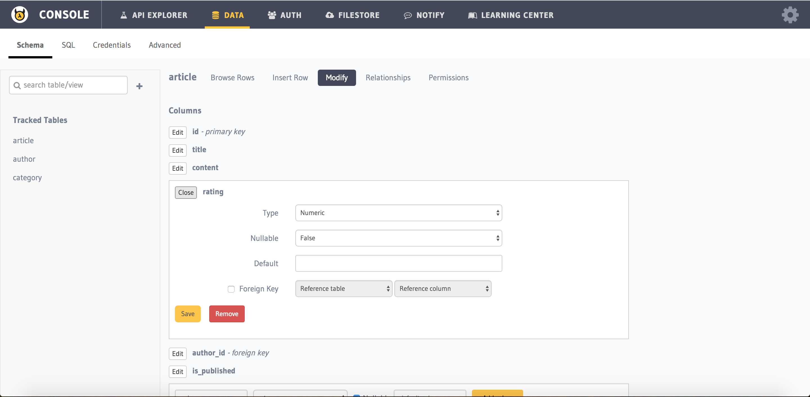
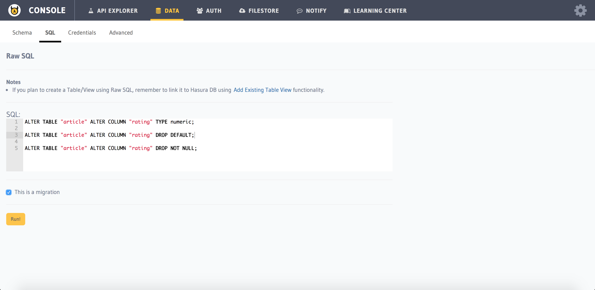

Altering a Column
=================

You can alter a column's type, default value and Nullable property via multiple ways.

**1. Using the console UI - Modify page of a table**

Head to ``Data > Schema > [table-name] > Modify`` section of :doc:`API console <../../api-console/index>`.
Click on ``Edit`` for the column you want to alter.

**2. Using the console UI - SQL page**

You can also alter column using SQL by heading to ``Data > SQL`` section in the console.

.. note::
      You should click on ``This is a migration`` option before executing the query if you want to retain the migration.

**3. Using the API:**

.. code-block:: http

      POST data.<cluster-name>.hasura-app.io/v1/query HTTP/1.1
      Authorization: Bearer <auth-token> # optional if cookie is set
      X-Hasura-Role: admin
      Content-Type: application/json

      {
            "type" : "run_sql",
            "args" : {
                "sql" : "ALTER TABLE article
                     ALTER COLUMN rating TYPE numeric;"
            }
      }

.. note::
      You cannot retain the query as a migration using the API