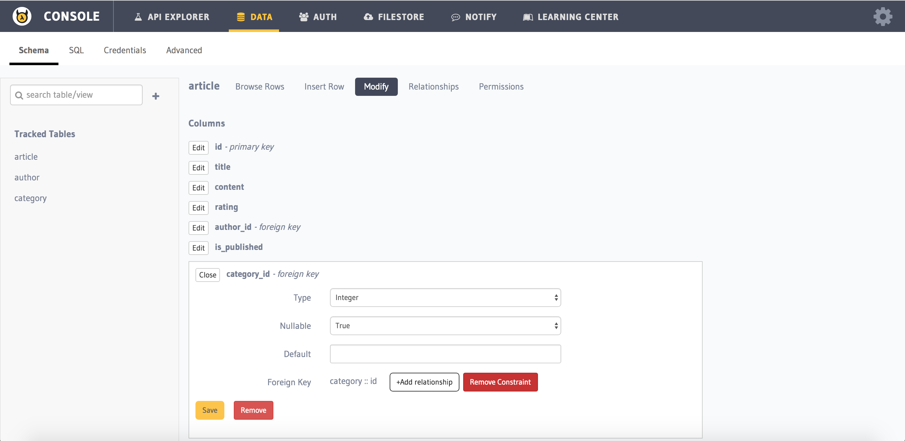

Deleting a Foreign Key
----------------------

You can delete Foreign key constraints via

**1. Using the console UI - modify page**

You can remove a foreign key constraint by heading to ``Data > Schema > [table-name] > Modify`` section in the :doc:`API console <../../api-console/index>`. Click on ``Edit`` for the column you want to alter and then click on ``Remove constraint`` button and confirm the foreign key removal.

**2. Using the API to delete a ``foreign key`` constraint:**

.. code-block:: http

      POST data.<cluster-name>.hasura-app.io/v1/query HTTP/1.1
      Authorization: Bearer <admin-token>
      Content-Type: application/json

      {	
    		"type" : "run_sql",
    		"args" : {
    			"sql" : "ALTER TABLE article 
    					DROP CONSTRAINT article_category_id_fkey;"
    		}
      }

.. note::
      You cannot retain the query as a migration using the API

**3. SQL page of API console UI:**

You can also run the above SQL by heading to ``Data > SQL`` section in the console.

.. note::
      You should click on ``This is a migration`` option before executing the query if you want to retain the migration.