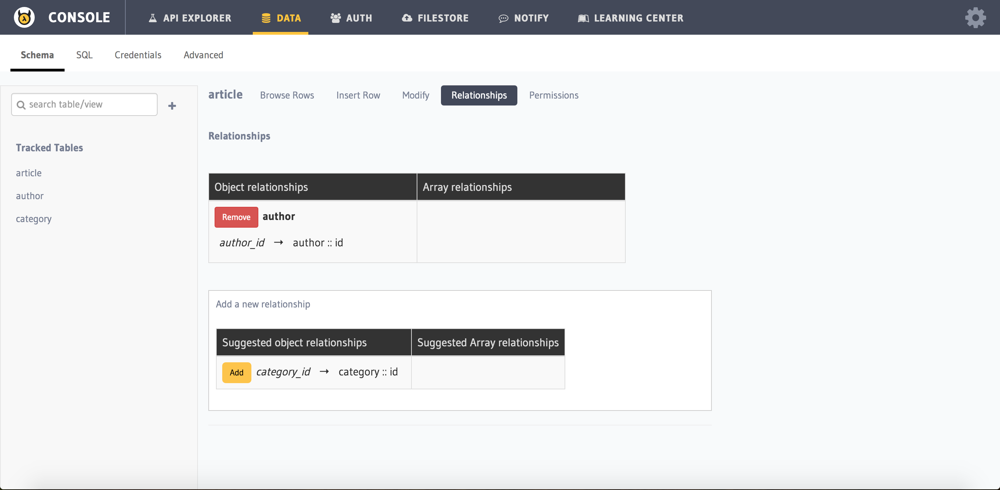

Deleting a Relationship
-----------------------

You can delete a ``relationship`` via the :doc:`API console <../../api-console/index>` or via the API.

**1. Using the console UI - Relationships page**
	
You can remove a relationship by heading to ``Data > Schema > [table-name] > Relationships`` section in the API console. Just click on ``Remove`` button and confirm the removal.

.. note::
      You can also see Suggested relationships in the UI. That's the easiest way to quickly add a relationship. The suggested relationship is determined by the foreign key definition across the tables.

**2. Using the API to delete a ``relationship``:**

.. code-block:: http

      POST data.<cluster-name>.hasura-app.io/v1/query HTTP/1.1
      Authorization: Bearer <admin-token>
      Content-Type: application/json

      {
      	"type" : "drop_relationship",
      	"args" : {
      		"table" : "article",
      		"relationship" : "author"
      	}
      }

In this case, we are removing a relationship from ``article`` table which was pointing to author table. (using author_id column). Once you have removed a relationship, it will come back to Suggested relationship section of the Relationships section.