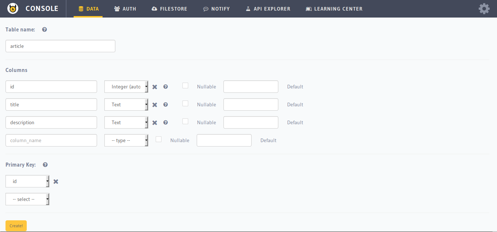
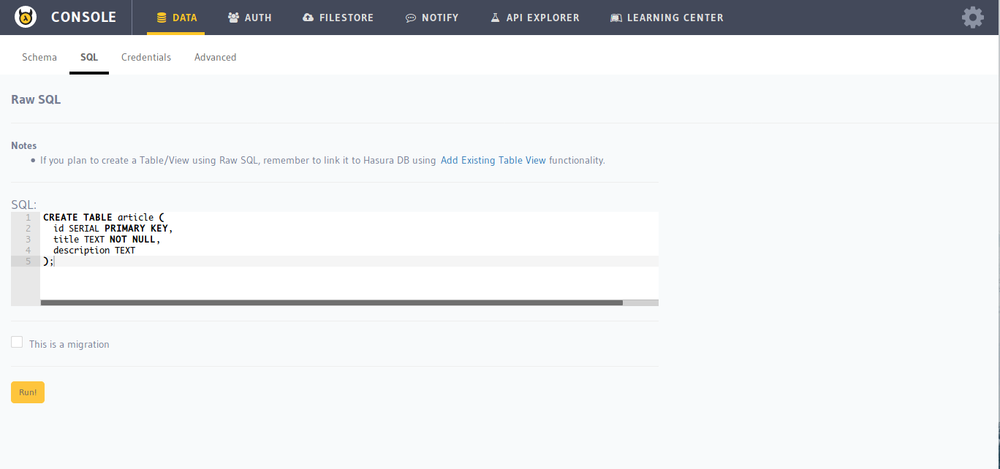

.. Hasura Platform documentation master file, created by
   sphinx-quickstart on Thu Jun 30 19:38:30 2016.
   You can adapt this file completely to your liking, but it should at least
   contain the root `toctree` directive.

.. _data-create-tables:

Creating a table
================

To add/create a new table in the database, the following options are available:

Using the console UI
--------------------

First launch the API console:

.. code-block:: bash

  $ hasura api-console

This will open the API console. Head to ``Data > Schema``.

Using SQL
---------

You can also create tables using SQL by heading to ``Data > SQL`` section in the API console.

.. note::

  You should click on ``This is a migration`` option before executing the query if you want to retain the query as a database migration.

Using the API
-------------

.. code-block:: http

  POST data.<cluster-name>.hasura-app.io/v1/query HTTP/1.1
  Authorization: Bearer <auth-token> # optional if cookie is set
  X-Hasura-Role: <role>  # optional. Required if request needs particular user role
  Content-Type: application/json

  {
      "type" : "run_sql",
      "args" : {
          "sql" : "CREATE TABLE article (
                       id SERIAL NOT NULL PRIMARY KEY,
                       title TEXT NOT NULL,
                       description TEXT
                   );"
      }
  }

