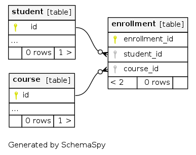

==========================
Many-to-many relationships
==========================

A many-to-many relationship is a type of cardinality that refers to the relationship between two tables **A** and **B** in which **A** may contain a parent instance for which there are many children in **B** and vice versa.

The best example of a many-to-many relationship is the relationship between ``students`` and ``courses``. A ``student`` could have enrolled in multiple ``courses`` and a ``course`` could have multiple ``students`` enrolled.

Lets try to create a many to many relationship between the ``student`` table and the ``course`` table:

Creating a many-to-many relationship
~~~~~~~~~~~~~~~~~~~~~~~~~~~~~~~~~~~~

#. :ref:`Create a table <data-create-tables>` named ``enrollment`` with ``student_id`` and ``course_id`` fields.
#. :ref:`Create a many-to-one relationship <many_to_one>` from the ``student`` and ``course`` tables to the ``enrollment`` table.
#. :ref:`Create a one-to-many relationship <one_to_many>` from the ``enrollment`` table to the ``student`` and ``course`` tables.

Fetching over a many-to-many relationship
~~~~~~~~~~~~~~~~~~~~~~~~~~~~~~~~~~~~~~~~~

To fetch the list of all ``students`` along with the ``courses`` they are enrolled in, the query will look something like:

.. rst-class:: api_tabs
.. tabs::

   .. tab:: GraphQL

      .. code-block:: none

         query fetch_students {
            student {
                id
                student_enrollments {
                    course_enrolled
                }
            }
         }

   .. tab:: JSON API

      .. code-block:: http
        :emphasize-lines: 14

        POST data.<cluster-name>.hasura-app.io/v1/query HTTP/1.1
        Content-Type: application/json
        Authorization: Bearer <auth-token> # optional if cookie is set
        X-Hasura-Role: admin

        {
            "type" : "select",
            "args" : {
                "table" : "student",
                "columns": [
                    "*",
                    {
                        "name": "student_enrollments",
                        "columns": [
                            "*",
                            {
                                "name": "course_enrolled",
                                "columns": ["*"]
                            }
                        ]
                    }
                ]
            }
        }
