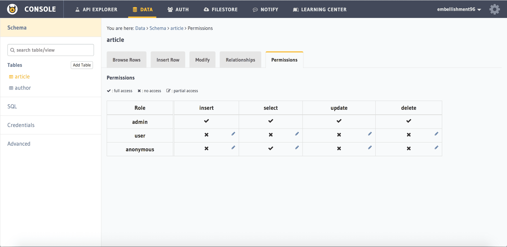
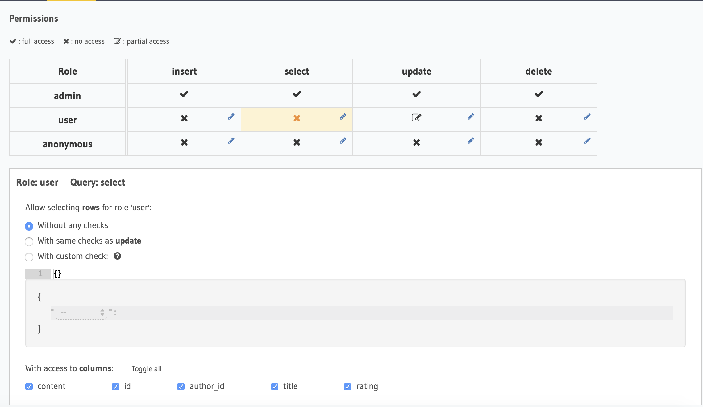
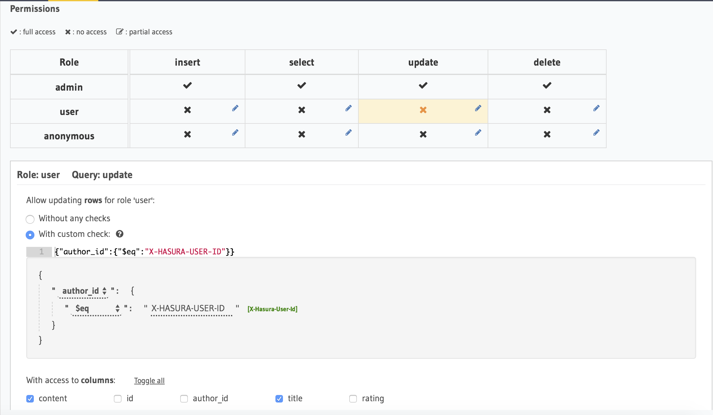
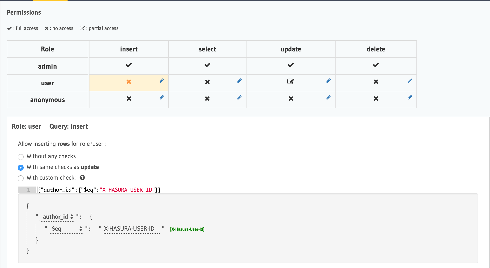
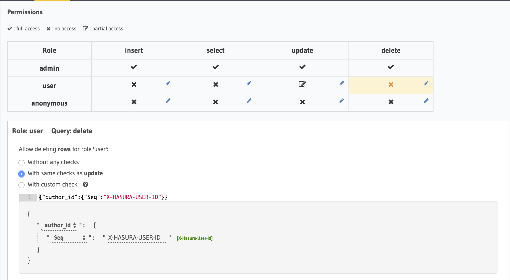

Data permissions and access control
===================================

The data APIs, by default can only be accessed by users with the ``admin`` role. However, we should never include the admin token in any client applications. So, we need to allow access to the data APIs for roles other than ``admin``. This is handled by the permission layer of the data APIs, which lets you define **row level** and **column level** access control policies for various roles.

What are the typical roles other than ``admin``?

#. ``user`` for logged in users
#. ``anonymous`` for users who haven't logged in.

We need to define permissions on all the tables that we have created so far (where applicable) for ``user`` and ``anonymous`` roles. We can use the data API to create permissions.

The hasura API gateway forwards ``X-Hasura-*`` headers with each request to the data microservice. So, when a data API call is made with an ``auth_token`` representing some user, the data microservice knows the user's roles and a variable called ``REQ_USER_ID`` is updated with the ``hasura_id`` of the user making the call. This variable can now be used to describe the access permissions for rows in tables.

Select permissions
------------------

Let us consider the ``article`` table. The following are the permissions we'd like to define for select queries on this table:

.. list-table::
   :header-rows: 1

   * - Role
     - Columns
     - Rows
   * - anonymous
     - all columns
     - all rows
   * - user
     - all columns
     - all rows

There are 2 methods to define permissions for a table: via the console UI and via a REST query.

Using the UI
^^^^^^^^^^^^
In the api-console, navigate to *Data -> article -> Permissions*.

This is the permissions section for the ``article`` table, which looks like this:

To add permissions, click the *Edit icon to the corresponding role and query type*:

.. image:: ../../../img/complete-tutorial/tutorial-9-add-permission.png

You can add permissions for the query types Select, Insert, Update, Delete for different roles (default anonymous and user).

Add permissions for the *Select* query for the *user* role.

Click *Save permissions* to apply the permissions.

You can use the same UI to add permissions for other query types.

Using a REST Query
^^^^^^^^^^^^^^^^^^

For ``anonymous`` role:

.. code-block:: http

   POST data.<cluster-name>.hasura-app.io/v1/query HTTP/1.1
   Content-Type: application/json
   Authorization: <admin-token>

   {
      "type" : "create_select_permission",
      "args" : {
           "table" : "article",
           "role" : "anonymous",
           "permission": {
              "columns" : "*",
              "filter" : {
                "is_published" : true
            }
          }
      }
   }

The response would be as follows:

.. code-block:: http

   HTTP/1.1 200 OK
   Content-Type: application/json

   {
       "message" : "success"
   }

We've specified ``*`` for ``columns`` as a short hand notation for all columns. ``filter`` is used to specify the rows that can be read. You may have noticed that the syntax is similar to that of ``where`` in ``select`` query. In fact, they are exactly the same. The only difference is that, in ``filter`` you can use a special placeholder variable ``REQ_USER_ID`` for the ``id`` of the user who makes the query. We'll see this in action when defining the select permission for ``user`` role on ``article`` table.

For ``user`` role:

.. code-block:: http

   POST data.<cluster-name>.hasura-app.io/v1/query HTTP/1.1
   Content-Type: application/json
   Authorization: <admin-token>

   {
       "type" : "create_select_permission",
       "args" : {
           "table" : "article",
           "role" : "user",
           "permission": {
              "columns" : "*",
              "filter" : {
                "$or" : [
                    { "is_published" : true },
                    { "author_id" : "REQ_USER_ID" }
                ]
             }
           }
       }
   }

The response would be as follows:

.. code-block:: http

   HTTP/1.1 200 OK
   Content-Type: application/json

   {
       "message" : "success"
   }

Update permissions
------------------

``anonymous`` role cannot update the data in ``article``, in fact, any table. You don't need to configure anything for this as only ``admin`` role has permissions by default while the other permissions have to be configured.

.. list-table::
   :header-rows: 1

   * - Role
     - Columns
     - Rows
   * - anonymous
     - None
     - None
   * - user
     - title, content
     - those written by the user

To set the permissions, you can use the api-console UI based workflow described above or the REST call:

Using the UI
^^^^^^^^^^^^

Using the REST query
^^^^^^^^^^^^^^^^^^^^

For ``user`` role:

.. code-block:: http

   POST data.<cluster-name>.hasura-app.io/v1/query HTTP/1.1
   Content-Type: application/json
   Authorization: <admin-token>

   {
       "type" : "create_update_permission",
       "args" : {
           "table" : "article",
           "role" : "user",
           "permission": {
             "columns" : ["title", "content", "is_published"],
             "filter" : {
                 "author_id" : "REQ_USER_ID"
             }
           }
       }
   }

Update permission syntax is the same as select permission's. You specify the columns that can be updated with ``columns`` and the rows that can be updated using ``filter``.

The response would be as follows:

.. code-block:: http

   HTTP/1.1 200 OK
   Content-Type: application/json

   {
       "message" : "success"
   }

Insert permissions
------------------

``anonymous`` cannot insert into ``article`` table. If you are a user, you should only be able to create an article with you as the author, i.e, you should not be allowed to set arbitrary ``author_id`` when inserting into ``article`` table. This is an assertion that must be verified before the data is persisted.

For ``user`` role, one should only be able to create an article with themself as the author, i.e, you should not be allowed to set arbitrary ``author_id`` when inserting into ``article`` table. This is an assertion that must be verified before the data is persisted.

With insert, you only get to specify the assertion that has to be validated with ``check``.

To set the permissions, you can use the api-console UI based workflow described above or the REST API way.

Using the UI
^^^^^^^^^^^^

Using the REST query
^^^^^^^^^^^^^^^^^^^^

.. code-block:: http

   POST data.<cluster-name>.hasura-app.io/v1/query HTTP/1.1
   Content-Type: application/json
   Authorization: <admin-token>

   {
       "type" : "create_insert_permission",
       "args" : {
           "table" : "article",
           "role" : "user",
           "permission": {
             "check" : {
                 "author_id" : "REQ_USER_ID"
             }
           }
       }
   }

The response would be as follows:

.. code-block:: http

   HTTP/1.1 200 OK
   Content-Type: application/json

   {
       "message" : "success"
   }

Delete permissions
------------------

``anonymous`` role cannot delete the data in ``article`` table.

.. list-table::
   :header-rows: 1

   * - Role
     - Rows
   * - anonymous
     - None
   * - user
     - those written by the user

With delete, you only get to specify the rows that are allowed to be deleted with ``filter``.

To set the permissions, you can use the api-console UI based workflow described above or the following REST call:

Using the UI
^^^^^^^^^^^^

Using the REST query
^^^^^^^^^^^^^^^^^^^^

For ``user`` role:

.. code-block:: http

   POST data.<cluster-name>.hasura-app.io/v1/query HTTP/1.1
   Content-Type: application/json
   Authorization: <admin-token>

   {
       "type" : "create_update_permission",
       "args" : {
           "table" : "article",
           "role" : "user",
           "permission": {
              "columns": ["title", "content"],
              "filter" : {
                 "author_id" : "REQ_USER_ID"
             }
           }
       }
   }

The response would be as follows:

.. code-block:: http

   HTTP/1.1 200 OK
   Content-Type: application/json

   {
       "message" : "success"
   }
