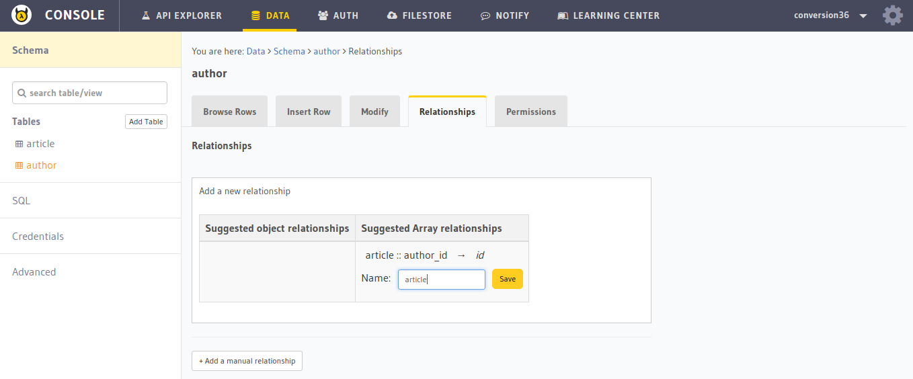
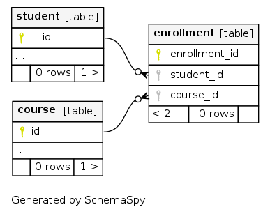

=============
Relationships
=============

.. _one_to_many:

One to many relationship
------------------------

In a one-to-many relationship, one record in a table can be associated with one or more records in another table. For example, each ``author`` can have multiple ``articles``. In the Hasura data APIs, one-to-many relationships are referred to as ``array relationships``.

Creating a one-to-many relationship
~~~~~~~~~~~~~~~~~~~~~~~~~~~~~~~~~~~

To add a one-to-many relationship from ``author`` to ``article``,

#. :doc:`Create a foreign key constraint on the "article" table <adding-foreign-key-constraint>`.
#. Open the API console and go to the ``author`` table.
#. Open the relationships tab.
#. Add the suggested array relationship and give it a desired name.

Fetching over a one-to-many relationship
~~~~~~~~~~~~~~~~~~~~~~~~~~~~~~~~~~~~~~~~

To fetch an ``author`` with ``name = "Clara"`` and all the ``articles`` authored by her, use a query like so:

.. code-block:: http

   POST /v1/query HTTP/1.1
   Content-Type: application/json
   Authorization: Bearer <auth-token> # optional if cookie is set
   X-Hasura-Role: <role>  # optional. Required if request needs particular user role

   {
       "type" : "select",
       "args" : {
           "table" : "author",
           "columns": [
               "name",
               {
                   "name": "article",
                   "columns": ["title"]
               }
           ],
           "where" : {
              "name": "Clara"
           }
       }
   }

.. _many_to_one:

Many to one relationship
------------------------

In a many-to-one relationship one entity contains values that refer to another entity that has unique values. For example, multiple ``articles`` can have the same unique ``author``. In the Hasura data APIs, many-to-one relationships are referred to as ``object relationships``.

Creating a many-to-one relationship
~~~~~~~~~~~~~~~~~~~~~~~~~~~~~~~~~~~

To add a many-to-one relationship from ``article`` to ``author``,

#. :doc:`Create a foreign key constraint on the "article" table <adding-foreign-key-constraint>`.
#. Open the API console and go to the ``article`` table.
#. Open the relationships tab.
#. Add the suggested object relationship and give it a desired name.

.. image:: many-to-one-rel.png

Fetching over a many-to-one relationship
~~~~~~~~~~~~~~~~~~~~~~~~~~~~~~~~~~~~~~~~

To fetch the list of all ``articles`` along with the name of each of their ``author``, use a query like so:

.. code-block:: http

   POST /v1/query HTTP/1.1
   Content-Type: application/json
   Authorization: Bearer <auth-token> # optional if cookie is set
   X-Hasura-Role: <role>  # optional. Required if request needs particular user role

   {
       "type" : "select",
       "args" : {
           "table" : "article",
           "columns": [
               "title",
               {
                   "name": "author",
                   "columns": ["name"]
               }
           ]
       }
   }

One to one relationship
-----------------------

To obtain one-to-one relationships, just :doc:`create a view <creating-views>` joining the two tables.

Many to many relationship
-------------------------

A many-to-many relationship is a type of cardinality that refers to the relationship between two entities **A** and **B** in which **A** may contain a parent instance for which there are many children in **B** and vice versa.

The best example of a many-to-many relationship is the relationship between ``students`` and ``courses``. A student could have enrolled in multiple courses and a course could have multiple students enrolled.

Creating a many-to-many relationship
~~~~~~~~~~~~~~~~~~~~~~~~~~~~~~~~~~~~

To create a many to many relationship between the ``student`` table and the ``course`` table:

#. Create a table named ``enrollment`` with ``student_id`` and ``course_id`` fields.
#. :ref:`Create a many-to-one relationship <many_to_one>` from ``student`` and ``course`` to ``enrollment``.
#. :ref:`Create a one-to-many relationship <one_to_many>` from ``enrollment`` to  ``student`` and ``course``.

Fetching over a many-to-many relationship
~~~~~~~~~~~~~~~~~~~~~~~~~~~~~~~~~~~~~~~~~

To fetch the list of all ``students`` along with the ``courses`` they are enrolled in, the query will look something like:

.. code-block:: http

   POST /v1/query HTTP/1.1
   Content-Type: application/json
   Authorization: Bearer <auth-token> # optional if cookie is set
   X-Hasura-Role: <role>  # optional. Required if request needs particular user role

   {
       "type" : "select",
       "args" : {
           "table" : "student",
           "columns": [
               "*",
               {
                   "name": "student_enrollments",
                   "columns": [
                      "*",
                      {
                        "name": "course_enrolled",
                        "columns": ["*"]
                      }
                   ]
               }
           ]
       }
   }
