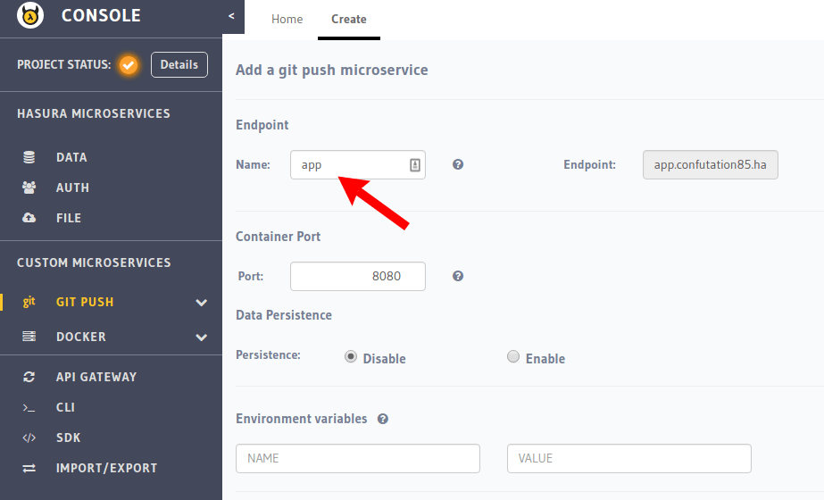

.. meta::
   :description: Learn how to install Hasura - create a project by claiming a free trial project or by installing Hasura on public cloud infra or on a laptop/desktop.
   :keywords: hasura, installation, cloud, public cloud

.. _deploy-webapp:

Deploying your webapp on Hasura
===============================

Hasura provides a fast and simple way to deploy your app built on your favourite
frameworks as a service on a secure https subdomain. To deploy your code on
Hasura, all you need to do is a ``git push hasura master``!

To set up this simple git push deployment system, you need the following:

* Your app code in a git repository
* A Dockerfile that contains instructions on building a Docker image for your app
* A git-push deployment enabled service on Hasura

There are two ways of doing this:

* Using the Hasura Quickstart Templates that have preconfigured Dockerfiles for various framesworks
* Using your own Dockerfile

Using the Quickstart Templates
------------------------------

Apps or Services deployed on Hasura run on Docker images, built according to a
Dockerfile. We've prepared `starter kits <https://github.com/hasura/quickstart-docker-git>`_ for all your favourite
frameworks, that already contain pre-configured Dockerfiles for you to quickly
setup your app!

The easiest way to use these templates is to install and set your project
context on Hasuractl as shown in :doc:`../../ref/cli/hasuractl` , and then do

.. code-block:: console

    $ hasuractl quickstart list
    INFO Checking for network connection
    INFO Updating from https://github.com/hasura/quickstart-docker-git
    Available quickstart templates:
    csharp-aspnet
    elasticsearch
    go-iris
    go-raw
    haskell-spock
    java-play
    java-spark
    java-spring-boot
    joomla
    js-angularjs
    mysql
    nginx
    nodejs-express
    nodejs-express-sass
    php-apache
    php-laravel
    python-django
    python-flask
    r-shiny
    ruby-rails
    serverless-functions
    swift-perfect
    swift-vapor
    wordpress

This will show you a list of all supported quickstart templates. If your
favourite framework is missing from this list, drop us a message at
support@hasura.io, and we'll get to work adding it.

Choose a template, and use the following command to create your app folder
called <app-name> 

.. code-block:: console

    $ hasuractl quickstart <template-name> <app-name> --create

This command will do the following:

* Create a service hosted at <app-name>.<project-name>.hasura-app.io, to which you can deploy your app
* Create a folder called <app-name>, that contains a Dockerfile with instructions  on building your app
* Copy a hello world app written in the chosen framework into the <app-name> directory, which you can later replace with your own app.

Now, cd into the folder, commit your code, and get ready to deploy!

.. code-block:: console

    $ cd <app-name>
    $ git commit -am "Initialized"

Make sure to add your ssh-key to your Hasura project before you deploy - check out
:ref:`add-SSH-keys` for more info.

Now, we deploy our app using

.. code-block:: console

    $ git push hasura master

Voila, your service is deployed and live! Check out your service live at <app-name>.<project-name>.hasura-app.io!

In case there are any errors in building or deploying your code, the git push command will show you errors and the push will fail. Fix the error, and push again!

.. admonition:: Behind The Scenes

   The Hasura platform basically builds a docker image from the latest git changes
   pushed by you, and deploys the right kubernetes service, deployment underneath.

   If you want finer control over your deployment, you are encouraged to use ``kubectl``
   and peek under the hood of the service that is automatically deployed.

Using your own Dockerfile
--------------------------------

Create a git-push enabled service on the Hasura console
^^^^^^^^^^^^^^^^^^^^^^^^^^^^^^^^^^^^^^^^^^^^^^^^^^^^^^^

Go to the ``Custom Microservices`` section of the Hasura console, select ``Git Push`` and create a git-push enabled service, and you're good to go.

For reference, here's a configuration screenshot:

.. rst-class:: featured-image

Add your SSH key
^^^^^^^^^^^^^^^^^^^

Please see :ref:`add-SSH-keys` for instructions on how to create and add your SSH key to a Hasura project.

Deploy to your git-push enabled service
^^^^^^^^^^^^^^^^^^^^^^^^^^^^^^^^^^^^^^^

Once a git-push enabled custom service has been added on the hasura console,
you must first set the hasura remote by following the instructions shown on the
manage page of your git-push service.

.. code-block:: console

   $ git remote add hasura ssh://hasura@<git-push-service-name>.<project-domain>.hasura-app.io:2022/~/git/<git-push-service-name>/

After adding the remote, you can commit your changes and push to the hasura
remote to instantly build and deploy your app in one command!

.. code-block:: console

   $ git push hasura master

Voila, your service is deployed and live! Check out your service live at <app-name>.<project-name>.hasura-app.io!

In case there are any errors in building or deploying your code, the git push command will show you errors and the push will fail. Fix the error, and push again!
