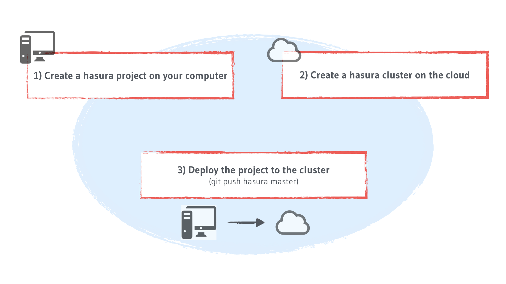
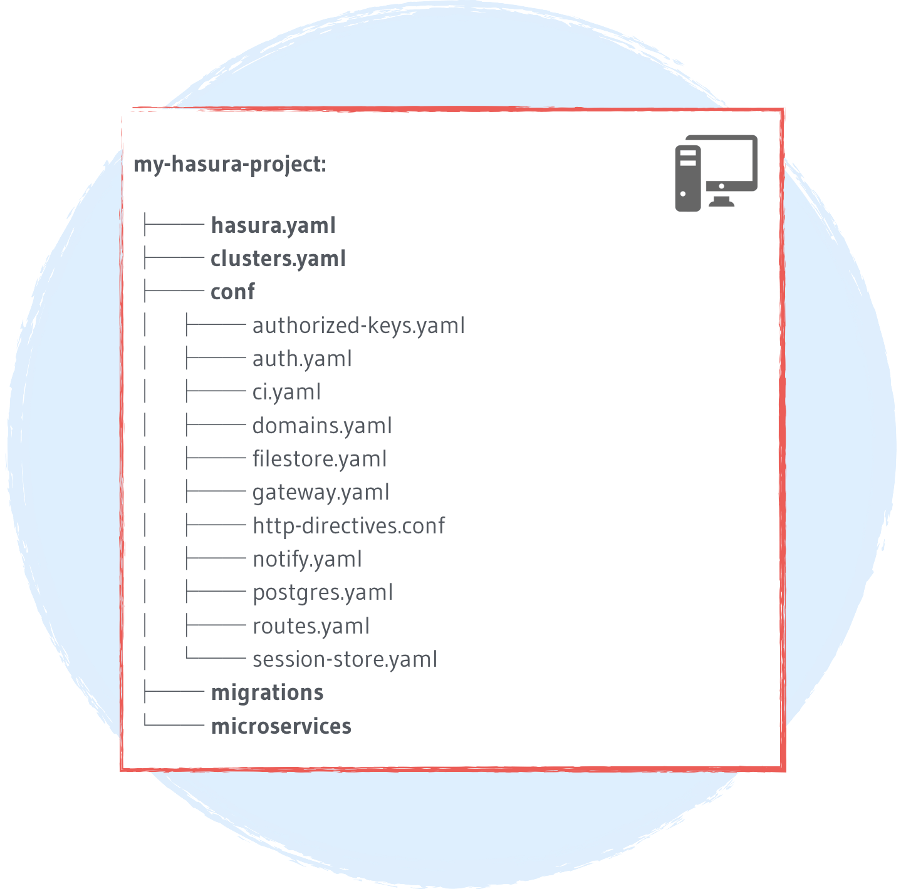
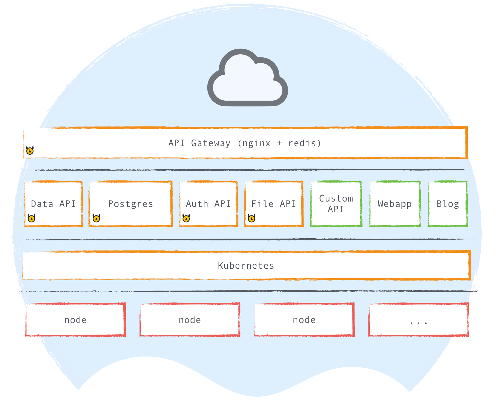

.. .. meta::
   :description: Getting started with Hasura
   :keywords: hasura, quickstart, getting started

.. _getting-started:

Getting started
===============

Hasura helps you build applications quickly. Hasura provides APIs for common uses cases (data, auth, filestore) and allows you to build your custom microservices easily too.

This getting started guide will help you grok Hasura and will get you off the ground with your first running application in a few minutes.

There are 3 core concepts that drive everything you do with Hasura. Hasura projects, Hasura clusters and deploying your project to the cluster. The ``hasura`` CLI tool is required to run manage everything Hasura.

Concept #1: A hasura project
----------------------------

Hasura breaks your entire application into a collection of microservices. There are few ready-made microservices which give you instant backend APIs you can use in your app directly, like data, auth and filestore. The data and auth microservice are backed by Postgres.

As you can imagine, there are various configurations for these microservices and schema information for the data models you create for your application.

Apart from this, your application will probably have custom microservices too, with source code and configuration specifications written by you.

Concept #2: A hasura cluster
----------------------------

A Hasura cluster is a cluster of nodes (VMs) on the cloud that can host any Hasura project. It has all the Hasura microservices running and the necessary tooling for you to deploy your Hasura project.

Concept #3: Deploying to the hasura cluster
-------------------------------------------

Once you have a Hasura cluster that is added to your Hasura project, running ``git push hasura master`` will
deploy your Hasura project. Your configurations, database schema, and your microservices will all be deployed in a single go. Note, you can also deploy selected changes only with some other advanced commands.

You're ready to start!
----------------------

Here's a list of your first steps:

- :doc:`Install <../install-hasura-cli>` the ``hasura`` CLI
- Quickstart (clone a hasura project + create a free cluster)

  - ``hasura quickstart hasura/hello-world``.
  - You can replace ``hasura/hello-word`` with any project from `hasura.io/hub <https://hasura.io/hub>`_

- Deploy your project or changes you make to the cluster

  - ``git push hasura master``

- Open the API console to manage your data models and test your APIs

  - ``hasura api-console``

The `hello-world <https://hasura.io/hub/project/hasura/hello-world>`_ project contains a sample blog-engine schema and a custom nodejs microservice and will guide you through the basics of using a Hasura project.

Deep dive
---------

Alternatively, if you'd like to get a deep understanding of how Hasura works, head to :doc:`The complete tutorial <../tutorial/index>`.

..
  Show 2 options:
  * quickstart: Quick intro to Hasura (~10mins)
  * tutorial: Detailed intro to Hasura
