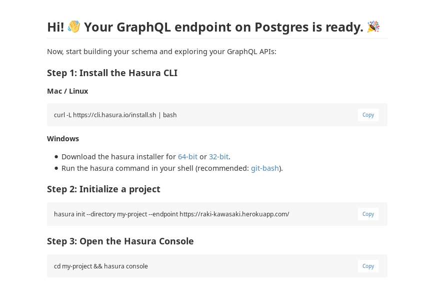

Install Hasura GraphQL Engine on Heroku
================================

Prerequisites:
**************

To proceed with the installation, please ensure that you have an account with Heroku and you have a working setup of the following

- `Heroku <https://devcenter.heroku.com/articles/heroku-cli#download-and-install>`_
- `Docker <https://docs.docker.com/install/>`_

Step 1: Setting up
******************

Create an application
^^^^^^^^^^^^^^^^^^^^^

.. code-block:: bash

  $ heroku create
  Creating app... done, ⬢ thawing-savannah-75305
  https://thawing-savannah-75305.herokuapp.com/ | https://git.heroku.com/thawing-savannah-75305.git

Note the app name ``thawing-savannah-75305`` from the command above. In the next commands, substitute <app-name> with ``thawing-savannah-75305``

Create Heroku Postgres Addon
^^^^^^^^^^^^^^^^^^^^^^^^^^^^^^

.. code-block:: bash

  $ heroku addons:create heroku-postgresql:hobby-dev -a <app-name>

The above command creates a free version of postgres, You can choose from the different options available `here <https://www.heroku.com/pricing#postgres-pricing>`_

Step 2: Initialize a project directory
**************************************

.. code-block:: bash

  hasura init --directory my-project

Step 3: Deploy to heroku
************************

.. code-block:: bash

  cd my-project
  cd __install/heroku
  git init
  git commit -am 'first commit'
  git remote add heroku HEROKU_GIT_REMOTE
  git push heroku master

Please visit `https://thawing-savannah-75305.herokuapp.com <https://thawing-savannah-75305.herokuapp.com>`_ (Please note to replace ``thawing-savannah-75305`` with your app name) and you should see the page as in the screenshot below.

Step 4: Open the hasura console
*******************************

In the my-project/config.yaml file set the endpoint:

.. code-block:: bash

  endpoint: https://HEROKU_APP_NAME.herokuapp.com

Now, open the hasura console:

.. code-block:: bash

  # Run this command in the my-project/ directory
  $ hasura console
