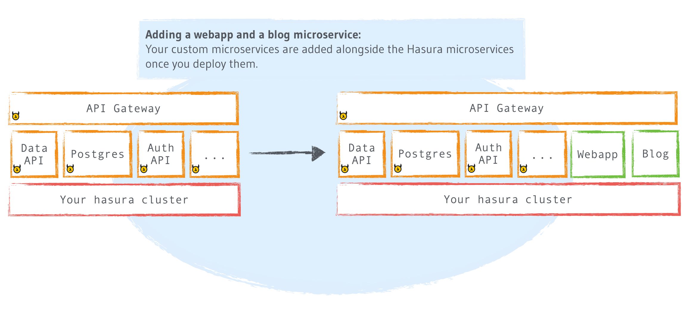

.. .. meta::
   :description: How to deploy docker images using hasura
   :keywords: hasura, manual, docker, image, custom microservice

Hasura project microservices
============================

A :doc:`Hasura project <../project/index>` is composed of a set of microservices.
These include certain :doc:`Hasura microservices <hasura-microservices>` but can also
include your own custom microservices.
Microservices are basically the individual 'apps' that run on a :doc:`cluster <../cluster/index>`.

Hasura microservices run in the **hasura namespace** while custom microservices run in the **default namespace** on a cluster.

Hasura microservices include the backend APIs provided by Hasura and other components of the Hasura platform.

Some typical examples of custom microservices you would add to your project include, an API service,
a webapp, a microservice that serves static files, for a simple HTML site or a SPA (eg: React),
a ready made microservice like the ghost blog-engine or a 'stateful' microservice like a database.

.. note::

    If you are starting a new hasura project, head to `hasura.io/hub <https://hasura.io/hub>`_ to
    find the right boilerplate project for you and follow the guide there!

Here's what your Hasura cluster looks like before and after you add custom microservices:

Now that you're familiar with the basic concepts of what a microservice is, See:

.. toctree::
  :maxdepth: 1
  :titlesonly:

  hasura-microservices
  add-microservice/index
  debug
  logs
  exec-container
  list
  env-variables
  change-subdomain
  communicating-between-microservices
  Connecting to Postgres from microservices <connect-postgres>
  Hot reloading changes to a microservice <hot-reloading>
