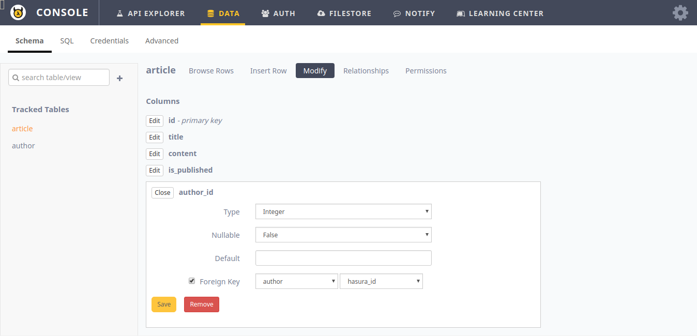

.. .. meta::
   :description: Part 3 of a set of learning exercises meant for exploring Hasura in detail. This part takes you over data modeling & introduces the data microservice's API.
   :keywords: hasura, getting started, step 3, data modeling

=========================================
Part VII: Data modelling for the blog app
=========================================

Our basic data requirements are as follows:

* Storing the profile data of each user
* Storing the article data and the author of each article
* Storing the likes given by users to articles
* Storing the comments written by users on articles

..
   `Basic data modelling <https://youtu.be/EdBjQ3zRBWg>`_
   The video shows you how to create data models using the project console.
   The document below however, is an API driven approach to creating data models.
   Don't skip reading this guide if you need a solid developer intro to modelling,
   especially if you want to start versioning your schema!

Creating tables
---------------

As you would normally do with any relational database, data is modelled as tables.

+----------------------------------------+----------------------------------------+
|Table                                   |Columns                                 |
+========================================+========================================+
|author                                  |id, name                                |
+----------------------------------------+----------------------------------------+
|article                                 |id, title, author_id, rating            |
+----------------------------------------+----------------------------------------+
|like                                    |user_id, article_id                     |
+----------------------------------------+----------------------------------------+
|comment                                 |id, user_id, article_id, comment        |
+----------------------------------------+----------------------------------------+

You can Create tables and model foreign key constraints via the API console like this:

.. figure:: ../../img/tutorial-7-create-author.png

	    Creating the ``author`` table

.. figure:: ../../img/tutorial-7-create-article.png

	    Creating the ``article`` table

To add foreign key constraints, after creating the tables go to *Modify* and edit the columns for which you wish to add foreign keys.
	    

	    Adding foreign key constraints to ``article``

Now similarly create the other tables and add foreign key constraints.
	    
In SQL, the structure of these tables is as follows:

.. literalinclude:: blog-schema.sql
   :language: sql

Next: Explore the Data APIs
----------------------------

Next, head to :doc:`Explore Data APIs <8-explore-data-apis>`.
