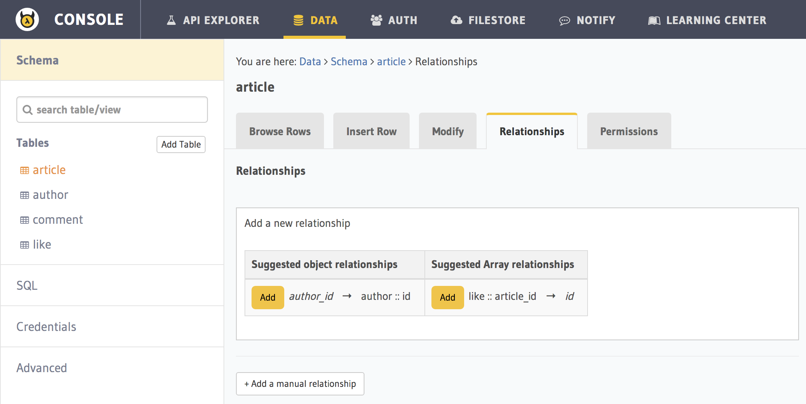
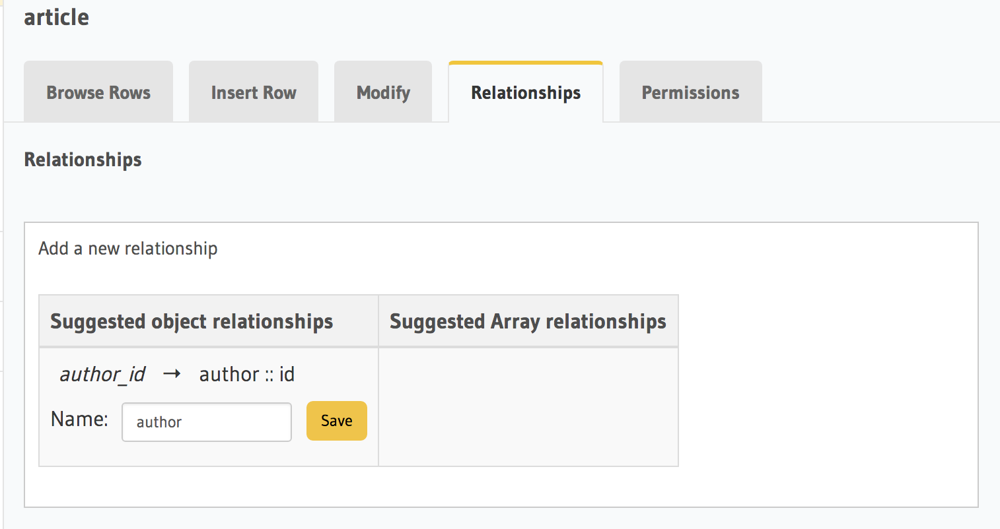
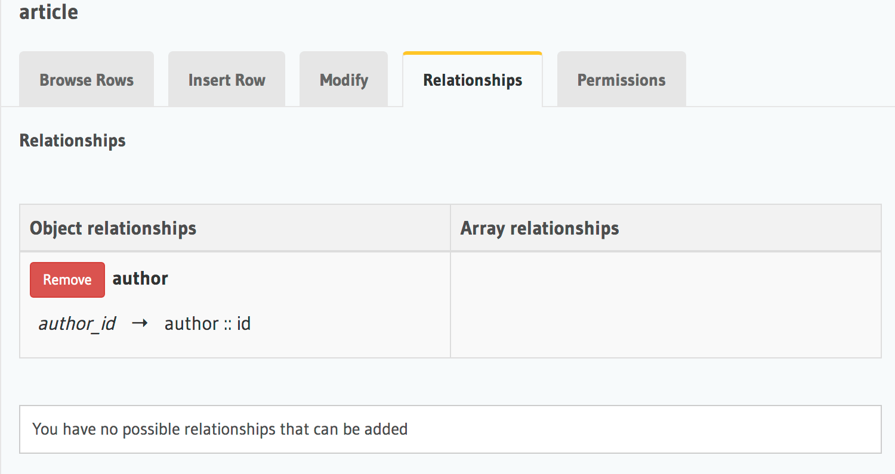

Part VIII: Adding relationships to data models
==============================================

Exploiting relationships in your data
-------------------------------------

If our data API microservice could understand the different relationships in data, then
we would be able to make more complex and interesting queries to fetch data.

.. code-block:: javascript

   // Current output of select query
   [{
      "id": 1,
      "title": "My first article",
      "content": "Lots of content...",
      "author_id": 3
   }]

   // Desired output of select query
   [{
      "id": 1,
      "title": "My first article",
      "content": "Lots of content...",
      "author_id": 3,
      "author": {
         "name": "Ramu"
         "id": 3
      }
   }]

Let's look at the different relationships we have in our data models:

* author:

  * has ``articles`` written by them
  * has ``comments`` posted by them
  * has ``liked_articles`` liked by them

* comment:

  * has an ``author`` who is the poster
  * has an ``article`` on which it was posted

* article:

  * has an ``author``
  * has ``comments``

* like:

  * has an ``author`` who has liked
  * has an ``article`` that has been liked

These relationships are captured by foreign key constraints where possible. If we were to represent rows of our table in JSON, as objects, then we can express these relationships as nested arrays or objects. Eg: Every ``author`` object can have a key called ``articles`` which is an array of article objects. Similarly, every ``article`` object can have a key called ``author`` which is an author object.

Let's see how these relationships are established.

.. list-table::
   :header-rows: 1

   * - Table
     - Relationship
     - Type
     - Established by
   * - author
     - articles
     - array
     - ``article(author_id) -> blog_user(hasura_id)``
   * - author
     - comments
     - array
     - ``comment(author_id) -> blog_user(hasura_id)``
   * - author
     - liked_articles
     - array
     - ``article_like(user_id) -> blog_user(hasura_id)``

   * - article
     - author
     - object
     - ``article(author_id) -> blog_user(hasura_id)``
   * - article
     - comments
     - array
     - ``comment(article_id) -> article(id)``
   * - article
     - categories
     - array
     - ``category(article_id) -> article(id)``

   * - article_like
     - liked_by
     - object
     - ``article_like(user_id) -> blog_user(hasura_id)``
   * - article_like
     - article
     - object
     - ``article_like(article_id) -> article(id)``

   * - comment
     - commented_by
     - object
     - ``comment(author_id) -> blog_user(hasura_id)``
   * - comment
     - article
     - object
     - ``comment(article_id) -> article(id)``

   * - category
     - articles
     - array
     - ``article_category(article_id) -> article(article_id)``

   * - article_category
     - article
     - object
     - ``article_category(article_id) -> article(id)``
   * - article_category
     - category
     - object
     - ``article_category(category_id) -> category(id)``

Creating relationships
----------------------

You can create relationship metadata for tables via the API console.

Let's say you wish to add an object relationship for ``article(author_id) -> author(hasura_id)``. Navigate to the *Relationships* tab in the ``article`` table.

You'll see an entry in *suggested object relationships*:

Click on *Add* to add a new object relationship and name the relationship:

The relationship is created:

You can create relationships for other constraints similarly.

Queries using relationships
---------------------------

To obtain the **author**'s name from the article table, we issue,

.. rst-class:: api_tabs
.. tabs::

   .. tab:: GraphQL

      .. code-block:: none

         query fetch_article {
           article {
             title
             author {
              name
             }
           }
         }

   .. tab:: JSON API

      .. code-block:: http

         POST /v1/query HTTP/1.1
         Content-Type: application/json
         Authorization: <admin-token>

         {
             "type" : "select",
             "args" : {
                 "table" : "article",
                 "columns": [
                     "title",
                     {
                         "name": "author",
                         "columns": ["name"]
                     }
                 ]
             }
         }

The same syntax can be used to obtain the titles of all articles across all **authors**.

.. rst-class:: api_tabs
.. tabs::

   .. tab:: GraphQL

      .. code-block:: none

         query fetch_author {
           author {
             name
             articles {
              title
             }
           }
         }

   .. tab:: JSON API

      .. code-block:: http

         POST /v1/query HTTP/1.1
         Content-Type: application/json
         Authorization: <admin-token>

         {
             "type" : "select",
             "args" : {
                 "table" : "author",
                 "columns": [
                     "name",
                     {
                         "name": "articles",
                         "columns": ["title"]
                     }
                 ]
             }
         }

You can use relationships inside ``where`` clause. For example, if we wish to only fetch articles having a rating of 5 by author with name ``Warren`` , we could :

.. rst-class:: api_tabs
.. tabs::

   .. tab:: GraphQL

      .. code-block:: none

         query fetch_article {
           article (where: {rating: {_eq: 5} author: {name: {_eq: "Warren"}}} ) {
             id
             title
           }
         }

   .. tab:: JSON API

      .. code-block:: http

         POST /v1/query HTTP/1.1
         Content-Type: application/json
         Authorization: <admin-token>

         {
             "type" : "select",
             "args" : {
                 "table" : "article",
                 "columns": [ "id", "title"],
                 "where" : {
                     "rating" : 5,
                     "author" : {
                         "name" : "Warren"
                     }
                 }
             }
         }

Let's fetch authors who has not written a article with rating less than 3

.. rst-class:: api_tabs
.. tabs::

   .. tab:: GraphQL

      .. code-block:: none

         query fetch_author {
           author (where: {_not: {articles: {rating: {_lte: 3}}}} ) {
             name
           }
         }

   .. tab:: JSON API

      .. code-block:: http

         POST /v1/query HTTP/1.1
         Content-Type: application/json
         Authorization: <admin-token>

         {
             "type" : "select",
             "args" : {
                 "table" : "author",
                 "columns": ["name"],
                 "where" : {
                     "$not" : {
                         "articles" : { "$any" : { "rating" : {"$lte": 3} }}
                     }
                 }
             }
         }

As you probably guessed, relationships can be nested. Let's get all articles with author information, comments and the author who posted the comment.

.. rst-class:: api_tabs
.. tabs::

   .. tab:: GraphQL

      .. code-block:: none

         query fetch_article {
           article {
             title
             author {
              name
             }
             comments {
              comment 
              commented_by {
                name
              }
             }
           }
         }

   .. tab:: JSON API

      .. code-block:: http

         POST /v1/query HTTP/1.1
         Content-Type: application/json
         Authorization: <admin-token>

         {
             "type" : "select",
             "args" : {
                 "table" : "article",
                 "columns": [
                     "title",
                     {
                         "name": "author",
                         "columns": ["name"]
                     },
                     {
                         "name" : "comments",
                         "columns" : [
                             "comment",
                             {
                                 "name" : "commented_by",
                                 "columns" : ["name"]
                             }
                         ]
                     }
                 ]
             }
         }

We can also use ``where``, ``limit``, ``offset`` inside array relationships. Let's say we want to fetch all authors and only their articles having a rating more than 2:

.. rst-class:: api_tabs
.. tabs::

   .. tab:: GraphQL

      .. code-block:: none

         query fetch_author {
           author {
             name
             articles (where: {rating: {_gte: 2}}) {
              title
             }
           }
         }

   .. tab:: JSON API

      .. code-block:: http

         POST /v1/query HTTP/1.1
         Content-Type: application/json
         Authorization: <admin-token>

         {
             "type" : "select",
             "args" : {
                 "table" : "author",
                 "columns": [
                     "name",
                     {
                         "name": "articles",
                         "columns": ["title"],
                         "where" : { "rating" : {"$gte": 2} }
                     }
                 ]
             }
         }

Next: Add permissions and access control
----------------------------------------

Next, head to :doc:`adding-permissions`.
