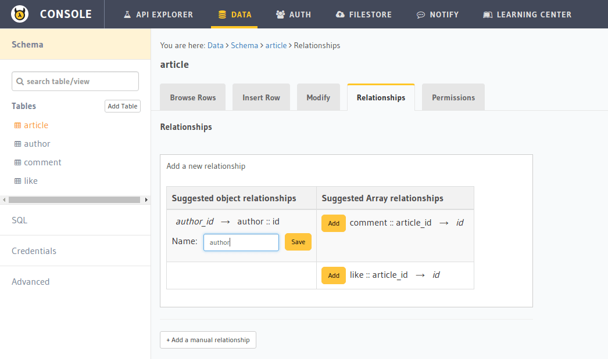

Part VIII: Adding relationships to data models
==============================================

Exploiting relationships in your data
-------------------------------------

The Data microservice allows to setup different relationships between data, which allows us to be able to make more
complex and interesting queries to fetch data.

For example:

.. code-block:: javascript

   // Current output of select query
   [{
      "id": 1,
      "title": "My first article",
      "content": "Lots of content...",
      "author_id": 3
   }]

   // Desired output of select query
   [{
      "id": 1,
      "title": "My first article",
      "content": "Lots of content...",
      "author_id": 3,
      "author": {
         "name": "Ramu"
         "id": 3
      }
   }]

Let's look at the different relationships we have in our data models:

* ``author``:

  * has ``articles`` written by them

* ``article``:

  * has an ``author``
  * has ``comments``
  * has ``likes``

* ``comment``:

  * has an ``article`` on which it was posted

* ``like``:

  * has an ``article`` that has been liked

These relationships can be captured by foreign key constraints. If we were to represent rows of our table in JSON, as
objects, then we can express these relationships as nested arrays or objects. Eg: Every ``author`` object can have
a key called ``articles`` which is an array of article objects. Similarly, every ``article`` object can have a key
called ``author`` which is an author object.

Let's see how these relationships are established:

.. list-table::
   :header-rows: 1
   :widths: 18 18 18 46

   * - Table
     - Relationship
     - Type
     - Established by
   * - author
     - articles
     - array
     - ``article::author_id -> author::id``
   * - article
     - author
     - object
     - ``article::author_id -> author::id``
   * - article
     - comments
     - array
     - ``comment::article_id -> article::id``
   * - article
     - likes
     - array
     - ``like::article_id -> article::id``
   * - comment
     - article
     - object
     - ``comment::article_id -> article::id``
   * - like
     - article
     - object
     - ``like::article_id -> article::id``

Creating relationships
----------------------

You can create relationships for tables via the ``API console``.

Let's say you wish to add the object relationship, ``author`` for the ``article`` table.
Click on the ``article`` table and navigate to the *Relationships* tab.

You'll see an entry in *suggested object relationships* for ``author_id -> author::id``:

.. image:: ../../img/complete-tutorial/tutorial-suggested-relationships.png

Click on *Add* to add a new object relationship and give name ``author`` to the relationship:

The relationship is created:

.. image:: ../../img/complete-tutorial/tutorial-created-relationship.png

You can create the other relationships similarly.

Queries using relationships
---------------------------

To obtain the **author**'s name from the article table, we issue,

.. rst-class:: api_tabs
.. tabs::

   .. tab:: GraphQL

      .. code-block:: none

         query fetch_article {
           article {
             title
             author {
              name
             }
           }
         }

   .. tab:: JSON API

      .. code-block:: http

         POST /v1/query HTTP/1.1
         Content-Type: application/json
         Authorization: Bearer <auth-token> # optional if cookie is set
         X-Hasura-Role: admin

         {
             "type" : "select",
             "args" : {
                 "table" : "article",
                 "columns": [
                     "title",
                     {
                         "name": "author",
                         "columns": ["name"]
                     }
                 ]
             }
         }

The same syntax can be used to obtain the titles of all articles across all **authors**.

.. rst-class:: api_tabs
.. tabs::

   .. tab:: GraphQL

      .. code-block:: none

         query fetch_author {
           author {
             name
             articles {
              title
             }
           }
         }

   .. tab:: JSON API

      .. code-block:: http

         POST /v1/query HTTP/1.1
         Content-Type: application/json
         Authorization: Bearer <auth-token> # optional if cookie is set
         X-Hasura-Role: admin

         {
             "type" : "select",
             "args" : {
                 "table" : "author",
                 "columns": [
                     "name",
                     {
                         "name": "articles",
                         "columns": ["title"]
                     }
                 ]
             }
         }

You can use relationships inside ``where`` clause. For example, if we wish to only fetch articles having a rating
of 5 by author with name ``Warren`` , we could use:

.. rst-class:: api_tabs
.. tabs::

   .. tab:: GraphQL

      .. code-block:: none

         query fetch_article {
           article (where: {rating: {_eq: 5} author: {name: {_eq: "Warren"}}} ) {
             id
             title
           }
         }

   .. tab:: JSON API

      .. code-block:: http

         POST /v1/query HTTP/1.1
         Content-Type: application/json
         Authorization: Bearer <auth-token> # optional if cookie is set
         X-Hasura-Role: admin

         {
             "type" : "select",
             "args" : {
                 "table" : "article",
                 "columns": [ "id", "title"],
                 "where" : {
                     "rating" : 5,
                     "author" : {
                         "name" : "Warren"
                     }
                 }
             }
         }

Let's fetch authors who has not written a article with rating less than 3:

.. rst-class:: api_tabs
.. tabs::

   .. tab:: GraphQL

      .. code-block:: none

         query fetch_author {
           author (where: {_not: {articles: {rating: {_lte: 3}}}} ) {
             name
           }
         }

   .. tab:: JSON API

      .. code-block:: http

         POST /v1/query HTTP/1.1
         Content-Type: application/json
         Authorization: Bearer <auth-token> # optional if cookie is set
         X-Hasura-Role: admin

         {
             "type" : "select",
             "args" : {
                 "table" : "author",
                 "columns": ["name"],
                 "where" : {
                     "$not" : {
                         "articles" : { "$any" : { "rating" : {"$lte": 3} }}
                     }
                 }
             }
         }

As you probably guessed, relationships can be nested. Let's get all authors, with their articles, with their comments.

.. rst-class:: api_tabs
.. tabs::

   .. tab:: GraphQL

      .. code-block:: none

         query fetch_article {
           author {
             name
             article {
               title
               comments {
                 comment
               }
             }
           }
         }

   .. tab:: JSON API

      .. code-block:: http

         POST /v1/query HTTP/1.1
         Content-Type: application/json
         Authorization: Bearer <auth-token> # optional if cookie is set
         X-Hasura-Role: admin

         {
             "type" : "select",
             "args" : {
                 "table" : "author",
                 "columns": [
                     "name",
                     {
                         "name": "articles",
                         "columns": [
                            "title",
                            {
                                "name": "comments",
                                "columns": ["comment"]
                            }
                         ]
                     }
                 ]
             }
         }

We can also use ``where``, ``limit``, ``offset`` inside array relationships. Let's say we want to fetch all authors and only their articles having a rating more than 2:

.. rst-class:: api_tabs
.. tabs::

   .. tab:: GraphQL

      .. code-block:: none

         query fetch_author {
           author {
             name
             articles (where: {rating: {_gte: 2}}) {
              title
             }
           }
         }

   .. tab:: JSON API

      .. code-block:: http

         POST /v1/query HTTP/1.1
         Content-Type: application/json
         Authorization: Bearer <auth-token> # optional if cookie is set
         X-Hasura-Role: admin

         {
             "type" : "select",
             "args" : {
                 "table" : "author",
                 "columns": [
                     "name",
                     {
                         "name": "articles",
                         "columns": ["title"],
                         "where" : { "rating" : {"$gte": 2} }
                     }
                 ]
             }
         }

Next: Add permissions and access control
----------------------------------------

Next, head to :doc:`adding-permissions`.
