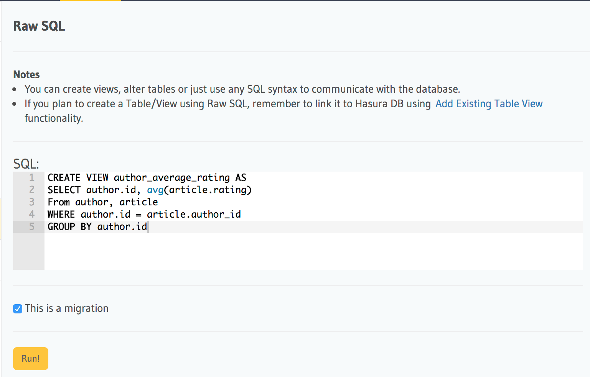
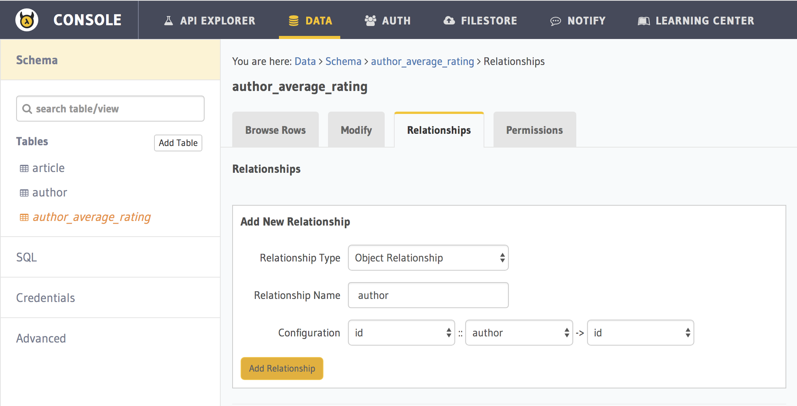
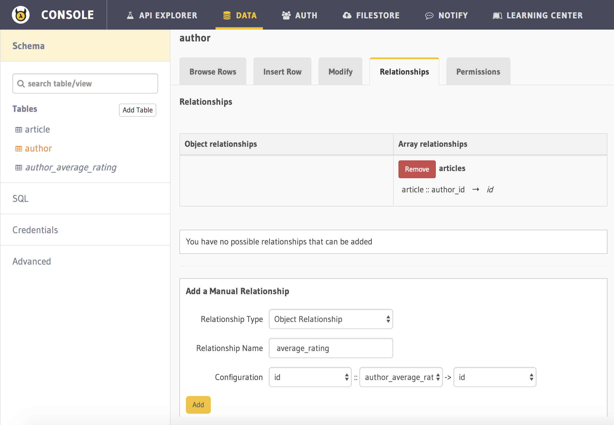

Part X: Aggregations, views and custom relationships
====================================================

The data API ``select`` query is designed to be simple yet powerful. But there are some queries that you cannot express
with the ``select`` query syntax. For example, getting the number of likes for each article. Aggregations (like count,
avg, group_by, etc) are not supported in the ``select`` query syntax. This is a conscious decision we have made to keep
the query language small.

To express complex queries like aggregations, window functions, custom joins etc, use SQL, which is designed for this
purpose. If you can express your query in SQL, you can define a view with it on which you can then use the data APIs as
we do on tables.

**For example**, let's see how we can get the average rating of all articles written by an author.

Let's `define the view in SQL <https://www.postgresql.org/docs/current/static/sql-createview.html>`_:

.. code-block:: sql

    CREATE VIEW author_average_rating AS
        SELECT author.id, avg(article.rating)
        From author, article
        WHERE author.id = article.author_id
        GROUP BY author.id

Now, let's set this view up on Hasura via the API console:

Navigate to the *Data > SQL* tab in the API console and enter the above SQL statement. Ensure the *This is a migration*
and *Track table* boxes are checked so that the query is added as a database migration and the Data microservice is
aware of the created view.

Hit *Run* to create the view on the Postgres database and to track it in the Data microservice (ie: allow querying via
Data APIs).

Now, you can use a ``select`` query to fetch the author's average rating as if ``author_average_rating`` is a table.

.. admonition:: Views are read only!

   Views are like read-only logical tables on the database.
   So that means that Data API requests to select will work, but you cannot
   insert/update/delete items from the view.

Relationships to/from views
---------------------------

We have seen how we can get author's average rating using the Data APIs. However, additional information of each author
can be attached to the ``author_average_rating`` view using an object relationship say, ``author``.

All the relationships that we've defined till now use foreign key constraints. However, you cannot define foreign key
constraints on/to views. So, in these cases, we have to manually define a relationship.

Here, we are defining a relationship from a ``author_average_rating`` view to ``author`` table:

The above relationship will allow you to fetch author's details when querying the view. But we might want to fetch
author's average rating when querying the author table itself. So we will now create a relationship from ``author``
table to ``author_average_rating`` view:

Now, let's fetch author details with their average rating:

.. code-block:: http

   POST /v1/query HTTP/1.1
   Content-Type: application/json

   {
       "type" : "select",
       "args" : {
           "table" : "author",
           "columns": [
               "id", "name",
               {
                   "name" : "average_rating",
                   "columns" : ["avg"]
               }
           ],
           "order_by" : "+name"
       }
   }

.. note::
   The above query will work only after adding permissions to the ``author_average_rating`` view.

Next: Custom code and microservices
~~~~~~~~~~~~~~~~~~~~~~~~~~~~~~~~~~~

Next, head to :doc:`custom-api`.
