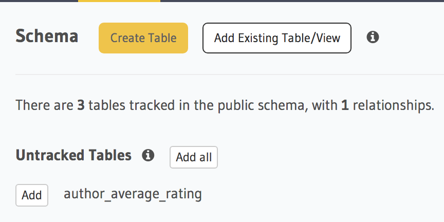

.. .. meta::
   :description: Part 5 of a set of learning exercises meant for exploring Hasura in detail. This part covers using the data API along with SQL views & relationships.
   :keywords: hasura, getting started, step 5, SQL views and relationships

======================================================
Part XII: Aggregations, views and custom relationships
======================================================

The JSON based query language in ``select`` query is designed to be simple yet powerful. There will be queries that you cannot express with the ``select`` query. For example, getting the number of likes for each article. Aggregations (like counting the number of likes) are not supported in the ``select`` query syntax. This is a conscious decision we've made to keep the query language small.

To express complex queries like aggregations, window functions, custom joins etc, use SQL, which is designed for this purpose. If you can express your query in SQL, define a view with it, you can use the ``data`` layer APIs on these views.

Let's see how we can get the likes of an article.

Data APIs on Postgres views
===========================

..
   `Aggregations and Views <https://www.youtube.com/watch?v=d6VHJ7FiJTg>`_

Let us define a view in `SQL <https://www.postgresql.org/docs/current/static/sql-createview.html>`_:

.. code-block:: sql

    CREATE VIEW author_average_rating AS
        SELECT author.id, avg(article.rating)
        From author, article
        WHERE author.id = article.author_id
        GROUP BY author.id

Let's apply this via the console:

Navigate to the *SQL* tab in the API console and enter the above SQL statement. Also, check the *This is a migration* box so that it can be added to the migrations.

.. image:: ../../img/complete-tutorial/tutorial-create-view.png

Adding a view via SQL. Don't forget to check *This is a migration*

.. .. code-block:: http

..      POST data.<cluster-name>.hasura-app.io/v1/query HTTP/1.1
..      Content-Type: application/json
..      Authorization: Bearer <admin-token>
..      {
..        "type" : "run_sql",
..        "args" : {
..          "sql" : "CREATE VIEW article_like_count AS...",
..        }
..      }

Let us then add this view to Hasura.

Navigate to the *Schema* tab in the *Data* section of the API console. You'll see a list of untracked tables. Click on *Add* next to the view name to track it.

The equivalent REST request is:

.. code-block:: http

   POST data.<cluster-name>.hasura-app.io/v1/query HTTP/1.1
   Content-Type: application/json
   Authorization: Bearer <admin-token>

   {
     "type" : "add_existing_table_or_view",
     "args" : {
       "name" : "author_average_rating"
     }
   }

As soon as the view is tracked by the Data API, you can use ``select`` as if ``author_average_rating`` is a table.

.. admonition:: Views are read only!

   Views are like read-only logical tables on the database.
   So that means that Data API requests to select will work, but you cannot
   insert/update/delete items from the view.

Relationships to/from views
===========================

We've seen how we can get author's average rating using the ``data`` APIs. However, additional information of each author can be attached to the author_average_rating view using an object relationship say, ``author``.

All the relationships that we've defined till now use foreign key constraints. However, you cannot define foreign key constraints on/to views. So, in these cases, we can manually define a relationship as follows:

Here, we are defining a relationship from a ``view`` to a ``table``.

.. image:: ../../img/complete-tutorial/tutorial-add-manual-relationship.png

The above relationship will allow you to fetch author's details when querying the view. But we might want to fetch author's average rating when querying the author table itself. So we will now create a relationship from ``author`` table to ``author_average_rating`` view.

.. image:: ../../img/complete-tutorial/tutorial-add-manual-rel-from-table.png

In the above example we have defined a relationship from a ``table`` to a ``view``.

Let's fetch author details with their average rating.

.. code-block:: http

   POST /v1/query HTTP/1.1
   Content-Type: application/json
   Authorization: Bearer <admin-token>

   {
       "type" : "select",
       "args" : {
           "table" : "author",
           "columns": [
               "id", "name",
               {
                   "name" : "average_rating",
                   "columns" : ["avg"]
               }
           ],
           "order_by" : "+name"
       }
   }

``Note:`` The above query will work only after adding permissions to the view ``author_average_rating``.

Next: Custom code and microservices
-----------------------------------

Next, head to :doc:`custom-api`.
