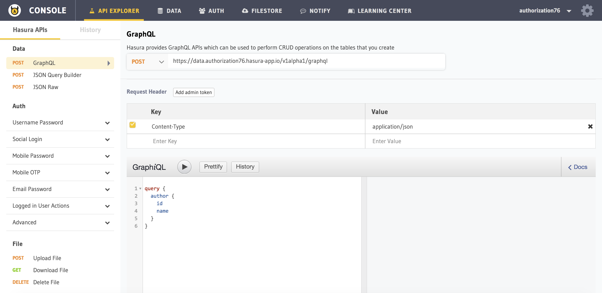

Part VII: Explore the data APIs
===============================

Now that you've created the data models, you can use Hasura's GraphQL / HTTP JSON APIs to query your data directly.

The ``data`` microservice
-------------------------

Every Hasura project comes with a data microservice. The ``data`` microservice provides an Graph API and an HTTP API over PostgreSQL, an extremely versatile open source relational database. We create tables in Postgres and access the data using the APIs provided by the ``data`` microservice.

Any user with the ``admin`` role has full-access to the data microservice. All requests to the ``data`` microservice are ``POST`` requests to ``/v1alpha1/graphql`` (for GraphQL queries) and ``/v1/query`` (for JSON APIs) endpoints. 

Explore using the API explorer & the query builder
--------------------------------------------------

Run:

.. code-block:: bash

   # Run this command inside your project directory
   $ hasura api-console

This will open up the ``api-console`` and show you the ``API explorer`` page which you can use to understand the APIs.

.. admonition:: Note

   You can try out all of the API examples below in the API explorer.
   
   Head to ``API explorer > Data > GraphQL`` for GraphQL APIs and Head to ``API explorer > Data > JSON Query Builder`` for JSON APIs

Inserting Data
--------------

Let's insert a couple of authors. The full definition of `insert` request can be found :ref:`here <data_insert>`.

.. rst-class:: api_tabs
.. tabs::

   .. tab:: GraphQL

      .. code-block:: none

         mutation insert_author {
           insert_author (objects: [{name: "Warren"},{name: "Greg"}]) {
             returning {
               id
             }
           }
         }

   .. tab:: JSON API

      .. code-block:: http
         :emphasize-lines: 13

         POST data.<cluster-name>.hasura-app.io/v1/query HTTP/1.1
         Content-Type: application/json
         Authorization: Bearer <auth-token> # optional if cookie is set
         X-Hasura-Role: <role>  # optional. Required if request needs particular user role

         {
             "type":"insert",
             "args":{
                 "table":"author",
                 "objects":[
                     {"name":"Warren"},
                     {"name":"Greg"}
                 ],
                 "returning":["id"]
             }
         }

Note the ``returning`` key. We would like to get the auto incremented id for each inserted row.

Querying Data
-------------

The query language lets you make simple to complex queries.

Let's look at a simple `select` query on the article table. The full definition of a `select` query can be found :ref:`here <data_select>`

.. rst-class:: api_tabs
.. tabs::

   .. tab:: GraphQL

      .. code-block:: none

        query fetch_article {
          author {
            id
            title
          }
        }

   .. tab:: JSON API

      .. code-block:: http

         POST data.<cluster-name>.hasura-app.io/v1/query HTTP/1.1
         Content-Type: application/json
         Authorization: Bearer <auth-token> # optional if cookie is set
         X-Hasura-Role: <role>  # optional. Required if request needs particular user role

         {
             "type" : "select",
             "args" : {
                 "table" : "article",
                 "columns": ["id", "title"]
             }
         }

This query returns ``id`` and ``title`` of rows from ``article`` table.

In the above query, we can have a ``where`` clause to apply filters on the data. Boolean operators like ``$and``, ``$or``, ``$not`` can be used in a ``where`` clause. See :ref:`here <BoolExp>` for a full list of supported Boolean operators.

.. rst-class:: api_tabs
.. tabs::

   .. tab:: GraphQL

      .. code-block:: none

          query fetch_article {
               article (where: {_and: [{rating: {_gte: 2} author_id: {_eq: 6} }] } ) {
                 id
                 title
                 author_id
               }
             }

   .. tab:: JSON API

      .. code-block:: http

         POST data.<cluster-name>.hasura-app.io/v1/query HTTP/1.1
         Content-Type: application/json
         Authorization: Bearer <auth-token> # optional if cookie is set
         X-Hasura-Role: <role>  # optional. Required if request needs particular user role

         {
             "type" : "select",
             "args" : {
                 "table" : "article",
                 "columns": ["id", "title"],
                 "where": {
                     "$and" : [
                         {"rating": {"$gte": 2}},
                         {"author_id" : 6}
                     ]
                 }
             }
         }

      .. admonition:: Syntactic sugar

         .. code-block:: json

            { "author_id": 6 }

         is just a shortcut for writing the 'is-equal-to' operator, ``$eq``

         .. code-block:: json

           { "author_id": { "$eq": 6 } }

``order_by`` is used to sort the results by a column. A prefix of ``+`` or ``-`` indicates ascending or descending order respectively. ``limit`` and ``offset`` are used to slice the result set.

Example,

.. rst-class:: api_tabs
.. tabs::

   .. tab:: GraphQL

      .. code-block:: none

        query fetch_article {
          author (limit: 10, order_by: ["+author_id"]) {
            id
            title
          }
        }

   .. tab:: JSON API

      .. code-block:: http

         POST data.<cluster-name>.hasura-app.io/v1/query HTTP/1.1
         Content-Type: application/json
         Authorization: Bearer <auth-token> # optional if cookie is set
         X-Hasura-Role: <role>  # optional. Required if request needs particular user role

         {
             "type" : "select",
             "args" : {
                 "table" : "article",
                 "columns": ["id", "title"],
                 "order_by" : "+author_id",
                 "limit" : 10
             }
         }

Updating Data
-------------

The request to update data consists of two parts - the new values and a ``where`` indicating what to update. The syntax of where clause is same as in the `select` query. For the full syntax of update request, see :ref:`here <data_update>`.

.. rst-class:: api_tabs
.. tabs::

   .. tab:: GraphQL

      .. code-block:: none

        mutation update_article {
          update_article(where: {id: {_eq: 4}} _set: {title: "Mysterious affair at Styles"}) {
            affected_rows
          }
        }

   .. tab:: JSON API

      .. code-block:: http

         POST /v1/query HTTP/1.1
         Content-Type: application/json

         {
             "type" : "update",
             "args" : {
                 "table" : "article",
                 "$set": {"title": "Mysterious affair at Styles"},
                 "where": {
                     "id": 4
                 }
             }
         }

Delete Data
-----------

The request to delete data takes a ``where`` clause indicating what to delete. The syntax of where clause is same as in the `select` query. For the full syntax of delete request, see :ref:`here <data_delete>`.

.. rst-class:: api_tabs
.. tabs::

   .. tab:: GraphQL

      .. code-block:: none

        mutation delete_article {
          delete_article(where: {rating: {_lte: 1}}) {
            affected_rows
          }
        }

   .. tab:: JSON API

      .. code-block:: http

         POST /v1/query HTTP/1.1
         Content-Type: application/json

         {
             "type" : "delete",
             "args" : {
                 "table" : "article",
                 "where": {
                    "rating": {"$lte" : 1}
                 }
             }
         }

Next: Add relationships
-----------------------

Next, head to :doc:`adding-relationships`.
