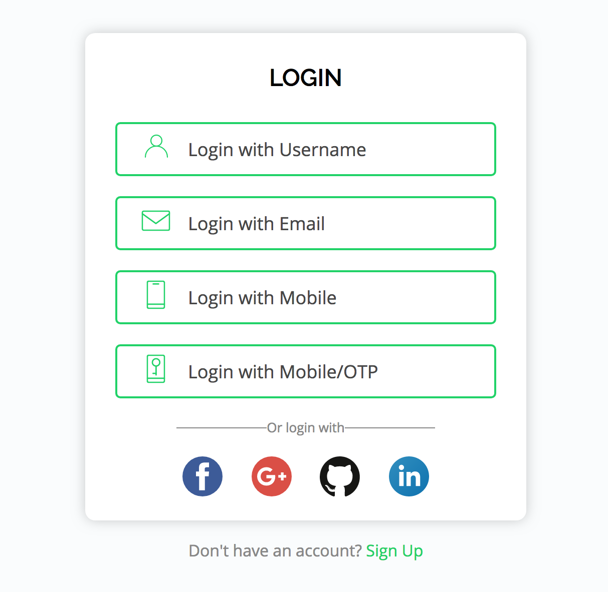

.. .. meta::
   :description: Part 7 of a set of learning exercises meant for exploring Hasura in detail. This part introduces the Auth UI Kit.
   :keywords: hasura, getting started, step 7, tutorial

===============================
Part VII: Using the Auth UI Kit
===============================

.. admonition:: Note

  You can skip this section if you want to write your own frontend for auth.

In the previous section, we learned and tried some basic auth APIs. However, if you do not want to write auth code, you can use a ready to use frontend interface for your web apps that comes pre-loaded with the Hasura Auth Microservice.

The UI kit runs on the url: ``auth.<cluster-name>.hasura-app.io/ui``.

It allows your application users to login/signup seamlessly using the :doc:`authentication providers <../auth/authentication/providers/index>` configured in the :doc:`auth conf <../project/directory-structure/conf/auth.yaml>`. The UI adapts automatically to display
the enabled auth providers. Just configure the auth conf of your Hasura Project and the UI Kit will immediatedly start working on the new changes.

By default, it is configured to login using only ``Username Password``. You can enable other auth providers by changing the auth conf. We will demonstrate below how to enable ``auth with Email and Google``. For enabling other providers, :ref:`read the instructions here <providers>`.

Enable auth with Email
----------------------

#. Open the ``conf/auth.yaml`` file from the project directory. Enable email provider to by setting ``defaultProviders > email > enabled`` to *true*.

#. Run a ``git push`` to ``hasura`` remote to apply these changes to the cluster.

   .. code-block:: bash

       $ git add .
       $ git commit -m "Enabled email email provider"
       $ git push hasura master

#. You will need an email service to programmatically send emails. You can either configure one of :doc:`smtp <../notify/email/smtp>` and :doc:`sparkpost <../notify/email/sparkpost>` or use the free trial service by Hasura called :doc:`Hasura Test Provider<../notify/email/hasura-test-provider>`. The ``Hasura Test Provider`` is enabled by default, so you can start using the service by running the blow commands from the project directory.

   .. code-block:: bash

      # Get your user-information
      $ hasura user-info
      # Copy the token from the output of above command and paste in the following
      $ hasura secret update notify.hasura.token <token>

#. Navigate to ``auth.<cluster-name>.hasura-app.io/ui`` and you will see the ``auth with email`` enabled.

Enable auth with Google
-----------------------

#. Obtain your Google OAuth ``client ID`` and ``client secret``.

#. Open the ``conf/auth.yaml`` file from the project directory. Enable Google provider to by setting ``defaultProviders > google > enabled`` to *true*.

#. Find the ``google`` key in ``conf/auth.yaml`` and enter your client ID in the ``clientIds`` array there. (The ``google`` key might be commented)

   .. snippet:: yaml
     :filename: auth.yaml

       ## For example if your client ID is "xxxxxx"
       google:
         clientIds: ["xxxxxx"]
         clientSecret:
           secretKeyRef:
             key: auth.google.client_secret
             name: hasura-secrets

#. Add the client secret to `secrets <https://docs.hasura.io/0.15/manual/hasuractl/hasura_secret.html>`_ by running the following command from your project directory.

   .. code-block:: bash

      $ hasura secret update auth.google.client_secret <client-secret>

#. Finally run a ``git push`` to the ``hasura`` remote to apply these configuration changes to your cluster.

   .. code-block:: bash

      $ git add .
      $ git commit -m "Enabled Google Provider"
      $ git push hasura master

#. Navigate to ``auth.<cluster-name>.hasura-app.io/ui`` and you will see the ``auth with Google`` enabled.

Next: Create your data models
-----------------------------

Next, head to :doc:`data-modelling`.
