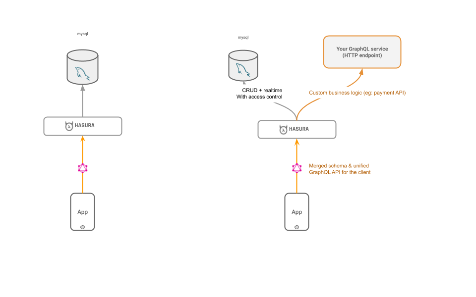

# Mysql + Hasura

Hasura GraphQL Engine is a blazing-fast GraphQL Server that we now have mysql support! Currently we're in *prototype* so not all features are implemented yet. The following are further details on use, what features are currently available, and some roadmap details.

## Prototype Feature Goals

* Initial support goal is around MySQL 8+.
* Prototype release will cover basic CRUD with JSON aggs.
* Support of MySQL as a database and dynamic source to add at runtime.
* No need for metadata or execution of DDL against the MySQL to function.
* CRUD, Realtime, and event trigger features.

## Try It Out

Check out the full repo for more details [here](https://github.com/hasura/graphql-engine).

