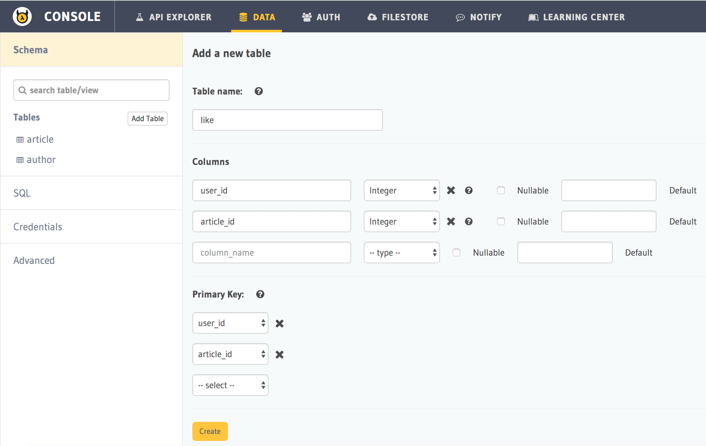

Part II: GraphQL Schema
=======================

GraphQL has its own type language that’s used to write GraphQL schemas - ``GraphQL schema language`` and it allows us to talk about GraphQL schemas in a language-agnostic way, since GraphQL can be used with any backend framework or programming language.

In very simple form, a GraphQL schema looks something like this:

.. code-block:: bash

	type Author {
	  id: ID!
	  name: String
	}

This is a simple type definition of ``author`` model in our application. ``id`` and ``name`` are fields defined for the ``author`` model with their respective types.

Now lets build a simple schema for a blog app where our basic data requirements are as follows:

* Storing the profile data of each user
* Storing the article data and the author of each article
* Storing the likes given by users to articles
* Storing the comments written by users on articles

Create tables
-------------

As you would normally do with any relational database, data is modelled as tables.

+----------------------------------------+----------------------------------------+
|Table                                   |Columns                                 |
+========================================+========================================+
|author                                  |id, name                                |
+----------------------------------------+----------------------------------------+
|article                                 |id, title, content, rating, author_id   |
+----------------------------------------+----------------------------------------+
|like                                    |user_id, article_id                     |
+----------------------------------------+----------------------------------------+
|comment                                 |id, user_id, article_id, comment        |
+----------------------------------------+----------------------------------------+

**Note:** If you are using the ``hello-world`` quickstart, tables ``author`` and ``article`` have already been created
via migrations

.. admonition:: Note

	With Hasura's GraphQL, you don't need to write your GraphQL Schema separately. It is automatically managed for you as you keep modifying the schema via the UI. Migration files will also be generated as you do this.

You can create tables via the ``API console``. 

Run:

.. code-block:: bash

   # Run this command inside your project directory
   $ hasura api-console

This will open up the ``API console`` and show you the ``API explorer`` page which you can use to understand the APIs
provided by the Data microservice.

.. image:: ../../../img/platform/manual/graphql-tutorial/tutorial-api-console.png

Head to *Data -> Add Table*.

Create Table ``like``:

Create Table ``comment``:

.. image:: ../../../img/platform/manual/graphql-tutorial/tutorial-create-table-comment.png

Create the ``author`` and ``article`` tables similarly if not already created.

Once these tables are created via console, the GraphQL schema for the same is generated by Hasura Data API.

Add foreign key constraints:
----------------------------

After creating the tables, the following foreign key constraints need to be set up to complete our data modelling:

* ``article::author_id -> author::id``
* ``like::article_id -> article::id``
* ``comment::article_id -> article::id``

To add foreign key constraints, click on the table, go to the *Modify* tab and edit the columns for which you wish
to add foreign keys.
	    
Adding foreign key constraint to ``article_id`` of ``like`` table:

.. image:: ../../../img/platform/manual/graphql-tutorial/tutorial-modify-table-like.png

Similarly, add the other foreign key constraints.

**Note** All of these schema related modifications will automatically reflect in GraphQL APIs.

	    
Next: Explore the GraphQL APIs
------------------------------

Next, head to :doc:`graphql-apis`.
