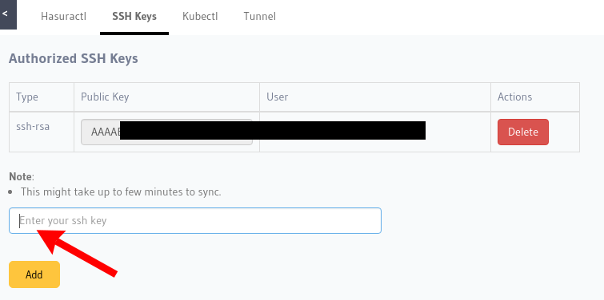

:orphan:

.. meta::
   :description: Reference documentation for creating and adding SSH keys to a Hasura project for secure access.
   :keywords: hasura, docs, CLI, SSH

.. _add-SSH-keys:

Adding SSH Keys to a Project
============================

Once you've generated an SSH key, you need to copy your public key and paste it in the ``SSH Keys`` section
in the CLI page on the Hasura console.

.. admonition:: Generating SSH keys

   In case you don't have an SSH key or aren't sure if you have one already, follow this guide:
   `Creating SSH Keys <https://confluence.atlassian.com/bitbucketserver/creating-ssh-keys-776639788.html>`_

Once you have your SSH key, copy it to your clipbard. You can try any of the commands below to copy
it to your clipboard:

.. code-block:: console

   $ cat ~/.ssh/id_rsa.pub | pbcopy       # Mac

   $ clip < ~/.ssh/id_rsa.pub             # Windows

   $ sudo apt-get install xclip           # Linux
   $ xclip -sel clip < ~/.ssh/id_rsa.pub  # Linux

Then, head to ``console.<project-name>.hasura-app.io/commandline/ssh-keys``, copy it into the textbox and add it!

