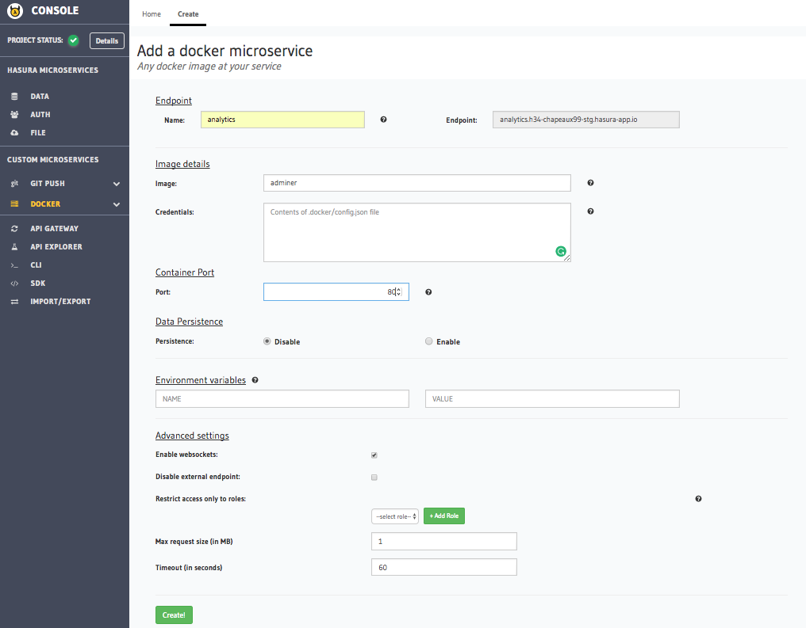

.. Hasura Platform documentation master file, created by
   sphinx-quickstart on Thu Jun 30 19:38:30 2016.
   You can adapt this file completely to your liking, but it should at least
   contain the root `toctree` directive.

.. meta::
   :description: Reference documentation for creating Docker Microservices. Learn how to deploy services using Docker images and configuring enviroment variables.
   :keywords: hasura, docs, Docker microservices

Creating Docker Microservices
=============================

Docker based microservices are created using the project console (`Project Console` -> `Custom Microservice` -> `Docker`->`Create`). Here is a reference image for creating such a service:

