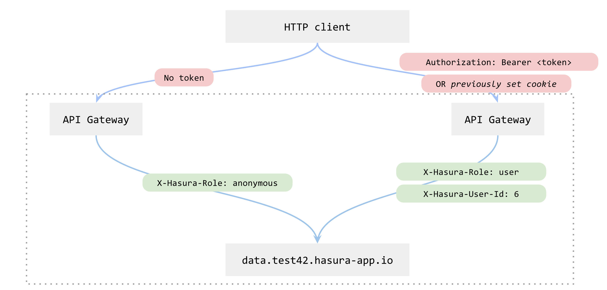

.. meta::
   :description: Reference documentation for managing user sessions in a Hasura project and role-based authorization and SSL certicates for individual microservices.
   :keywords: hasura, docs, API Gateway, sessions, roles, access control, SSL certs, SSL certificates

Session Management & SSL certificates
=====================================

Sessions
--------

When a user is logged-in, a session token is attached to that user. A session
token is nothing but a unique, un-guessable identifier attached to that user
for that session. This way a user can make subsequent requests without having
to authenticate, with credentials, on every request.

Each API request to Hasura can contain an ``Authorization`` bearer token or a
cookie.  The API gateway resolves this token into the corresponding ``role``
and ``user_id`` headers.  So when the API that is finally contacted, has the
user id and role information it needs. Hence, that API doesn't have to do any
further authentication/authorization. The API gateway takes care of it.

The user id and role headers are called:

* ``X-Hasura-User-Id``: This header value contains the user id of the user
  making the request.

* ``X-Hasura-Role``: This header value contains the current role of the user
  making the request.

If no token is found by the API gateway, the value of ``X-Hasura-User-Id`` will
be ``0`` and ``X-Hasura-Role`` will be ``anonymous``.

-----

Example
"""""""

To make an authenticated API request, the client has to send either a
previously set cookie, or an Authorization header like:

.. code-block:: guess
   
   Authorization: Bearer <token>

where the ``<token>`` is received in an earlier API call (like login).

Here's a flowchart that explains what happens when an API request is made:

----

Side Note
"""""""""
If your application runs on a browser, you don't have to manage any session
tokens manually. As Hasura already sets and reads cookies, this part
automatically taken care of.

But if you developing a non-browser application, then you might have to manage
session tokens by yourself. This is discussed in more detail in Hasura Auth's
documentation.

HTTP services are upstream
--------------------------

Every Hasura service is hosted at a subdomain under the main project's domain.
The API gateway proxies requests to upstream services based on subdomains.

**Example**:
The data service is hosted under the ``data`` subdomain. If your
project is called ``test42``, the main project's domain is
``test42.hasura-app.io``, and the data service is hosted at
``data.test42.hasura-app.io``. All external requests to the ``test42`` project
reaches the API gateway first, then the gateway will proxy it upstream based on
the subdomain.

Role based authorization
""""""""""""""""""""""""

The API gateway can also optionally check for role based authorization. That
means while adding a custom service, one can specify what roles are allowed to
access the service.  API gateway will resolve incoming requests to  check the
role. If the service allows access to that role, only then the gateway will
proxy it upstream, otherwise it will throw a ``401 Authorization Required``
error.

This can be configured while adding a custom service. Look for the "Allowed
role" settings in the "Add custom service" page.

.. TODO: Add screenshot of custom API page with the Allowed role highlighted.

SSL certificates for every HTTPS endpoint
-----------------------------------------

The API gateway system auto-generates `LetsEncrypt`_, Grade A SSL certificates for
every subdomain.

.. _LetsEncrypt: https://letsencrypt.org/
