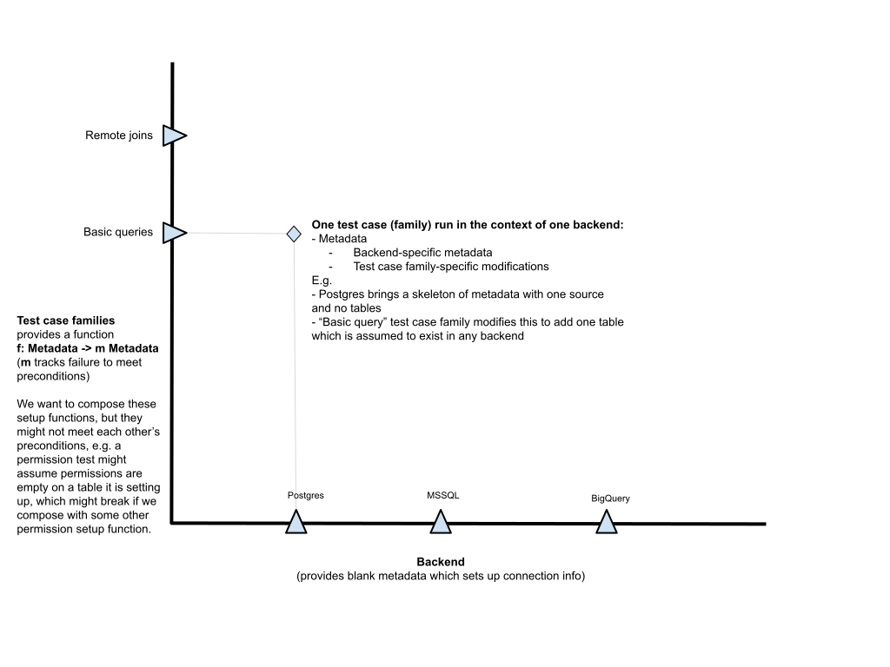

- [Project goal](#project-goal)
- [Proposal](#proposal)
  - [Requirements](#requirements)
  - [Acceptance criteria](#acceptance-criteria)
  - [Checkpoints](#checkpoints)
  - [Nice-to-have](#nice-to-have)
  - [Rationale](#rationale)
  - [Open questions](#open-questions)
- [Other considerations](#other-considerations)
  - [Long-term goals](#long-term-goals)
    - [Backends](#backends)
    - [Test Groups](#test-groups)
    - [Test Plan](#test-plan)
  - [Related work](#related-work)
    - [DB-to-DB joins testing](#db-to-db-joins-testing)
    - [Dynamic backends](#dynamic-backends)
    - [Unification of CI and local integration test setup](#unification-of-ci-and-local-integration-test-setup)

---
authors: Phil Freeman ([paf31](https://github.com/paf31)), Abby Sassel ([sassela](https://github.com/sassela))

---

Project goal
============

The recent work on new backends has cast a light on some problems which substantially slow down new feature development:

1. It is prohibitively expensive, in terms of developer effort, to write integration tests for alternative (non-Postgres) backends, or to port existing Postgres tests to other backends.

2. The existing test infrastructure does not support cross-backend feature testing, such as generalized joins.

3. The current method of running integration tests in a local development environment and in CI (BuildKite) is inconsistent and convoluted.

**Project goal: Make it as easy as possible for developers to write high-quality tests for new features, and run them locally and in CI**.
1. Good backend and cross-backend support built in.
2. Test suite should be trivially runnable on dev machine or CI.
3. Developer time-to-write and see result of a test should be very small.
4. Test suite should be very easy to read for a junior or intermediate Haskell developer.
5. Test suite performance should be fast where feasible.

Proposal
========

Produce a Haskell-based test suite which can initially complement, and eventually replace, the testing power of the current pytest test suite for alternative backend and cross-backend features.

<!-- how does this differ from code coverage? -->
The *testing power* is the ability to identify incorrect code via a failing test.

A *test group* is an indivisible unit of the test suite. Each test group runs an ordered sequence of tests. Test groups with only a single test are allowed and preferred.

Requirements
------------
- Common feature set tests (for example, [basic queries](https://github.com/hasura/graphql-engine/issues/7627)) share a single schema representation to minimise duplication of setup/teardown files.
- Test suite execution is trivially parallelisable; state coupling, shared state, and dependencies across test groups are avoided or made explicit.
- CI invocation of the test suite defers to the same command used to run the tests locally.
- The test suite launches ephemeral graphql-engine servers by itself and doesn't require any existing service to be running.
- A local iteration on a single test case (edit the test then run to failure) is not slower for a comparable pytest on typical developer hardware. (The class of tests to compare here would execute a single GraphQL query against a single backend.)
- Test execution for a given feature set is not slower for a comparable subset of pytests, on similar hardware to the current pytest CI setup.
- Test framework allows access to intermediate app state for more fine-grained integration tests *as well as* end-to-end (request/response) tests.

Acceptance criteria
-------------------
*How will we know when we've achieved the project goal?*
- A test suite, comparable to the existing `TestGraphQLQueryBasicMySQL`, is executable locally against a MySQL backend.
- A test suite, comparable to the existing `TestGraphQLQueryBasicCommon`, is executable locally against all currently supported backends (Postgres, Citus, SQL Server, BigQuery and MySQL) or a subset thereof.
- A test suite, comparable to the [existing `RemoteResourceSpec`](https://github.com/hasura/graphql-engine-mono/blob/main/server/tests/integration/Tests/RemoteSourceSpec.hs) is executable locally against a Postgres backend(s).
- The test suite runs in CI.

Checkpoints
-----------
[This GitHub issue is kept up to date with progress.](https://github.com/hasura/graphql-engine/issues/7760)

 *Each checkpoint does not necessarily correspond to single PR. Organise PRs as you judge sensible, but prefer smaller PRs where they are functional and self-contained.*

We will scope this to something very simple for now: basic queries (where, order by, filter and offset) but aim to be as comprehensive and deliberate as possible. Incidentally, this will also be the first set of features we will want to be able to test for any new backend. We will extend this subset of features in the same order as that in which we prioritize work on new backends.

- [ ] Create, or reuse, a restricted testing context within which to run tests again a GraphQL Engine instance. The existing `TestM` can be reused, adapted, or replaced.
- [ ] POC for a single test or small subset of tests within `TestGraphQLQueryBasicMySQL`, executable locally against MySQL.
- [ ] Run that test/small suite in CI.
- [ ] POC for a single test or small subset of tests within `TestGraphQLQueryBasicCommon`, executable locally against all backends, and run in CI.
- [ ] POC for a single test or small subset of tests within `RemoteResourceSpec`, executable locally against Postgres and run in CI.
- [ ] Implement the equivalent of `TestGraphQLQueryBasicMySQL`.
- [ ] Implement the equivalent of `TestGraphQLQueryBasicCommon`.
- [ ] Implement the equivalent of `RemoteResourceSpec`.


Nice-to-have
------------
- Coherent, human-readable test fixtures which could be used to spin up a local environment with semi-realistic data given a schema, amongst other things. Would be great to make use of FPCo folks experience here, namely developing [fakedata-haskell](https://github.com/fakedata-haskell/fakedata).
- A way of measuring the testing power of the new test suite versus the old test suite. That is to say, we must be able to easily collect metrics related to test failures which are caught by the old test suite (related to basic queries, initially), but not caught by the new test suite, and vice versa.
- We should be able to identify which subset of the pytest suite has been replaced with the new test groups. This will allow us to gradually sunset pytest classes in favour of the equivalent Haskell test groups with confidence.
- Choosing which tests to run should be convenient, e.g. it should be easy to iterate on an individual test, run a particular test against all backends, or run all tests against a particular backend.
- Test groups must only be made as large as is *required* (e.g. if we have to run some tests in order because each sets up the state for the next one), and test groups that can be split into smaller ones should be refactored thus.

Rationale
---------
*What design decisions have been debated that are worth documenting?*

Should the test suite spin up the services it needs, or expect necessary services to be running?
* Fewer implicit dependencies will improve usability of the test suite for new and existing code contributors, which is the main goal of this project.
* However, the test suite should also support more advanced (or less common, but still important) use cases; Pro feature testing, different graphql-engine versions and command line options.
* Decision: [start an graphql-engine server by default](https://github.com/hasura/graphql-engine/issues/7801), separately to the test suite execution, and support endpoint overrides. Databases will be brought up with Docker.

Should we stick to the golden test approach from the pytest suite?
* The proposed [advantages of golden tests](https://ro-che.info/articles/2017-12-04-golden-tests) are outweighed by the complex [automated](https://github.com/hasura/graphql-engine/blob/504f13725fb7a92de8159523b836aa5fcbd3e6ce/server/tests-py/conftest.py#L504-L683), and tedious [manual](https://github.com/hasura/graphql-engine/issues/7139), lookup of disparate setup, teardown and golden files.
* Including test setup, teardown, results and assertions in the same file will reduce/remove the file lookup overhead and smooth the workflow for adding and updating snapshot tests.
* Self-contained test modules might also encourage organising into "smallest possible test groups"; the file length passing some threshold could be a prompt for developers to split up large test groups. Max file length can be suggested or enforced in developer tools and CI.
* Decision: experiment with entirely self-contained Haskell test modules and quasi-quoted YAML, SQL and GraphQL as needed.

Open questions
--------------
- [ ] how might we [access intermediate application state](#db-to-db-joins-testing), so we can write more granular integration tests (and get faster feedback, better type inference & error messages)?
- [ ] should we take [the proposed composable metadata approach](#long-term-goals) to support testing multiple backend and test group combinations?
- [ ] how might we share the same schema for different backends, so we can test the same features across multiple backends with minimal code duplication?

Other considerations
====================

Long-term goals
---------------

If this project is successful, we will work to prioritize adding other “feature areas” to this new test suite. The ideal scenario would be to replace as much as possible of pytest over the next 6 to 12 months. It will have to remain for tests which don’t fit into this new framework, but its surface area should be greatly reduced.

There will be two axes along which we will extend things: test cases (partitioned into groups), and backends. We need to make it possible for developers to work along each of these axes:

-   Adding a new test case to an existing group for all existing backends

-   Adding a new test group and implementing test support for all (or a subset of) existing backends

-   Adding a new backend and implementing support for some existing test groups

We can visualize the space of tests as follows:



The test architecture should reflect this structure.

### Backends

The x-axis represents the various backends. Each backend should implement the following:

-   The ability to provision or connect to a test database

-   The ability to list out supported all test groups

-   The ability to set up the test database schema, which should cover all of the supported test groups

-   A blank metadata structure which provides the test database as a data source with a standard name

-   The ability to run a test transactionally, with roll-back of data between test cases

This might be sensibly implemented in a new BackendTest type class.

### Test Groups

The y-axis represents the various test groups.

Test groups should be roughly aligned with product features. For example, basic queries and remote schemas might be two product feature areas which necessitate the creation of new test groups.

Each group should implement the following:

-   A function which modifies the blank metadata structure to add its own necessary metadata

    -   This function might fail, because it might have preconditions on the input metadata. E.g. a test group might set up permissions on a table, but assume that permissions are undefined as a precondition. Composing two such groups could result in failure.

    -   A failure to install metadata additions should result in a test failure.

### Test Plan

Given these backends and test groups, the basic test plan looks like this:

-   For each backend B (in parallel):

    -   Provision a test database for B

    -   Create a blank metadata structure for B

    -   For each test group G which B claims to support:

        -   Apply the metadata additions for G to the metadata

        -   Replace the metadata on the server with this generated metadata

        -   Run all of the tests cases in group G

Related work
------------

### DB-to-DB joins testing
[DB-to-DB Joins Test Suite tracking GitHub issue](https://github.com/hasura/graphql-engine-mono/issues/2528)


[This change](https://github.com/hasura/graphql-engine/commit/67b4e1cc5b1351fd0e9951f003ed081fa65297e7) unblocks testing of DB-to-DB joins, which was untenable with our existing Python test suite. Although the PR includes exploratory work and overlaps somewhat with this RFC’s proposal, it’s minimally-scoped to support testing of DB-to-DB joins as soon as possible. Some or all of this work may be refactored or deleted depending on the outcome of this RFC and related work.

Within that PR, [Vamshi described](https://github.com/hasura/graphql-engine-mono/pull/2403#issuecomment-933630333) the expected DB-to-DB relationship behaviour and a proposal for designing new DB-to-DB joins tests.

*Feedback from DB-to-DB joins testing effort*
1. the test monad - we're currently using a mix of `Test.Hspec.Wai`'s `WaiSession` and a reader called `TestM` to carry around some postgres config. this limits us to request/response testing, and doesn't give us much access to the guts of the running server. if it were me, i might go full `YesodExample` style and add a new type with an `Example` instance and expose helpers to encapsulate both request/response testing and examining the server state. this also gives you better type inferences and error messages
2. integrating with `scripts/dev.sh` - these tests are currently in a separate module tree from the other haskell tests (i believe intentionally?), so dev.sh doesn't appear to know about them. probably want to rectify that
3. conventions for backend-specific setup - Phil's composable `testCaseFamily :: SourceMetadata backend -> m (SourceMetadata backend)` looks reasonable, but we're currently doing:
    ```haskell
    withMetadata
    :: ((SourceMetadata ('Postgres 'Vanilla), Application) -> IO b)
    -> IO b
    ```
    because connections are acquired and released bracket-style, and we're using hspec's hooks.

Ask [Joe](https://github.com/jkachmar)/[IR team](https://github.com/orgs/hasura/teams/server-data-sources) for more detail if needed.

### [Dynamic backends](https://github.com/hasura/graphql-engine-mono/pull/2614)
Ask [Joe](https://github.com/jkachmar)/[IR team](https://github.com/orgs/hasura/teams/server-data-sources) for more detail if needed.

### [Unification of CI and local integration test setup](https://github.com/hasura/graphql-engine/issues/7140)
Ask [Vamshi](https://github.com/0x777) for more detail if needed.
