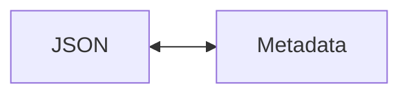
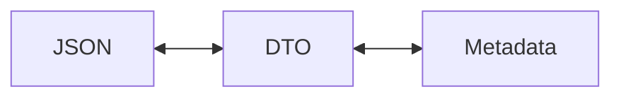

# Separate Metadata API Types from Business Logic Types

## Metadata

<dl>
  <dt>authors:</dt> <dd>Jesse Hallett &lt;<a href="mailto:jesse.hallett@hasura.io">jesse.hallett@hasura.io</a>&gt;</dd>
  <dt>discussion:</dt>
  <dd>https://github.com/hasura/graphql-engine-mono/pull/4619</dd>
  <dt>state:</dt> <dd>draft</dd>
</dl>

Github provides a generated table of contents.
To access it click the button above on the left that looks like this:


## Motivation

We want an accurate specification of exported metadata,
and the best way to get one is to generate it automatically.
Right now it is difficult to derive specifications because serialization for the
`Metadata` type goes through hand-written Aeson instances.
The `Metadata` type in `Hasura.RQL.Types.Metadata` is an internal business logic
type that does not exactly reflect data that is consumed and produced by the
metadata API.
What is actually served through the API is a different type that is implicit in
handwritten `parseJSON` and `toJSON` functions.
Because it is implicit it is difficult to introspect that type.
This RFC proposes to make the API type explicit, and to give it a name.

A full specification for metadata has several benefits:

- The Console and CLI teams will be able to use generated TypeScript and Go type
  definitions to verify correctness at type-checking time of code that
  manipulates metadata.
- Users who chose to edit metadata directly with the help of the CLI will be
  better supported. An OpenAPI specification could be the basis for an IDE
  plugin that could greatly improve the editing experience.
- We will have better options for detecting breaking changes to the metadata
  API. It is likely we will be able to automate that check. This should help
  server devs to work with more confidence when they work on metadata, or on the
  API.
- We will be able to communicate metadata changes more clearly, and with less
  effort.

Any changes to the metadata API as part of this work would present barriers to
work due to need for consensus on those changes, and need for customer
communication.
So the plan here is to do as much as possible without any changes to the
observable API,
including avoiding changes to order of fields in JSON.
If we do need to make changes to the API to fully specify it then we can narrow
the scope of problem points as we work so that we can be as informed as possible
when planning changes.

A plan that requires a full metadata specification to appear at once would
require so much up-front work that it would likely be an insurmountable
obstacle.
Therefore this RFC proposes an incremental plan.
We will begin with a barely sketched out specification,
and fill in details over time.
We will merge changes frequently,
and verify that the observable API is unchanged at each step.

## The Plan

This RFC proposes to introduce a new set of DTO types with the same shape as the
JSON currently produced and consumed by the Metadata API.
(DTO stands for "data transfer object". It is a term commonly used for a type
whose specific purpose is to represent serialized data.)
Ideally we will eventually have DTO types for the full metadata export, and for
each other Metadata API operation.
We will start at the top, with the full-export type.
Metadata API calls will be switched to using these types as they are
implemented.
DTO values will be immediately translated to or from existing metadata types in
the API handler -
most existing code, and new business logic code will continue to use the
existing types.

So where currently we have conversion directly to and from JSON,



The plan is to switch to converting from JSON to DTO to internal Metadata type,



The advantage of inserting the DTO type is to get an explicit representation of
API data that we can introspect and automatically derive a specification from.

### The Target Specification Format: OpenAPI

The plan is to generate a specification in [OpenAPI][] format including
a description of the entire exported metadata data structure,
and eventually descriptions of data expected by each of the metadata API
endpoints.
OpenAPI is a broadly useful format because there are tools to generate type
definitions for various languages using OpenAPI as an input.
And importantly OpenAPI supports sum types via either [discriminated unions][],
or where appropriate non-discriminated unions (using the `oneOf` operator
without specifying a `discriminator`). Sum types will be essential for
representing the possible variations of the metadata format.

[OpenAPI]: https://spec.openapis.org/oas/latest.html
[discriminated unions]: https://spec.openapis.org/oas/latest.html#discriminator-object

The GDC team is already using [autodocodec][] to generate OpenAPI specs so the
plan is to use the same library for metadata.

[autodocodec]: https://github.com/NorfairKing/autodocodec

Other format options include generating TypeScript type definitions,
possibly using [aeson-typescript][],
or [JSONSchema][].
Both support similar feature sets to OpenAPI for describing *data* including
support for sum types.
As far as we know there are more options for generating type definitions for
various languages using OpenAPI as an input compared to using TypeScript as an
input.
OpenAPI describes both data and REST APIs while the other two options only
describe data.
If we run into serious problems with OpenAPI we can check whether we might have
an easier time with one of the other formats.

[aeson-typescript]: https://hackage.haskell.org/package/aeson-typescript-0.4.0.0
[JSONSchema]: https://json-schema.org/

### Translating from Business Types to DTOs

Manual Aeson implementations for metadata types will be repurposed to translate
between DTO and internal Metadata type instead of between JSON and Metadata.
Reusing as much of the existing serialization code as possible will help to
ensure that the new serialization implementation produces the same results as
the existing implementation.

### Incremental Design

The introduction of DTO types should be incremental.
We can start with a top-level `MetadataDTO` type.
(If anyone hates that name I'm open to discussion.)
At the beginning large portions of the `MetadataDTO` structure
will have the Aeson `Value` type as a TODO placeholder.
This will allow us to pass through those portions of the data structure to
existing serialization logic.
Over time we can replace `Value` types with specific types, and push the
`Value` placeholders down the tree until eventually they are all gone.

We will be able to start generating OpenAPI specifications immediately;
but the definitions will have generic `object` placeholders in the same places
where the DTO types have `Value` placeholders.
The generated specification will become more useful over time as work on the
transition continues.

If we find that there are metadata features that cannot be fully-described
according to the plan in this RFC then we can keep those portions of the
`MetadataDTO` as placeholders until we can come up with an appropriate plan.
We will have a functional API regardless,
and we will be able to get some value from the portions of the data structure
that we can accurately describe.

### Representing Different Formats with Sum Types

Exported metadata does not come in just one format.
In some cases the allowed and required fields vary depending on, for example,
the type of backend database in use.
In other areas certain metadata values will trigger backward-compatibility logic
that accepts an older format.
It is not clear yet if we can capture all of this accurately in one OpenAPI
document.
But the plan is to get as close as possible by representing different possible
formats using sum types within the DTO types.

As mentioned previously OpenAPI supports sum types. For example a DTO type like
this:

```haskell
data MetadataDTO = MetadataDTOV1 MetadataV1
                 | MetadataDTOV2 MetadataV2
		 | MetadataDTOV3 MetadataV3
```

might map to this OpenAPI snippet:

```yaml
schema:
  oneOf:
    - $ref: '#/components/schemas/MetadataV1'
    - $ref: '#/components/schemas/MetadataV2'
    - $ref: '#/components/schemas/MetadataV3'
  discriminator:
    propertyName: version
    mapping:
      1: '#/components/schemas/MetadataV1'
      2: '#/components/schemas/MetadataV2'
      3: '#/components/schemas/MetadataV3'
  properties:
    version:
      type: integer
```

which describes this possible JSON value:

```json
{
  "version": 3
  // more fields described by the #/components/schemas/MetadataV3 OpenAPI document
}
```

### Testing 

We will keep the original JSON conversion functions for the `Metadata` type
around during the transition process to test that JSON ⟷ DTO ⟷ Metadata
conversions produce the same results as existing JSON ⟷ Metadata conversions,
and that the reverse conversions are also equivalent.

## Why Not Use the Existing Metadata Types RFC?

We already have a lot of work from Gavin in the [Metadata Types RFC][].
The proposal in that RFC is to maintain a hand-written specification that can be
consumed by customers,
and to generate Haskell types from the specification which would serve the same
role as the DTO types described in this RFC.
On the other hand this RFC proposes Haskell types as the source-of-truth
instead.

[Metadata Types RFC]: https://github.com/hasura/graphql-engine-mono/blob/main/contrib/metadata-types/RFC.md

After discussion with Gavin and Vamshi our thinking is that using Haskell types
as the source-of-truth presents the lowest friction solution for the Server
team.
This is important because we need buy-in from the Server team to make any of
this work, and to make sure that it is maintained.
Haskell as the source-of-truth also gives us the best options for leveraging
GHC's type checking to help verify that the generated specification matches the
server implementation.

But we can still get value from Gavin's work:
the specification that he produced serves as an excellent starting point for
designing Haskell DTOs.

## What About GraphQL?

It is not the intention of this RFC to preclude a future GraphQL version of the
metadata API.
In fact the work proposed here will hopefully make it easier to produce such an
API when we are ready.
The main reason not to pursue GraphQL right now is that approach would require
a new API which comes with lots of design decisions.
The point of this RFC is to better specify the API that we already have,
that customers are using.

When we implement a GraphQL API we will have, among other things, a query field
called `metadataExport` or something along those lines.
That field will need a well-defined type.
The proposed metadata DTO type should be able to fill that role.

## Potential Downsides

After the introduction of DTO types any changes to the Metadata API will require
changes to both the metadata business types, and to the DTOs.
We will need to ensure that the two sets of types fully reflect each other so
that some functionality does not accidentally become inaccessible through the
API.
It will be up to server devs adding features to make sure that the new feature
is represented in DTO types.
Checks for breaking changes to the OpenAPI specification will catch potential
cases where some functionality is accidentally removed from a DTO.

## Considerations

### Preserving Order of Elements

With serialization logic moving from the `Metadata` type to a new DTO type
responsibility for order of serialized properties will necessarily move as well.
It is important to keep order consistent.
The [upgrade to aeson v2](https://github.com/hasura/graphql-engine-mono/pull/4611)
makes this easier since it will serialize object properties in alphabetical
order which is easy to emulate in a new type.

### Difference in Default Value Handling Between Metadata Versions

I'm told that there was a change to the way default values are handled between
metadata versions 1 and 2.
In the old version default values are omitted when exporting metadata,
while in the new version all values are serialized even if they are the default.
I think we can capture the appropriate behavior in the DTO ⟷ Metadata
conversion.
